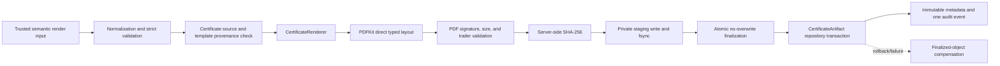

# Module 8.6D — Direct PDF Renderer and Certificate Artifact Foundation

**Status:** Implementation candidate; architecture review pending
**Date:** 2026-07-29
**Runtime scope:** Internal backend foundation only

## 1. Purpose and boundary

Module 8.6D provides the internal capability to render and durably finalize one
immutable private PDF artifact for an already existing `Certificate`. It does
not create a certificate and does not expose issuance, download, public
verification, revocation, or frontend behavior.

The implementation follows the approved certificate issuance contract:

- direct typed PDF drawing only;
- no HTML, CSS, browser, executable template, remote asset, or shell boundary;
- transient rendering and staging conditions are not database states;
- `CertificateArtifact` is inserted only after durable storage finalization;
- finalized metadata has no update, delete, restore, or replacement API.

## 2. Internal architecture



The service depends on project-owned `CertificateRenderer`,
`CertificateArtifactStorage`, and `CertificateArtifactRepository` interfaces.
PDFKit types remain inside the renderer adapter. Local filesystem paths remain
inside the storage adapter.

## 3. Render input and typed layout

`CertificateRenderInput` contains normalized semantic data only:

- certificate identity and number;
- recipient, course, and organization snapshots;
- completion, issue, and issuance dates;
- locale;
- immutable template identity/version;
- renderer contract version;
- approved optional signatory name and title.

Zod rejects unknown fields. A caller cannot provide coordinates, colors,
drawing commands, markup behavior, font paths, storage paths, URLs, or
checksums. Text is normalized to Unicode NFC, internal whitespace is collapsed,
non-whitespace control characters are rejected, and bounded lengths match the
approved database snapshots. The resulting object is frozen.

The only supported v1 contract is:

- template code `STANDARD_COURSE_COMPLETION`;
- template version `1`;
- renderer contract `certificate-pdf-v1`;
- locale `uz-Latn`.

PDFKit draws a fixed A4 landscape layout with project-owned dimensions,
margins, colors, font roles, and line-breaking bounds. Markup-shaped text is
drawn as inert text; no HTML interpreter exists in the pipeline.

## 4. Renderer and fonts

The renderer is `pdfkit@0.19.1`, exposed internally as:

- identifier: `pdfkit-direct-certificate-renderer`;
- version: `pdfkit-0.19.1-layout-v1`.

The approved fonts come from
`@expo-google-fonts/noto-sans@0.4.2`:

- `400Regular/NotoSans_400Regular.ttf`;
- `700Bold/NotoSans_700Bold.ttf`.

The font files are package-local TTF assets. They are never resolved from the
operating system or a network URL. The package carries Noto Sans under the
**SIL Open Font License 1.1**. The implementation calculates one deterministic
bundle checksum over length-delimited Regular and Bold bytes and requires the
active immutable `CertificateTemplateVersion` font provenance to match:

- package asset identifier;
- bundle checksum;
- family and package version;
- license identifier and provenance.

The renderer and font loaders also compare installed package metadata with the
approved pinned versions. Missing, upgraded, or mismatched renderer/font assets
fail closed before producing a PDF.

## 5. PDF validation and resource bounds

The renderer:

- uses no current-time or random values;
- sets controlled document metadata from the immutable issuance timestamp;
- accumulates at most the configured maximum;
- enforces a configured timeout;
- destroys the stream on timeout or size failure;
- rejects stream errors without exposing PDFKit details.

Before staging, the service verifies actual bytes:

- MIME is `application/pdf`;
- size is non-zero and at most 10 MiB;
- header begins with `%PDF-`;
- the trailer has a bounded valid `startxref` reference to the expected PDFKit
  cross-reference table and terminates with `%%EOF`;
- reported and actual byte sizes match.

SHA-256 is calculated by the server from actual validated bytes and encoded as
64 lowercase hexadecimal characters. The local provider recalculates the
checksum from the finalized object before issuing its receipt. Integrity
comparisons use timing-safe digest equality.

## 6. Private storage pipeline

The local adapter uses the private root configured by
`CERTIFICATE_ARTIFACT_STORAGE_ROOT`. It is deliberately separate from
`MEDIA_STORAGE_ROOT` and generic media routes.

Logical final keys use:

```text
certificates/{issue-year}/{certificate-uuid}/{operation-uuid}.pdf
```

Staged keys use the provider-private `.staging/` namespace. Keys are generated
by the server and validated against fixed UUID/namespace patterns. Root
containment checks reject absolute paths, traversal, public-media overlap, and
symlinked parent-directory escapes. The configured root cannot be the project
root, filesystem root, media root, a media-root child, or a parent of media
storage. Relative configuration cannot escape the project root. The caller
cannot provide a path or filename.

Local finalization performs:

1. exclusive staging-file creation;
2. bounded byte write;
3. file flush (`fsync`) and close;
4. atomic hard-link creation at the final key;
5. no-overwrite collision enforcement;
6. finalized size and SHA-256 verification;
7. POSIX final-directory-chain synchronization;
8. staging-link removal and POSIX staging-directory synchronization.

Staging and final storage are under one configured root, so local hard-link
finalization remains on one filesystem. The provider-neutral interface can be
implemented later by S3/MinIO without changing artifact business logic.

Local storage is suitable for development and controlled single-node
verification. Production activation still requires the approved durable
private object-storage, backup, reconciliation, and integrity-monitoring
operating model. Node.js does not expose portable Windows directory `fsync`;
Windows development therefore relies on platform hard-link semantics after the
staged file itself is flushed and closed, not on a cross-platform power-loss
durability guarantee.

## 7. Persistence and immutability

The application service first verifies that:

- the certificate exists;
- no artifact is already related to it;
- all immutable certificate snapshots equal the normalized render input;
- template identity, locale, renderer contract, signatory, organization, and
  font provenance match.

Only after final storage succeeds does the repository insert
`CertificateArtifact`. The insert and `certificate.artifact_finalized` audit
record share one database transaction. The database supplies one timestamp for
both `finalizedAt` and `createdAt`.

The repository intentionally exposes no generic artifact update or deletion
method. Database uniqueness and the existing immutable trigger remain the final
guards. Target-less Prisma `P2002` errors are classified only after querying the
actual certificate/storage uniqueness records; unrelated uniqueness failures
are not mislabeled.

Internal artifact resolution reads the bounded object, validates its persisted
size, SHA-256, and PDF structure, and returns a stream over those already
verified bytes. It does not hand an unchecked live filesystem stream to later
application layers.

## 8. Compensation and audit

Failure before storage success creates no `CertificateArtifact` row. Staged
bytes are discarded after validation, renderer, staging, or finalization
failure.

If database insertion or its audit record fails after finalization, the service
physically removes only the newly finalized private object. A cleanup failure
is returned as `CERTIFICATE_ARTIFACT_COMPENSATION_FAILED` without disclosing the
storage key or absolute path.

One safe failure audit is attempted with:

- certificate identifier;
- failure category;
- template version when validated;
- renderer identifier and version.

PDF bytes, rendered text, storage keys, absolute paths, font paths, raw
provider errors, and library errors are excluded. Failure-audit persistence
failure is treated as an infrastructure persistence failure rather than
claiming successful finalization.

## 9. Configuration

| Variable                            | Default                         | Validation                                               |
| ----------------------------------- | ------------------------------- | -------------------------------------------------------- |
| `CERTIFICATE_ARTIFACT_STORAGE_ROOT` | `private-certificate-artifacts` | Non-empty; project-root relative unless already absolute |
| `CERTIFICATE_PDF_MAX_BYTES`         | `10485760`                      | Positive integer, maximum 10 MiB                         |
| `CERTIFICATE_PDF_RENDER_TIMEOUT_MS` | `10000`                         | Integer from 100 to 120,000 milliseconds                 |

The private root is ignored by Git. No storage path is returned through the
internal application DTO.

## 10. Determinism statement

With identical normalized input, template/layout version, PDFKit version,
Noto Sans files, runtime configuration, and application version, current tests
produce byte-identical PDF output. Controlled creation/modification metadata
uses the immutable issuance timestamp.

Byte identity is not promised across dependency, font, Node.js, compression, or
layout-version changes. Those changes require a renderer-version change and
review. The SHA-256 of the actual finalized bytes is the authoritative
integrity identifier; missing or corrupt artifacts are never silently
regenerated.

## 11. Deferred work

Module 8.6D does not implement:

- certificate issuance orchestration;
- private HTTP read/download;
- public verification;
- revocation or reissue;
- frontend UI;
- template administration;
- orphan reconciliation worker;
- production S3/MinIO storage.

Those capabilities remain subject to their approved later modules and
production activation gates.
