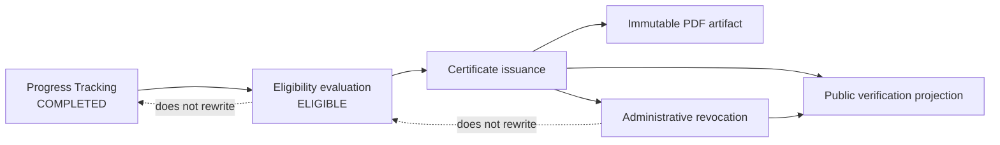
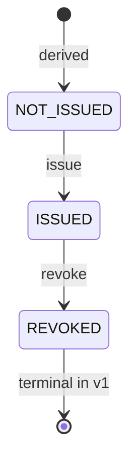

# Certificate Issuance and Lifecycle Contract

**Status:** Review Candidate
**Module:** 8.6A
**Contract version:** 1.0.0-rc.1
**Implementation status:** Contract only; not available at runtime
**Date:** 2026-07-28

## 1. Purpose, authority, and precedence

This document is the canonical Module 8.6 contract for certificate issuance,
artifact handling, delivery, verification, and revocation in Turk Tili LMS. It
turns an immutable eligible evaluation into an independently auditable
credential without changing course completion or eligibility evidence.

The following precedence applies:

1. This contract and
   [ADR-004](./design-system/decisions/ADR-004-certificate-issuance-lifecycle.md)
   govern certificate issuance and lifecycle behavior after approval.
2. The
   [Course Completion and Certificate Eligibility Contract](./COURSE_COMPLETION_CERTIFICATE_ELIGIBILITY_CONTRACT.md)
   and
   [ADR-003](./design-system/decisions/ADR-003-course-completion-certificate-eligibility.md)
   remain authoritative for completion and eligibility.
3. The
   [Progress Tracking Contract](./PROGRESS_TRACKING_CONTRACT.md) and
   [ADR-002](./design-system/decisions/ADR-002-progress-tracking-contract.md)
   remain authoritative for learning progress.
4. The
   [documentation-only OpenAPI contract](./openapi/course-completion-certificate-eligibility.v1.yaml)
   is the machine-readable HTTP boundary. A contradiction is resolved in favor
   of this canonical contract until both documents are corrected.
5. General architecture and Design System documents remain authoritative where
   they do not conflict with a domain contract.

All Module 8.6 operations documented here remain `contract-only` and
`not-available` until their named implementation phase is approved, implemented,
tested, and separately released.

## 2. Scope and non-goals

### 2.1 Approved contract scope

- Password-based step-up authentication for high-risk certificate actions
- Immutable certificate, template-version, and artifact concepts
- Synchronous staged issuance
- Human-readable certificate numbering
- Private PDF artifact delivery
- Public verification through an opaque token
- Administrative revocation
- Student, teacher, administrator, and public capability boundaries
- Failure recovery, audit, privacy, and implementation sequencing

### 2.2 Explicitly deferred

- Certificate reissue and supersession runtime
- QR-code generation or embedding
- MFA and external identity providers
- Digital signatures, qualified electronic signatures, and timestamp services
- Email delivery, printing, bulk export, and bulk issuance
- Arbitrary HTML, CSS, JavaScript, or user-uploaded certificate templates
- Certificate expiry, renewal, transfer, or blockchain anchoring
- Teacher issuance, revocation, or artifact download
- Silent artifact regeneration

Deferral means no client or implementation may infer or invent the behavior.

## 3. Domain boundaries and definitions

| Concept                 | Authority                | Definition                                                                          |
| ----------------------- | ------------------------ | ----------------------------------------------------------------------------------- |
| Course completion       | Progress Tracking        | Terminal, frozen enrollment completion evidence                                     |
| Certificate eligibility | Certificate Eligibility  | Versioned decision over the frozen completion evidence                              |
| Certificate issuance    | Certificate Lifecycle    | Creation of an immutable credential from one eligible evaluation                    |
| Certificate artifact    | Certificate Artifact     | Immutable PDF bytes and trusted storage metadata associated with one certificate    |
| Public verification     | Certificate Lifecycle    | Privacy-limited projection reached through a high-entropy opaque token              |
| Revocation              | Certificate Lifecycle    | Permanent invalidation of an issued credential without deleting its history         |
| Reissue or supersession | Future contract revision | Creation of a new certificate related to, but never replacing, an older certificate |

Student identity is derived through the referenced enrollment. A user ID sent by
a client is never an issuance input. The certificate stores display snapshots
needed for the historical credential, not a second source of authorization or
enrollment ownership.



## 4. Step-up authentication contract

### 4.1 Protected actions and actors

The following actions require both normal bearer authentication and a valid
step-up proof:

| Action                | Actor in v1 | Permission            |
| --------------------- | ----------- | --------------------- |
| Issue a certificate   | ADMIN       | `certificates.issue`  |
| Revoke a certificate  | ADMIN       | `certificates.revoke` |
| Reissue a certificate | Deferred    | Not granted in v1     |

Role and permission checks are both required at route and service boundaries.
Recent authentication never replaces RBAC or object-scope authorization.
Future template activation/retirement is not a v1 endpoint; when approved, it
must use a dedicated permission and this same target-bound step-up pattern.

### 4.2 Recent authentication

For the initial local-password architecture, recent authentication means a
successful password login or successful password step-up on the current,
non-revoked session within the preceding **10 minutes**, measured using database
server time. Refresh-token rotation alone does not refresh this timestamp.

The current session schema has no recent-auth field. A later persistence phase
must add `last_authenticated_at` or an equivalent session-bound timestamp. This
contract does not modify Prisma.

### 4.3 Challenge and proof

1. The authenticated client requests a typed challenge for an action and target.
2. The backend revalidates session, role, permission, and target scope without
   revealing an unauthorized target.
3. The challenge is bound to `userId`, `sessionId`, the credential epoch
   represented by `passwordChangedAt`, action, target type, target identifier, a
   server-held continuation identifier, and expiry.
4. If recent authentication is not sufficient, the client submits the current
   password to the verification endpoint. Passwords are verified with the
   existing password service and never stored or logged.
5. Success returns a random, opaque **256-bit** proof once. Only its SHA-256 hash
   is persisted.
6. The protected action supplies the proof in `X-Step-Up-Proof`.
7. The proof is consumed atomically with the protected mutation.

Challenge expiry is **5 minutes**. A verified proof expires after **2 minutes**,
is single-use, and is bound to exactly one user, session, action, and target.
Changing any binding invalidates it.

### 4.4 Replay, retries, and limits

- A proof cannot authorize a second logical mutation.
- Concurrent proof consumers lock the proof row or perform a conditional update
  requiring `consumedAt IS NULL`; exactly one protected transaction can consume
  it.
- An already successful idempotent replay may return the stored response after
  normal authentication and authorization are revalidated; it does not require
  or consume another proof.
- A failed transaction rolls back proof consumption.
- A failed artifact preflight occurs before proof consumption and may be retried
  with the same challenge while it remains valid.
- Five failed verifications lock that challenge.
- Challenge creation is limited to 5 attempts per 15 minutes per user/session.
- Verification is limited to 10 attempts per 15 minutes per user and privacy-safe
  IP key. Deployment-level limits may be stricter.
- Rate-limit counters must work across API nodes.

Session logout, logout-all, expiry, rotation/replacement, account deactivation,
role/permission loss, forced password change, password reset, or password change
invalidates authorization for every outstanding challenge/proof. Password
change/reset advances `passwordChangedAt`; challenge/proof verification and
final protected transactions must compare that stored credential epoch. The
password-change transaction must expire outstanding challenges/proofs for that
user, including those bound to the current session.

Password re-entry is sufficient for v1. MFA is explicitly deferred and may be
added later as another typed verification method without changing proof
semantics. No external identity provider is implied.

### 4.5 Continuation and frontend flow

`/verify-action` is the full-page fallback. A dialog may be used when the same
contract is preserved. The client sends no arbitrary return URL. The server
stores a short-lived continuation record containing an allowlisted route name,
protected action summary, target binding, and nonce. After verification, the
client returns to a fresh destructive-action confirmation; verification never
auto-submits the mutation.

Cancel, expiry, session loss, inaccessible target, and permission change discard
the proof and continuation. Focus returns to the initiating control where
possible.

### 4.6 Step-up audit events

- `security.step_up.challenge_created`
- `security.step_up.succeeded`
- `security.step_up.failed`
- `security.step_up.proof_consumed`

Metadata is limited to action, target type, opaque target ID, session ID,
challenge ID, result/reason code, attempt count, and correlation ID. It must not
contain passwords, raw proofs, access/refresh tokens, authorization headers, or
full request bodies.

## 5. Certificate persistence contract

The names below are conceptual. Module 8.6B must translate them into repository
naming conventions and reviewed PostgreSQL constraints without redesign.

### 5.1 Certificate

| Field                         | Contract                                                                |
| ----------------------------- | ----------------------------------------------------------------------- |
| `id`                          | Internal UUIDv7 primary key; never used for public verification         |
| `certificate_number`          | Unique immutable human-readable serial                                  |
| `verification_token_hash`     | Unique SHA-256 hash; the raw token is never stored                      |
| `enrollment_id`, `course_id`  | Composite restrictive relation proving the enrollment/course pairing    |
| `eligibility_evaluation_id`   | Restrictive relation to the exact immutable `ELIGIBLE` evidence         |
| `template_version_id`         | Restrictive relation to an immutable active template version            |
| `status`                      | Stored lifecycle value: `ISSUED` or `REVOKED`                           |
| `version`                     | Positive optimistic concurrency version, initially 1                    |
| `issued_at`, `issued_by_id`   | Database time and issuing administrator                                 |
| `revoked_at`, `revoked_by_id` | Both null for `ISSUED`, both set for `REVOKED`                          |
| `revocation_reason_code`      | Typed reason; null until revocation                                     |
| `revocation_reason_note`      | Optional bounded 10–500 character explanation                           |
| snapshot fields               | Recipient name, course title, organization name, locale, and issue date |
| timestamps                    | `created_at`, `updated_at`; no `deleted_at`                             |

Student identity is obtained from `enrollment_id`; no independent
client-supplied `student_id` is accepted. If a denormalized student ID is later
stored for indexed reporting, a composite database invariant must prove that it
matches the enrollment.

### 5.2 CertificateArtifact

One certificate has exactly one finalized artifact after successful issuance.
The artifact has its own UUIDv7, unique `certificate_id`, provider, opaque
provider-relative storage key, `application/pdf` MIME, byte size, SHA-256
checksum, renderer identifier/version, and `finalized_at`. It has no soft-delete
or restore lifecycle.

### 5.3 CertificateDisclosureControl

One certificate may have one separate disclosure-control row. It contains
unique `certificate_id`, optional `recipient_name_suppressed_at`, suppressing
ADMIN actor, typed reason, and timestamps. It never changes certificate
validity, artifact bytes, or the immutable name snapshot. Absence means the
approved public name projection is enabled. Creation/update is a future
privacy-admin workflow; the schema concept is required before public
verification so account anonymization does not require mutating the credential.

### 5.4 CertificateTemplate and CertificateTemplateVersion

- `CertificateTemplate` is a stable administrative identity and code.
- `CertificateTemplateVersion` is an immutable typed rendering definition with
  integer version, locale, lifecycle `DRAFT | ACTIVE | RETIRED`, organization
  snapshot defaults, approved asset references, and renderer contract version.
- DRAFT versions may be edited before activation.
- Activation freezes all rendering inputs. ACTIVE and RETIRED versions are
  immutable.
- Exactly one ACTIVE version per template code and locale is enforced with a
  PostgreSQL partial unique index.
- The initial release seeds one `STANDARD_COURSE_COMPLETION` template for
  `uz-Latn`.
- Active versions pin every logo, seal, signatory image, and font by immutable
  asset identity and SHA-256. Font family/version, license identifier, and
  license provenance are recorded for compliance and historical rendering.

No template stores arbitrary HTML, CSS, JavaScript, executable expressions,
remote URLs, or unrestricted JSON.

### 5.5 Step-up persistence concepts

- `StepUpChallenge`: hashed nonce, user/session/credential-epoch/action/target
  bindings, continuation ID, attempt count, expiry, verified/locked timestamps.
- `StepUpProof`: hashed proof, challenge reference, the same immutable bindings,
  expiry, and consumed timestamp.
- `UserSession`: recent-authentication timestamp.

Expired security records are retained only for a short security window and then
hard-deleted by a reviewed cleanup job.

### 5.6 Shared idempotency promotion

The existing physical `idempotency_records` table is promoted from Progress
ownership to a shared mutation-infrastructure boundary rather than duplicated.
It remains actor-scoped and enrollment-scoped, but its `enrollment_id` foreign
key is moved from `enrollment_progress_roots.enrollment_id` to
`course_enrollments.id`. Existing values remain valid because every current
progress root already references that enrollment. Progress services continue to
validate the progress root inside their own transactions.

The operation vocabulary adds `ISSUE_CERTIFICATE` and `REVOKE_CERTIFICATE`; the
stored success envelope contains the resulting certificate identity/version.
Progress-specific resulting version columns remain nullable for certificate
operations and retain their existing meaning. No certificate table references a
Progress-owned idempotency entity, and no second certificate-specific
idempotency system is introduced.

### 5.7 Indexes and constraints

Required database protections include:

- unique `certificate_number`;
- unique `verification_token_hash`;
- unique finalized artifact `certificate_id` and storage key;
- unique disclosure-control `certificate_id`;
- unique template `(template_id, version, locale)`;
- partial unique active template `(template_id, locale)`;
- unique certificate `enrollment_id`, because v1 permits no second certificate
  even after revocation;
- indexes on `(enrollment_id, status)`, `(course_id, status, issued_at)`,
  `(eligibility_evaluation_id)`, `(issued_by_id, issued_at)`,
  `(revoked_by_id, revoked_at)`, artifact checksum, and security-record expiry;
- positive versions and byte sizes;
- artifact byte size no greater than 10 MiB (`10,485,760` bytes);
- paired revocation fields;
- `ISSUED` rows have no revocation fields and `REVOKED` rows have all required
  revocation fields;
- exact enrollment/course/evaluation relationships through composite keys;
- artifact MIME fixed to `application/pdf`;
- append-only or trigger-protected immutable certificate facts and template
  versions.

All authoritative relationships use `ON DELETE RESTRICT` and `ON UPDATE
CASCADE`. Actor attribution may not silently disappear; account anonymization
uses a controlled identity-retention strategy rather than cascaded deletion.

Cross-table facts—eligible status, current permission, teacher ownership,
session validity, and artifact existence—are transaction/service invariants,
not SQL `CHECK` constraints.

## 6. Certificate lifecycle

`NOT_ISSUED` is a derived API projection meaning no certificate row exists.
Only `ISSUED` and `REVOKED` are persisted in v1.



Allowed transition:

- no row → `ISSUED`;
- `ISSUED` version N → `REVOKED` version N+1.

Forbidden transitions:

- `REVOKED` → `ISSUED`;
- editing an issued snapshot, number, token, template version, evidence, issuer,
  issuance time, artifact key, or checksum;
- deletion as revocation;
- issuing a second certificate for the same enrollment in v1.

An identical idempotent retry returns the original success. A new request for
an enrollment that already has a certificate returns
`CERTIFICATE_ALREADY_ISSUED`, including when the existing certificate is
revoked. Reissue is deferred, so `SUPERSEDED` is deliberately absent.

## 7. Issuance contract

### 7.1 Preconditions

Issuance requires all of the following at the final write:

1. The actor has an ACTIVE account, ADMIN role, and `certificates.issue`.
2. The session and step-up proof are valid for `CERTIFICATE_ISSUE` and the exact
   enrollment.
3. The enrollment exists, is not soft-deleted, and belongs to the selected
   course and student.
4. The enrollment is `COMPLETED`; cancelled or suspended enrollment state
   cannot be used as a shortcut.
5. The referenced latest canonical eligibility evaluation is `ELIGIBLE`,
   internally consistent, and tied to the same enrollment/course/progress root.
6. Its completion, curriculum, policy, and evaluation versions match the
   issuance request and current frozen evidence.
7. An ACTIVE compatible `uz-Latn` template version exists.
8. No certificate exists for the enrollment.
9. `Idempotency-Key`, explicit `confirmed: true`, and expected evidence
   identifiers/versions are present.

Course archival after completion does not invalidate frozen evidence and does
not alone block issuance. Course hard deletion is restricted. Teacher ownership
does not grant issue capability in v1.

### 7.2 Mode

Issuance is **synchronous and staged**. The API returns `201` only after the PDF
is finalized and the certificate, artifact metadata, audit record, consumed
proof, and idempotency response commit successfully. PDF rendering does not run
inside a database transaction.

The initial release does not expose a job state. If measured production
rendering exceeds the request budget, asynchronous issuance requires a future
contract with job identity, polling, cancellation, and delivery semantics.

### 7.3 Duplicate and concurrency behavior

The enrollment row is the canonical issuance lock. The unique enrollment
constraint is the final guard. Concurrent requests may render separate staging objects, but
only one can commit. Losers remove staged/finalized orphan objects and return
the stored replay or `CERTIFICATE_ALREADY_ISSUED` as appropriate.

Serializable retries are bounded to three attempts with jitter and apply only
to genuine PostgreSQL serialization/deadlock or the expected unique race.
Business, authorization, artifact, and validation errors are never retried as
serialization failures.

## 8. Idempotency contract

| Property              | Decision                                                                     |
| --------------------- | ---------------------------------------------------------------------------- |
| Required operations   | Issue and revoke                                                             |
| Key scope             | Unique per actor user and key                                                |
| Business scope        | Enrollment for issue; certificate plus enrollment for revoke                 |
| Fingerprint           | SHA-256 of canonical operation, path IDs, normalized body, and contract ver. |
| Stored result         | Exact successful HTTP status and response envelope                           |
| Retention             | 24 hours initially; cleanup never deletes certificate/audit history          |
| Same key/same request | Revalidate auth/scope, then replay stored response                           |
| Same key/new request  | `IDEMPOTENCY_KEY_REUSED`                                                     |
| Concurrent same key   | One winner; follower observes committed result or bounded conflict/retry     |
| Failed request        | No success record; same key may retry unless failure itself is deterministic |

Idempotency does not cache authentication, authorization, or step-up failures.
It does not make a proof reusable. A successful replay is allowed without a new
proof only after current authentication and permission checks pass.

The stored response is an immutable mutation receipt—operation, certificate,
enrollment, number, resulting status/version, and occurrence time—not a cached
current certificate-detail projection. An issue receipt may therefore state
that its operation produced `ISSUED` even if a later independent revocation has
changed current status. Clients follow `Location` or refetch current status
after processing the receipt.

Module 8.6B must first promote the existing table to shared infrastructure and
replace only its enrollment foreign-key target. It must preserve every current
record, index, progress operation, response, and event relation. Certificate
runtime cannot begin while the record remains owned relationally by
`EnrollmentProgressRoot`.

## 9. Certificate numbering

The initial format is:

`TTL-{UTC_YEAR}-{SEQUENCE}`

`SEQUENCE` is a zero-padded, 10-digit value allocated by PostgreSQL from one
global monotonic sequence. Example: `TTL-2026-0000000042`.

- The database is the sole generation authority.
- The number is globally unique, human-readable, immutable, and safe to display.
- Sequence gaps are expected after rollbacks and are never filled or reused.
- The year is captured at allocation using database UTC time; it does not reset
  uniqueness.
- A unique constraint remains the final collision guard.
- An unexpected collision receives at most three bounded regeneration attempts,
  then `CERTIFICATE_NUMBERING_CONFLICT`.
- The number is not a secret and is not the public verification credential.
- Future reissue, if approved, must allocate a new number.

## 10. Template and snapshot contract

The renderer consumes a versioned, typed input:

- template code, version, renderer contract version, and locale;
- certificate number and issue date;
- recipient display-name snapshot;
- course title snapshot;
- organization legal/display name snapshot;
- approved logo/seal/signatory asset versions;
- fixed localized labels.

The issuer selects no arbitrary template body at issuance. The service selects
the current compatible ACTIVE version. Every snapshot string is normalized,
bounded, and escaped before rendering. Locale uses BCP 47; the initial locale is
`uz-Latn`. Future locale/template versions may be added without changing older
certificates.

The certificate references the exact immutable template version. Mutable user,
course, settings, or template data is never consulted to reconstruct a
historical artifact. Retiring a template prevents new use but does not change or
remove artifacts produced from it.

## 11. Artifact and PDF contract

- The canonical artifact is one immutable PDF with MIME `application/pdf`.
- It is generated once during staged issuance and retained as issued.
- SHA-256 is calculated over finalized bytes and stored with byte size and
  renderer version.
- The renderer and storage adapter reject empty output and output larger than
  **10 MiB (10,485,760 bytes)** before certificate persistence.
- The renderer uses a bundled, approved Unicode font and local approved assets.
- Remote asset fetching, HTML-to-PDF, arbitrary HTML/CSS/JavaScript, macros, and
  executable templates are prohibited in v1.
- Staging paths and final storage keys are generated by the server and never
  derived from a certificate number, recipient name, or client filename.
- A successful issuance cannot exist without a finalized artifact record.
- Silent regeneration is prohibited. Missing/corrupt bytes return
  `CERTIFICATE_ARTIFACT_UNAVAILABLE` and create an operational alert.
- Byte-identical reproduction is not assumed across renderer versions.
  Administrative recovery or reissue requires a later approved workflow.
- The artifact is private. No provider URL or storage path is returned.

The artifact provider must support stage, finalize, open, discard, checksum,
existence inspection, and idempotent cleanup. Local storage is permitted for
development; production requires durable private object storage, backup,
integrity monitoring, and access control approved before activation.

Each staged/final object carries non-secret provider metadata containing an
opaque issuance-attempt ID, created time, expected checksum, and expected byte
size. The durable reconciler scans only the certificate namespace, ignores
objects younger than one hour, compares their opaque keys/checksums with
committed `CertificateArtifact` rows on the primary database, deletes only
unreferenced objects, and records metrics/audit-safe outcomes. A database row
with missing or mismatched bytes is never auto-deleted or regenerated; it raises
an operational integrity alert.

## 12. Existing Media Storage compatibility

The existing `MediaFile` module represents user-uploaded content with category,
soft delete, restore, generic download, uploader ownership, and optional
checksum. Those semantics conflict with immutable certificate evidence.

The smallest compatible extension is:

1. Reuse or extract the low-level provider-relative path validation, stream-open,
   staging, finalization, and removal mechanics.
2. Introduce a certificate-owned artifact record and a dedicated private
   `certificates/` namespace.
3. Do not create a generic `MediaFile` row for certificate PDFs.
4. Do not add a certificate media category to public upload validation.
5. Do not expose certificate artifacts through generic media get, delete,
   restore, or download routes.
6. Use physical removal only for failed/unreferenced staging compensation or a
   future approved retention process.

Provider paths stay opaque. Checksum, MIME, and byte size are verified at
finalization and again during integrity checks. The later storage adapter must
preserve the current traversal protections and support S3/MinIO without changing
certificate business logic.

## 13. Public verification contract

Public verification is approved for the initial Module 8.6 implementation,
subject to privacy/retention approval.

- Route: `GET /api/v1/public/certificates/verify/{verificationToken}`
- Token: 32 cryptographically secure random bytes encoded as unpadded base64url
  (43 characters)
- Storage: SHA-256 hash only; comparison follows safe lookup practices
- URL: public application origin plus the raw token; no certificate UUID,
  enrollment ID, user ID, JWT, email, or name in the URL
- Unknown or malformed token: generic HTTP 404 with
  `CERTIFICATE_VERIFICATION_NOT_FOUND`
- Issued credential: HTTP 200 with public status `VALID`
- Revoked credential: HTTP 200 with public status `REVOKED`
- No expiry or superseded response exists in v1

The public DTO contains only certificate number, status, recipient display-name
snapshot or a privacy-safe omission, course title snapshot, organization name,
issued date, optional revoked date, and safe revocation reason code. It exposes
no internal identifiers, email, enrollment data, actor data, notes, audit
metadata, artifact path, checksum, or token.

Apply `Cache-Control: no-store`, `X-Content-Type-Options: nosniff`, a uniform
response shape/timing where practical, 20 requests per minute per privacy-safe
IP key, and deployment-wide abuse controls. Log a security telemetry event with
token hash prefix or lookup outcome, never the raw token.

Because the token is an intentional public capability embedded in a URL, the
verification HTML and API responses also require `Referrer-Policy: no-referrer`
and `X-Robots-Tag: noindex, nofollow`. The public page loads no third-party
scripts, pixels, fonts, images, or analytics and sends no token-bearing URL to
client telemetry. Reverse proxies, WAFs, access logs, tracing, and error
reporting must redact the path segment before production activation. HTTPS is
mandatory outside local development.

Token rotation is not supported in v1 because the raw value is retained only in
the immutable artifact. Confirmed disclosure is handled by certificate
revocation; generating a replacement token/artifact belongs to the deferred
reissue contract. Certificate number is never accepted as a verification
credential.

### QR decision

QR generation is deferred from the initial Module 8.6 release. The canonical PDF
may show the human-readable verification URL as text. A future QR contains only
the same HTTPS public verification URL with its opaque token; it must contain no
JWT, session data, name, email, internal IDs, or other private data.

## 14. Download contract

### 14.1 Access

- STUDENT may download only their own issued certificate with
  `certificates.self_download`.
- ADMIN may download for an authorized operational purpose with
  `certificates.download`; the action is audited.
- TEACHER has status visibility for assigned courses but no artifact-download
  capability in v1.
- A revoked artifact is unavailable to students and returns
  `CERTIFICATE_REVOKED`. An administrator with `certificates.download` may
  retrieve it for investigation; the response is visibly marked by surrounding
  UI and the access is audited.

### 14.2 HTTP behavior

- `Content-Type: application/pdf`
- `Content-Disposition: attachment; filename="turk-tili-sertifikat-{safe-number}.pdf"`
- `Content-Length` from trusted artifact metadata/open result
- strong `ETag` derived from checksum
- `Cache-Control: private, no-store`
- `X-Content-Type-Options: nosniff`
- no provider redirect and no path disclosure
- byte range is not supported in v1

Missing or checksum-invalid bytes return
`CERTIFICATE_ARTIFACT_UNAVAILABLE`; they do not trigger regeneration.

## 15. Revocation contract

Only an ADMIN with `certificates.revoke` can revoke. Course ownership is not a
substitute and does not restrict a properly authorized administrator.

The request requires:

- `Idempotency-Key`;
- step-up proof bound to `CERTIFICATE_REVOKE` and the certificate;
- `expectedVersion`;
- `confirmed: true`;
- one of `FRAUD`, `ADMINISTRATIVE_ERROR`, `DUPLICATE_ISSUANCE`,
  `POLICY_VIOLATION`, or `OTHER`;
- a normalized 10–500 character note when code is `OTHER`, otherwise an optional
  bounded note.

Revocation is a serializable `ISSUED` → `REVOKED` version increment. It records
database time, actor, typed reason, optional note, audit, proof consumption, and
idempotency result atomically. The record and PDF remain immutable and retained.
Completion and eligibility remain unchanged.

A same-key replay returns the stored result. A new request against an already
revoked certificate returns `CERTIFICATE_ALREADY_REVOKED`. A stale expected
version returns `CERTIFICATE_VERSION_CONFLICT`. Success returns an immutable
revocation mutation receipt; clients then refetch current certificate detail.

## 16. Reissue decision

Reissue is not supported in the initial Module 8.6 release. No public reissue
endpoint or permission is created.

A future contract revision must define approved causes, step-up and permission,
the immutable `supersedes_certificate_id` chain, new number and token, new
artifact and snapshots, whether original eligibility can be reused, public
status for superseded credentials, download rules, audit, and migration. An old
certificate is never overwritten, renumbered, or reused.

The v1 full unique `enrollment_id` constraint intentionally prevents reissue at
the database boundary. Future reissue is therefore not an additive-column-only
change: its approved migration must replace that constraint with a reviewed
series/sequence and active-certificate uniqueness design after preflight. This
is a deliberate safety gate, not an assumption that reissue can be enabled by
application code alone.

## 17. Retention and anonymization

Certificate metadata, eligibility linkage, revocation history, audit, and
artifact are retained by default and are never automatically soft-deleted.
Hard deletion is prohibited until the platform owner approves a jurisdiction-
specific legal retention schedule, lawful basis, backup expiry, and erasure
procedure.

This unresolved legal policy is a **production activation blocker**, not a
schema-design blocker for additive implementation:

- exact retention duration;
- whether and when recipient snapshots may be anonymized;
- treatment of artifacts after a valid erasure request;
- revoked-certificate retention;
- audit and security-log retention;
- backup expiration and restoration handling.

User deactivation or soft deletion does not rewrite a certificate. Hard deletion
of users, enrollments, courses, evaluations, templates, or actors referenced by
certificates is restricted.

Public identity disclosure is controlled independently from the immutable
credential. A future reviewed privacy workflow may record recipient-name
suppression separately, causing a valid public DTO to return a null recipient
name while leaving verification status, artifact, and historical record
unchanged. It must not mutate the original name snapshot silently.

| Decision area                           | Blocks 8.6B schema?                                 | Blocks later phase/production?               |
| --------------------------------------- | --------------------------------------------------- | -------------------------------------------- |
| Metadata/artifact/revoked retention     | No; retain indefinitely, no delete                  | Yes, production retention/runbook approval   |
| Account deletion/anonymization          | No; restrictive FKs and separate disclosure control | Yes, production erasure workflow             |
| Immutable student-name snapshot         | No; required historical fact                        | Public disclosure approval before 8.6F       |
| Audit retention                         | No; existing append-only model                      | Production security/legal schedule           |
| Backup expiry/restoration               | No                                                  | Production operations approval               |
| Public verification after anonymization | No; status remains, name may be null                | Privacy approval and tested suppression flow |

If legal review rejects indefinite private retention or requires artifact
mutation/deletion incompatible with these conservative fields, 8.6B must stop
before migration rather than guessing. Under the current retain-and-suppress
default, no unresolved duration changes the 8.6B table shape.

## 18. Authorization matrix

`✓` means role, permission, authentication, and object scope all pass.

| Capability                            | STUDENT                              | TEACHER                                        | ADMIN                              | PUBLIC |
| ------------------------------------- | ------------------------------------ | ---------------------------------------------- | ---------------------------------- | ------ |
| View eligibility/status               | ✓ own, existing read permissions     | ✓ assigned course, existing course-read perms  | ✓ course/global authorized scope   | —      |
| View certificate detail               | ✓ own + `certificates.self_read`     | ✓ assigned course + `certificates.course_read` | ✓ + `certificates.course_read`     | —      |
| Issue                                 | —                                    | —                                              | ✓ `certificates.issue` + step-up   | —      |
| Revoke                                | —                                    | —                                              | ✓ `certificates.revoke` + step-up  | —      |
| Reissue                               | Deferred                             | Deferred                                       | Deferred                           | —      |
| Download issued artifact              | ✓ own + `certificates.self_download` | —                                              | ✓ `certificates.download`          | —      |
| Download revoked artifact             | —                                    | —                                              | ✓ `certificates.download`, audited | —      |
| Verify public projection              | ✓ no auth                            | ✓ no auth                                      | ✓ no auth                          | ✓      |
| View audit-sensitive certificate data | —                                    | —                                              | ✓ existing audit permission        | —      |
| Manage template versions              | —                                    | —                                              | Deferred                           | —      |

Unauthorized or out-of-scope object access uses a non-enumerating not-found or
scope-denied response consistent with existing endpoint conventions.

Module 8.6B seeds only the newly required `certificates.self_download` for
STUDENT and `certificates.download` for ADMIN, idempotently. Existing
`certificates.self_read`, `certificates.course_read`, `certificates.issue`, and
`certificates.revoke` grants remain unchanged. TEACHER receives no download,
issue, or revoke grant.

## 19. Exact API matrix

All new operations below are documentation-only and not available at runtime.

| Method | Path                                                        | Auth/scope                               | Key contracts                                       | Phase |
| ------ | ----------------------------------------------------------- | ---------------------------------------- | --------------------------------------------------- | ----- |
| POST   | `/auth/step-up/challenges`                                  | Authenticated protected-action candidate | Typed action/target, rate limit                     | 8.6C  |
| POST   | `/auth/step-up/challenges/{challengeId}/verify`             | Same user/session/challenge              | Password or recent-auth confirmation                | 8.6C  |
| POST   | `/enrollments/{enrollmentId}/certificates`                  | ADMIN + `certificates.issue`             | Idempotency, proof, confirmation, evidence versions | 8.6E  |
| GET    | `/me/certificates/{certificateId}`                          | STUDENT + self read + ownership          | Private detail DTO                                  | 8.6E  |
| GET    | `/me/certificates/{certificateId}/download`                 | STUDENT + self download + ownership      | PDF stream                                          | 8.6E  |
| GET    | `/courses/{courseId}/certificates/{certificateId}`          | TEACHER assigned or ADMIN + course read  | Management detail DTO                               | 8.6E  |
| GET    | `/courses/{courseId}/certificates/{certificateId}/download` | ADMIN + download only                    | PDF stream, audit                                   | 8.6E  |
| POST   | `/certificates/{certificateId}/revoke`                      | ADMIN + `certificates.revoke`            | Idempotency, proof, expectedVersion, reason         | 8.6F  |
| GET    | `/public/certificates/verify/{verificationToken}`           | Public                                   | Privacy DTO, abuse limit                            | 8.6F  |

The four Module 8.5C eligibility/status reads remain implemented and compatible.
After issuance, their certificate-status projection may return the same
`ISSUED` or `REVOKED` certificate reference defined here.

### 19.1 Issue request

```json
{
  "eligibilityEvaluationId": "uuid",
  "eligibilityEvaluationVersion": 1,
  "completionVersion": 4,
  "curriculumVersion": 7,
  "confirmed": true
}
```

The step-up proof is a header, not a body field. The response is `201` with an
immutable issuance mutation receipt and `Location` for the current certificate
detail. It never returns the verification token or storage path.

### 19.2 Revocation request

```json
{
  "expectedVersion": 1,
  "reasonCode": "ADMINISTRATIVE_ERROR",
  "reasonNote": "Validated correction required by the registrar.",
  "confirmed": true
}
```

### 19.3 Step-up request

Challenge creation accepts an enum action, target type, target UUID, and
allowlisted continuation name. Verification accepts the existing account
password only when recent authentication is insufficient. Responses expose
challenge/proof expiry and safe continuation identity, never hidden permission
details.

### 19.4 Endpoint rate limits and audit

| Operation           | Initial application limit                                       | Audit/telemetry                    |
| ------------------- | --------------------------------------------------------------- | ---------------------------------- |
| Create challenge    | 5 per 15 min per user/session                                   | challenge created                  |
| Verify challenge    | 10 per 15 min per user/privacy-safe IP key                      | success and failure                |
| Issue               | 5 per 15 min per actor/enrollment                               | requested, issued, or safe failure |
| Revoke              | 5 per 15 min per actor/certificate                              | revoked or step-up failure         |
| Private detail      | 60 per min per actor                                            | privileged course read only        |
| Private download    | 20 per min per actor and 5 per min per certificate              | every successful stream start      |
| Public verification | 20 per min per privacy-safe IP key plus deployment global limit | privacy-safe lookup telemetry      |

Rate-limit state must be shared across API nodes. `Retry-After` is returned when
available. Limits are initial maximums and may be reduced operationally without
expanding access or changing successful DTOs.

## 20. Stable error catalog

| HTTP | Code                                     | Meaning                                                      |
| ---- | ---------------------------------------- | ------------------------------------------------------------ |
| 422  | `VALIDATION_ERROR`                       | Request shape or bounded field invalid                       |
| 401  | `AUTHENTICATION_REQUIRED`                | No active authenticated session                              |
| 401  | `INVALID_ACCESS_TOKEN`                   | Bearer token invalid or expired                              |
| 403  | `ACCESS_DENIED`                          | Role/permission denied                                       |
| 403  | `COURSE_SCOPE_DENIED`                    | Authenticated actor cannot manage the course                 |
| 403  | `STEP_UP_VERIFICATION_FAILED`            | Password verification failed or challenge is locked          |
| 404  | `ENROLLMENT_NOT_FOUND`                   | Enrollment absent or hidden in actor scope                   |
| 404  | `CERTIFICATE_NOT_FOUND`                  | Certificate absent or hidden in actor scope                  |
| 404  | `CERTIFICATE_VERIFICATION_NOT_FOUND`     | Public token unknown or malformed                            |
| 409  | `CERTIFICATE_EVIDENCE_CONFLICT`          | Evidence/version no longer matches canonical frozen evidence |
| 409  | `CERTIFICATE_ALREADY_ISSUED`             | Enrollment already has a certificate                         |
| 409  | `CERTIFICATE_ISSUANCE_CONFLICT`          | Bounded concurrent issuance could not resolve safely         |
| 409  | `CERTIFICATE_ALREADY_REVOKED`            | New revoke request targets an already revoked record         |
| 409  | `CERTIFICATE_VERSION_CONFLICT`           | Optimistic expected version is stale                         |
| 409  | `CERTIFICATE_REVOKED`                    | Student artifact download is no longer allowed               |
| 409  | `IDEMPOTENCY_KEY_REUSED`                 | Key fingerprint differs from its original operation          |
| 409  | `CERTIFICATE_NUMBERING_CONFLICT`         | Bounded number collision recovery exhausted                  |
| 422  | `CERTIFICATE_NOT_ELIGIBLE`               | No approved eligible evidence                                |
| 422  | `CERTIFICATE_TEMPLATE_UNAVAILABLE`       | No compatible active immutable template                      |
| 424  | `CERTIFICATE_ARTIFACT_GENERATION_FAILED` | Renderer could not create a valid PDF                        |
| 424  | `CERTIFICATE_ARTIFACT_STORAGE_FAILED`    | Staging or finalization failed                               |
| 424  | `CERTIFICATE_ARTIFACT_UNAVAILABLE`       | Persisted artifact missing or failed integrity verification  |
| 428  | `STEP_UP_REQUIRED`                       | Recent authentication or proof is required                   |
| 428  | `STEP_UP_PROOF_EXPIRED`                  | Challenge/proof exceeded its server expiry                   |
| 428  | `STEP_UP_PROOF_INVALID`                  | Proof binding, consumption, or verification failed           |
| 429  | `RATE_LIMIT_EXCEEDED`                    | Operation or verification limit exceeded                     |

Production errors contain the stable code, Uzbek Latin user-facing message,
correlation ID, and safe validation issues only. They never include stack
traces, paths, tokens, evidence internals, or existence details beyond the
endpoint's authorized boundary.

## 21. Audit event catalog

| Event                                | When                                                  | Safe bounded metadata                                                 |
| ------------------------------------ | ----------------------------------------------------- | --------------------------------------------------------------------- |
| `certificate.issue_requested`        | Authorized issue preflight begins                     | enrollment, evaluation, template version, idempotency fingerprint ref |
| `certificate.issued`                 | Certificate/artifact transaction commits              | certificate, number, course, enrollment, versions, checksum prefix    |
| `certificate.issue_failed`           | Post-authorization issuance fails                     | phase, stable reason, attempt, correlation ID; no raw token/path      |
| `certificate.revoked`                | Revocation commits                                    | certificate, prior/new version, typed reason, actor                   |
| `certificate.download_started`       | Audit commits immediately before authorized streaming | certificate, actor class, disposition; no path                        |
| `certificate.privileged_viewed`      | Admin/teacher reads private certificate detail        | certificate, course, purpose context if supplied                      |
| `certificate.verification_viewed`    | Public verification lookup                            | result category, token-hash prefix, privacy-safe network key          |
| `security.step_up.challenge_created` | Challenge created                                     | bindings, expiry, correlation                                         |
| `security.step_up.succeeded`         | Verification creates proof                            | challenge, method, session, correlation                               |
| `security.step_up.failed`            | Verification denied                                   | challenge, safe reason, attempts, correlation                         |
| `security.step_up.proof_consumed`    | Protected mutation consumes proof                     | challenge, action, target, mutation correlation                       |

`certificate.issued`, artifact metadata, proof consumption, idempotency success,
and the certificate row commit atomically. `certificate.revoked`, proof
consumption, idempotency success, and state update also commit atomically.
Operational failure events that cannot share the failed transaction use the
existing safe logging/outbox boundary and must not claim that the mutation
committed.

Challenge-created and step-up-success audits commit atomically with their
challenge/proof records. If a success audit cannot persist, no proof or
certificate mutation commits. An authenticated download audit must persist
before bytes are streamed; failure denies the stream, and `download_started`
does not claim completion. Failed password verification remains denied even if
failure-audit infrastructure is unavailable, but raises a security alert.
Public verification telemetry is best-effort and never changes the public
credential result.

No `certificate.reissued` event is emitted in v1.

## 22. Frontend route and workflow contract

### 22.1 Student

- Existing progress/eligibility surfaces show `NOT_ISSUED`, `ISSUED`, or
  `REVOKED` from server DTOs.
- `/app/certificates/:certificateId` displays private certificate summary,
  issue date, course, organization, status, and permitted download.
- Issued state offers `Sertifikatni yuklab olish`.
- Revoked state explains that the credential is invalid and removes student
  download.
- Loading, background refresh, offline-stale, absent, forbidden, artifact
  unavailable, and download failure are distinct.

### 22.2 Administrator and teacher

- `/admin/courses/:courseId/certificates/:certificateId` provides read detail
  and capability-based issue/revoke/download controls.
- Issuance may begin from an eligible enrollment detail. The confirmation shows
  recipient/course/evidence/template snapshots and warns that issued facts are
  immutable.
- Revocation uses a danger confirmation, typed reason, optional note, and
  expected version.
- Both actions invoke step-up when required and return to a fresh confirmation;
  they never trust a previous page's eligibility calculation.
- Teacher course reporting may link to
  `/teacher/courses/:courseId/certificates/:certificateId` for read-only status.
  It exposes no issue, revoke, or download control.

### 22.3 Public

- `/verify/certificates/:verificationToken` displays `Haqiqiy`,
  `Bekor qilingan`, or generic `Topilmadi`.
- The raw token is never copied into analytics, error telemetry, document title,
  or visible debug output.
- Search indexing is disabled and responses do not expose private navigation.

### 22.4 Shared interaction and accessibility

- Backend capabilities control every action; clients never infer authority from
  a role label or eligibility badge.
- No optimistic update is used for issue or revoke.
- Destructive confirmation and step-up are separate, keyboard-complete dialogs
  or pages using shared overlay/form primitives.
- Status is expressed by text and icon, never color alone.
- Server errors are summarized and field errors are associated with controls.
- Success is announced once through an appropriate live region and focus moves
  to the updated status heading.
- At 320 px, cards/actions stack, long certificate numbers wrap safely, dialogs
  fit the viewport, and no horizontal page scroll is introduced.
- Print is not an approved application workflow.

### 22.5 React Query

Keys include authenticated scope, actor/session scope where required,
enrollment/course/certificate identity, and operation version. Successful issue
invalidates the exact eligibility status, certificate status/detail, relevant
course reporting record, and student course progress summary. Successful revoke
invalidates certificate detail/status, relevant reporting record, and public
verification only through server state; public responses are `no-store`.

Mutations are serialized per target in UI only as a usability aid. Server
transactions and idempotency remain authoritative.

## 23. Transaction architecture

### 23.1 Issuance

1. Authenticate/authorize, resolve an idempotency replay, and read-only validate
   the proof binding/expiry before spending renderer resources. A new mutation
   still consumes the proof only in the final transaction.
2. Read a candidate evidence/template snapshot and allocate a certificate number
   from PostgreSQL. Sequence gaps are acceptable.
3. Generate the verification token in memory, render PDF outside a transaction,
   checksum it, write it to an opaque staging key, and finalize it to a unique
   private key. Finalization and provider receipt verification are outside the
   database transaction.
4. Start a SERIALIZABLE transaction and lock in this order:
   session → step-up proof → enrollment → progress root → eligibility evaluation
   → template version → existing certificate guard/idempotency key.
5. Revalidate every issuance precondition and exact staged snapshot.
6. Compare the immutable finalization receipt and rendered-input fingerprint
   with the revalidated database snapshot without another storage call; insert
   certificate and artifact metadata, consume proof, append audit, and
   persist idempotency response.
7. Commit and return `201`.

No renderer or storage network operation runs inside the database transaction.
If the transaction rolls back after finalization, compensation deletes the
unreferenced final object. A scheduled orphan reconciler compares storage keys
to artifact records and removes only safely aged, unreferenced objects.

### 23.2 Revocation

One SERIALIZABLE transaction locks session → proof → certificate → idempotency
key, revalidates ADMIN/permission/version/status, transitions to `REVOKED`,
consumes proof, appends audit, and stores the response. No artifact operation is
part of revocation.

### 23.3 Reissue

No reissue transaction exists in v1. A later contract must use a new certificate
row and artifact, link supersession, and preserve both public histories.

### 23.4 Retry policy

At most three transaction attempts use bounded exponential jitter. Only
PostgreSQL serialization failure, deadlock, or an explicitly classified
issuance uniqueness race is retried. Storage and rendering retries are bounded,
idempotent, and occur without holding a database transaction.

## 24. Failure and recovery matrix

| Failure                              | Committed DB state                | Artifact state                     | Retry/compensation                 | Stable error / audit                         |
| ------------------------------------ | --------------------------------- | ---------------------------------- | ---------------------------------- | -------------------------------------------- |
| Eligibility/template preflight fails | Unchanged                         | None                               | Fix domain state; no compensation  | Domain error; safe `issue_failed`            |
| PDF generation fails                 | Unchanged                         | Staging removed                    | Same key may retry                 | `CERTIFICATE_ARTIFACT_GENERATION_FAILED`     |
| Staging write fails                  | Unchanged                         | Partial staging removed            | Same key may retry                 | `CERTIFICATE_ARTIFACT_STORAGE_FAILED`        |
| DB validation/insert fails           | Transaction rolled back           | Staged/final orphan removed        | Correct or bounded retry           | Classified domain/DB error                   |
| Serialization conflict               | Transaction rolled back           | Staging retained for bounded retry | Up to three attempts, then cleanup | `CERTIFICATE_ISSUANCE_CONFLICT` if exhausted |
| Duplicate same request/key           | Original success remains          | Original artifact remains          | Replay stored response             | No duplicate success audit                   |
| Same key/different request           | Original record unchanged         | New staging removed                | New key required                   | `IDEMPOTENCY_KEY_REUSED`                     |
| Concurrent issuance                  | One certificate commits           | Winner retained; loser cleaned     | Loser observes/reports winner      | Replay or `CERTIFICATE_ALREADY_ISSUED`       |
| Number collision                     | No invalid row commits            | Staging reused or removed          | Regenerate at most three times     | `CERTIFICATE_NUMBERING_CONFLICT`             |
| Storage finalization fails           | Transaction rolled back           | Staging cleaned or quarantined     | Bounded retry/reconciler           | `CERTIFICATE_ARTIFACT_STORAGE_FAILED`        |
| Audit insert fails                   | Whole mutation rolls back         | Final orphan compensated           | Same key may retry                 | Internal failure; no issued/revoked claim    |
| Step-up invalid/expired              | Unchanged                         | Preflight staging must be removed  | New verification/proof             | Step-up stable error/security audit          |
| Revocation race                      | One version transition commits    | Unchanged                          | Re-read; same-key replay           | Already-revoked or version-conflict          |
| Stored artifact later missing        | Certificate remains authoritative | Missing/corrupt                    | Alert; no silent regeneration      | `CERTIFICATE_ARTIFACT_UNAVAILABLE`           |
| Public verification miss             | Unchanged                         | Unchanged                          | Client may retry under rate limit  | Generic verification not found/telemetry     |
| Post-commit cache invalidation fails | Certificate/revocation committed  | Unchanged                          | Retry invalidation; no rollback    | Operational alert; original audit remains    |

Crash recovery operates from durable staging/final namespaces, minimum-age
guards, and database references. Cleanup never guesses from filenames and never
deletes a referenced artifact.

There is no crash window between DB commit and artifact finalization because
finalization precedes the transaction. A crash between finalization and DB
commit leaves only an unreferenced object identified by its attempt metadata;
the durable reconciler removes it after the one-hour safety age. A crash after
DB commit leaves both the finalized object and authoritative metadata.

## 25. Security threat review

| Threat                         | Required mitigation                                                               |
| ------------------------------ | --------------------------------------------------------------------------------- |
| IDOR/certificate enumeration   | Scoped repository queries, role+permission checks, non-public UUIDs               |
| Course ownership bypass        | Service policy and course assignment checks for teacher reads                     |
| Student enumeration            | Enrollment-derived identity and non-enumerating not-found behavior                |
| Verification-token enumeration | 256-bit token, hash-only storage, uniform misses, rate/global abuse limits        |
| Proof replay/stale proof       | Single-use hash, short expiry, user/session/action/target binding, atomic consume |
| Password/session state changes | Credential epoch, final session/RBAC checks, transactional invalidation           |
| CSRF                           | Bearer auth is not ambient; reject cookie-auth mutation fallback; strict CORS     |
| Path traversal                 | Provider-relative generated keys and root containment checks                      |
| Filename/header injection      | Server-generated ASCII filename and escaped `Content-Disposition`                 |
| Template injection/XSS         | Typed fields, escaped text, no arbitrary HTML/CSS/JS or remote assets             |
| Unsafe HTML-to-PDF             | Direct typed renderer; HTML rendering prohibited in v1                            |
| QR leakage                     | QR deferred; future payload limited to opaque HTTPS verification URL              |
| Artifact leakage               | Private provider, authorized streaming, no path/provider URL in DTO or logs       |
| URL/referrer token leakage     | No-referrer/noindex, no third parties/analytics, proxy/tracing path redaction     |
| Duplicate issuance race        | Serializable locks, idempotency, unique enrollment constraint                     |
| Revocation race                | Expected version, row lock, serializable transaction                              |
| Privilege escalation           | Route and service RBAC, current session/role checks, target-bound step-up proof   |
| Sensitive logs                 | Redaction of passwords, proofs, tokens, paths, notes, and full public URLs        |
| Data tampering                 | Immutable rows, restrictive FKs, checksum validation, append-only audit           |

Content Security Policy, HTTPS, Helmet headers, production stack-trace
suppression, dependency review, renderer sandboxing where supported, and private
storage credentials remain deployment requirements.

## 26. Implementation phase split

The safest reviewable sequence is:

1. **8.6A — Contract & Architecture:** this documentation-only milestone.
2. **8.6B — Schema & Migration Foundation:** additive certificate, artifact,
   disclosure-control, template, step-up, session recent-auth, permissions and
   constraints; safe promotion of the existing idempotency FK/operations;
   migration preflight and real PostgreSQL regression tests; no runtime.
3. **8.6C — Step-up Authentication Runtime:** challenge/proof repositories,
   services, routes, frontend `/verify-action`, authorization, rate limiting,
   audit, and security tests.
4. **8.6D — Artifact & Renderer Foundation:** private certificate storage
   adapter, typed template renderer, deterministic snapshot input, checksum,
   staging/reconciliation, and artifact tests; no public issuance route.
5. **8.6E — Issuance, Private Read & Download:** issuance transaction,
   idempotency integration, private read/download APIs, status integration,
   student/admin/teacher read workflows, and end-to-end tests.
6. **8.6F — Public Verification & Revocation:** public verification, abuse
   controls, administrative revocation, related frontend flows, privacy and
   concurrency tests.
7. **Future contract revision:** reissue/supersession and optional QR.

No phase begins automatically. Each requires architecture review, quality gates,
and explicit authorization. Production activation additionally requires the
retention/privacy decision and durable storage operations approval.

## 27. Approval gates and unresolved production blockers

Before 8.6B:

- architecture must approve this contract, ADR, OpenAPI, conceptual database
  update, and page contracts;
- security must approve password step-up, proof binding, rate limits, and public
  verification threat controls;
- database owners must approve constraints, lock order, sequence gaps, and
  idempotency ownership/FK promotion.
- privacy/legal must accept retain-by-default private records and separate
  public-name suppression as the schema baseline; an exact duration may remain a
  production operations gate.

Before artifact/issuance implementation:

- product must approve certificate number/visible snapshots and Uzbek copy;
- legal/brand owners must approve organization identity and fixed template;
- the renderer package and bundled font license must pass dependency/security
  review;
- storage operations must approve staging, durable private storage, backup,
  integrity, and reconciliation.

Before production activation:

- privacy/legal retention and anonymization policy must be approved;
- public disclosure fields and suppression workflow must be approved;
- abuse limits and operational alert/recovery runbooks must be tested;
- accessibility must approve step-up, confirmation, status, download, and public
  verification flows.

Until this Review Candidate is approved, it is not an implementation
authorization.
