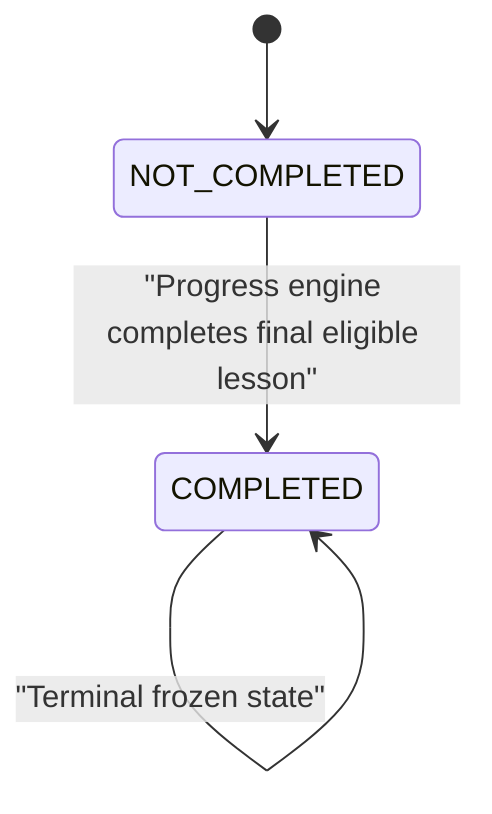
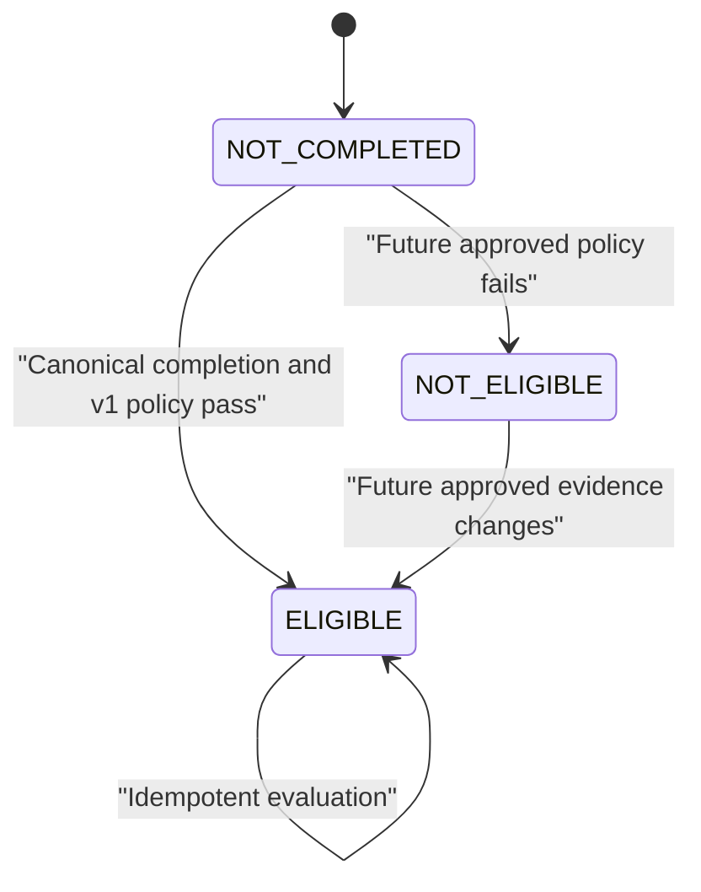
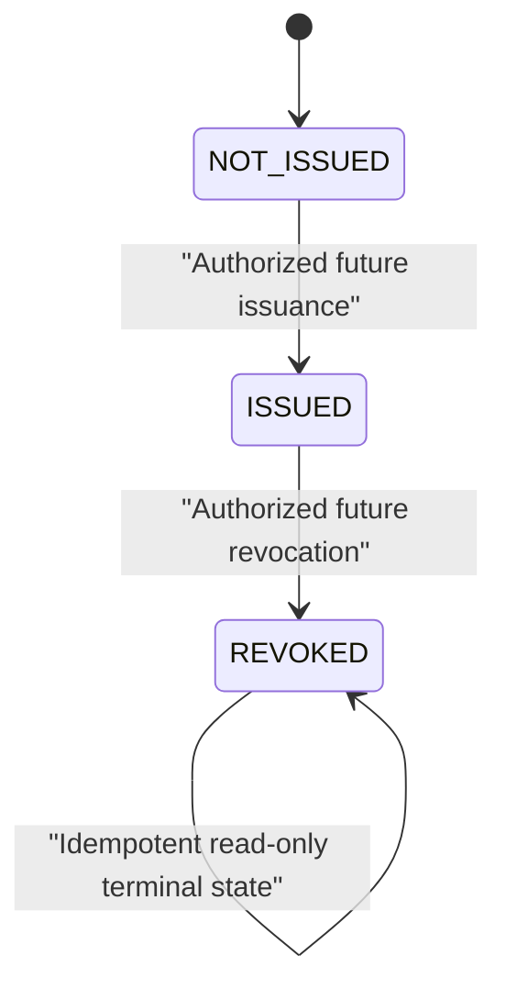

# Course Completion and Certificate Eligibility Contract

- **Contract version:** 1.0.0
- **Status:** Review candidate for Module 8.5A
- **Scope:** Architecture and API contract only
- **Default interface locale:** `uz-Latn`
- **Depends on:** Progress Tracking v1, Course Enrollment v1, Module 8.4 reporting
- **Intended consumers:** Module 8.5B, Module 8.5C, Module 8.6, web, mobile,
  Telegram, and future trusted integrations

## 1. Authority and precedence

After approval, this document is the canonical repository contract for course
completion evidence, certificate eligibility, and the boundary between
eligibility and certificate issuance.

The following precedence applies:

1. The [Progress Tracking Contract](./PROGRESS_TRACKING_CONTRACT.md) remains
   authoritative for lesson, block, course-progress, and enrollment-completion
   behavior.
2. This contract is authoritative for evaluating certificate eligibility from
   canonical completion evidence and for exposing eligibility or certificate
   status.
3. The
   [Certificate Eligibility OpenAPI](./openapi/course-completion-certificate-eligibility.v1.yaml)
   is authoritative for HTTP paths, request and response DTOs, permissions, and
   public error codes.
4. [ADR-003](./design-system/decisions/ADR-003-course-completion-certificate-eligibility.md)
   records the architectural rationale.
5. General certificate descriptions in `PROJECT_ARCHITECTURE.md`,
   `DATABASE_ARCHITECTURE.md`, and the Design System are informative where they
   do not contradict the contracts above.

No runtime, schema, migration, seed, frontend, certificate artifact, or
deployment work is authorized by Module 8.5A.

## 2. Scope and non-goals

### 2.1 In scope

- Canonical definitions
- Course-completion evidence requirements
- Certificate-eligibility policy and state
- Evidence snapshot and policy versioning
- Recalculation and historical-stability rules
- Certificate-status boundary
- Authorization and capability policy
- REST and DTO contract
- Accessibility, audit, privacy, and future-compatibility rules

### 2.2 Non-goals

This contract does not authorize or define:

- PDF or image generation
- Certificate templates or template editors
- QR codes or public verification pages
- Email, push, Telegram, or other delivery
- Download, printing, signing, seals, or signatures
- Media or storage-provider integration
- Reissue behavior
- Assessment, attendance, or manual-approval runtime
- Public certificate verification

Those capabilities require separately approved contracts. Their absence must
not be represented by placeholder UI or fabricated production data.

## 3. Definitions

### 3.1 Course Completion

Course Completion is the terminal result owned by Progress Tracking v1. An
enrollment is completed only when the progress engine atomically establishes:

- enrollment status is `COMPLETED`;
- `completedAt` is non-null;
- the enrollment progress root is frozen;
- `coursePercentage` is exactly `100`;
- `totalEligibleLessons` is greater than zero;
- `completedLessons` equals `totalEligibleLessons`;
- a fixed-column `COURSE_COMPLETED` progress event captures the completion
  snapshot.

Course Completion is enrollment-scoped. A later re-enrollment is a separate
lifecycle and cannot reuse completion or eligibility from an earlier
enrollment.

### 3.2 Certificate Eligibility

Certificate Eligibility is a versioned backend decision that a particular
completed enrollment satisfies one approved certificate-eligibility policy.
It is not calculated by a client and is not inferred solely from a displayed
percentage.

For contract version 1.0.0, the only supported eligibility policy is
`COURSE_COMPLETION_ONLY`.

### 3.3 Certificate Issued

Certificate Issued means an authorized future issuance workflow has created an
immutable certificate record from one eligible evidence snapshot. Issuance
does not change course completion or the eligibility evidence used to justify
it.

An eligibility response saying `ELIGIBLE` does not mean a certificate has been
issued.

### 3.4 Certificate Revoked

Certificate Revoked means an issued certificate is no longer valid because an
authorized administrator completed the future revocation workflow. Revocation
preserves the certificate record, issuance evidence, actor, reason, and
timestamp.

Revoking a certificate does not rewrite the learner's completed enrollment and
does not silently erase the eligibility decision that supported issuance.

### 3.5 Expired

Certificate expiry is not supported in v1. The public v1 certificate-status
enum therefore does not contain `EXPIRED`.

Adding expiry later requires a contract revision defining:

- which policy sets the expiry;
- whether renewal or reissue is allowed;
- the authoritative clock and transition;
- historical and public-verification behavior;
- notification and accessibility requirements.

Clients must not infer expiry from course archival, policy replacement, or
elapsed time.

## 4. Domain ownership and authoritative state

Completion, eligibility, and certificates are related but remain separate
authoritative concepts.

| Concern                         | Authoritative owner       | Canonical evidence                                           |
| ------------------------------- | ------------------------- | ------------------------------------------------------------ |
| Course completion               | Progress Tracking         | Completed enrollment, frozen progress root, completion event |
| Certificate eligibility         | Certificate Eligibility   | Versioned eligibility decision and evidence snapshot         |
| Certificate issuance/revocation | Future Certificate module | Immutable certificate lifecycle record                       |
| UI presentation                 | API DTO and capabilities  | Never client-derived                                         |

The certificate module may read progress completion evidence through an
approved service/repository boundary. It must not recalculate lesson progress
using a second algorithm or update Progress Tracking tables directly.

## 5. State machines

### 5.1 Course-completion state

This state machine is owned by Progress Tracking and is restated only to define
the eligibility input.

`COMPLETED` cannot return to `NOT_COMPLETED` in v1.

### 5.2 Eligibility state

Eligibility is not a combined certificate lifecycle.

V1 behavior:

- `NOT_COMPLETED` is a derived response and requires no persisted decision.
- A valid `COURSE_COMPLETION_ONLY` evaluation produces `ELIGIBLE`.
- `NOT_ELIGIBLE` is reserved for an approved future policy with requirements
  beyond completion. Current runtime must not emit it without a later approved
  contract.
- Eligibility is not revoked in v1. Evidence correction requires a separately
  approved administrative invalidation contract.

### 5.3 Certificate state

Direct transitions from `NOT_ISSUED` to `REVOKED`, or from `REVOKED` to
`ISSUED`, are forbidden. Reissue requires its own future contract and a new
certificate record.

### 5.4 Composite UI state

`CERTIFIED` is a presentation label, not a persisted eligibility state.

| Completion    | Eligibility     | Certificate  | Composite UI state  |
| ------------- | --------------- | ------------ | ------------------- |
| Not completed | `NOT_COMPLETED` | `NOT_ISSUED` | Not completed       |
| Completed     | `ELIGIBLE`      | `NOT_ISSUED` | Eligible            |
| Completed     | `ELIGIBLE`      | `ISSUED`     | Certified           |
| Completed     | `ELIGIBLE`      | `REVOKED`    | Certificate revoked |

Clients must render the values returned by the backend and must not reconstruct
this table from unrelated responses.

## 6. Eligibility rules

### 6.1 V1 policy

The only approved policy code is `COURSE_COMPLETION_ONLY`, version `1`.

An enrollment is eligible when all of these conditions are true:

1. The enrollment exists and belongs to the requested actor scope.
2. The enrollment status is `COMPLETED`.
3. `completedAt` is non-null.
4. The enrollment progress root exists and is frozen.
5. The frozen course percentage is `100`.
6. `totalEligibleLessons > 0`.
7. `completedLessons = totalEligibleLessons`.
8. The completion curriculum version is available.
9. Canonical completion evidence is internally consistent.

The backend must fail closed when completion evidence is missing or
contradictory. It must not repair or fabricate evidence during a read request.

### 6.2 Lesson and block completion

- Required lesson completion is inherited from Progress Tracking v1.
- Required, visible, active blocks enter lesson prerequisites and aggregates.
- Optional blocks do not block lesson completion.
- Certificate Eligibility must consume the frozen course-completion snapshot;
  it must not recount current curriculum independently.

### 6.3 Assessments and passing scores

Assessment requirements and passing scores are not supported in eligibility v1
because no approved assessment runtime contract exists.

The v1 policy must represent assessment behavior as `NONE`. A later assessment
integration must add typed fields such as required assessment identity,
attempt policy, score scale, passing threshold, grading finality, and qualifying
attempt snapshot. It must not use unrestricted JSON or client-calculated scores.

Adding an assessment requirement is a policy-version change and must not
silently invalidate an existing eligibility or certificate.

### 6.4 Manual approval

Manual approval is not supported in v1. Teachers and administrators cannot
override incomplete progress or manually mark a learner eligible.

A future manual-approval policy requires:

- an explicit permission;
- reviewer scope;
- reason and evidence fields;
- optimistic concurrency;
- step-up policy where required;
- immutable audit history;
- approved pending, approved, and rejected states.

### 6.5 Attendance

Attendance is not supported in v1. No attendance percentage or client activity
may be treated as evidence.

### 6.6 Future extensibility

Eligibility policy growth must use versioned, typed policy variants. Supported
future examples may include:

- required final assessment;
- multiple required assessments;
- manual review;
- verified attendance;
- externally verified prerequisite.

Unknown policy types must fail closed. Clients display backend-provided status,
reason codes, and capabilities rather than interpreting policy internals.

## 7. Evidence snapshot

### 7.1 Required persisted evidence

Module 8.5B must propose an additive, normalized persistence model capable of
retaining:

- eligibility evaluation UUID;
- enrollment UUID;
- course UUID;
- student UUID through trusted relational references;
- eligibility status;
- policy code and immutable policy version;
- evaluation version;
- evaluated timestamp;
- completion timestamp;
- completion curriculum version;
- completion version;
- completed lesson count;
- eligible lesson count;
- course percentage;
- fixed reason codes;
- evaluating system/actor attribution;
- created timestamp;
- supersession linkage if a later approved reevaluation is introduced.

The evidence used for an issued certificate must remain reproducible even when
the course title, curriculum, policy, or learner profile later changes.

### 7.2 Data that must not be stored in eligibility evidence

- Passwords, tokens, secrets, session identifiers, or authorization headers
- Raw IP addresses
- Full request or response bodies
- Learner names, email addresses, or other mutable profile copies
- Raw lesson activity history
- Assessment answers or answer keys
- Arbitrary or unrestricted JSON metadata
- PDF, QR, signature, seal, template, or storage-provider data
- Client-calculated percentages or client timestamps

Certificate issuance may later require deliberate display-name and course-title
snapshots, but those belong to the issuance contract, not eligibility evidence.

### 7.3 Snapshot versioning

- `policyVersion` identifies the exact eligibility policy.
- `evaluationVersion` supports optimistic concurrency and future reevaluation.
- `completionVersion` and `completionCurriculumVersion` identify the canonical
  progress snapshot.
- Issuance must reference one immutable eligibility evaluation by UUID.
- Existing evidence is never updated merely because a course or policy changes.

## 8. Evaluation and transaction rules

### 8.1 New completions

Module 8.5C must integrate eligibility evaluation with automatic course
completion without creating a second completion algorithm.

The preferred boundary is one PostgreSQL `SERIALIZABLE` transaction covering:

1. progress eligibility validation;
2. final lesson completion;
3. canonical aggregate update;
4. enrollment transition to `COMPLETED`;
5. frozen progress snapshot;
6. `COURSE_COMPLETED` event;
7. v1 eligibility evaluation and evidence snapshot.

If implementation constraints make this atomic boundary impossible, Module
8.5C must return to architecture review rather than silently use eventual
consistency.

### 8.2 Repeated evaluation

Evaluation is idempotent for the same enrollment, policy version, and canonical
completion version. Repetition returns the authoritative decision without
creating duplicate current records.

### 8.3 Existing completed enrollments

Module 8.5B must provide preflight and backfill planning. Backfill may create an
eligibility decision only when existing frozen completion evidence satisfies
every v1 invariant.

Rows with missing or contradictory evidence must be reported for deliberate
resolution. Historical completion must never be fabricated from the current
curriculum.

## 9. Recalculation rules

### 9.1 Curriculum changes

- Active enrollments follow Progress Tracking curriculum-version rules.
- Completed enrollments and their eligibility evidence remain frozen.
- Publishing, unpublishing, reordering, archiving, or deleting later curriculum
  does not recalculate completed eligibility.
- A future explicit evidence-correction workflow must be audited and versioned.

### 9.2 Course archival or deletion

Course archival or soft deletion does not revoke completion, eligibility, or an
issued certificate. It may affect content access but not historical evidence.

Hard deletion must remain restricted while completion, eligibility, or
certificate records reference the course.

### 9.3 Enrollment cancellation and suspension

- `SUSPENDED` and `CANCELLED` enrollments are not eligible.
- Current enrollment lifecycle rules do not allow `COMPLETED` to transition to
  `CANCELLED` or `SUSPENDED`.
- Cancelling an incomplete enrollment preserves progress history but produces
  no eligibility decision.

### 9.4 Policy updates

- Policy updates create a new immutable policy version.
- The new version applies prospectively unless a separately approved
  reevaluation operation explicitly selects historical enrollments.
- Existing eligible decisions and issued certificates never change silently.
- A policy editor must use typed and validated fields; it cannot expose JSON,
  SQL, code, or general-purpose expressions.

### 9.5 Retakes and re-enrollment

Each enrollment lifecycle is evaluated independently. A retake or
re-enrollment receives a new enrollment UUID, completion snapshot, eligibility
evaluation, and any future certificate.

## 10. Certificate issuance and revocation boundary

### 10.1 Issuance

Issuance is reserved for Module 8.6 and requires:

- an `ELIGIBLE` evaluation;
- the exact eligibility evaluation UUID and version;
- `certificates.issue`;
- service-level authorization;
- an `Idempotency-Key`;
- explicit audit;
- recent-authentication/step-up approval before implementation;
- a future certificate issuance contract for numbering, templates, artifacts,
  and public verification.

Module 8.5C may expose eligibility and `NOT_ISSUED` status but must not issue a
certificate.

### 10.2 Revocation

Revocation is reserved for Module 8.6.

- Only an `ADMIN` with `certificates.revoke` may revoke.
- Teacher, student, and future auditor roles cannot revoke.
- A reason code and bounded human-readable reason are required.
- The action requires confirmation, recent authentication/step-up, optimistic
  concurrency, and audit.
- Revocation is idempotent only when the same certificate is already revoked
  with the same authoritative outcome.
- Revocation never deletes the certificate or rewrites completion evidence.
- The API and UI immediately expose `REVOKED` after success.

## 11. Authorization contract

Authorization is enforced by route middleware and repeated in the service
policy. Frontend guards are usability controls only.

| Actor          | Eligibility/status access                    | Issue                | Revoke                |
| -------------- | -------------------------------------------- | -------------------- | --------------------- |
| Student        | Own enrollment only                          | No                   | No                    |
| Teacher        | Enrollment in currently assigned course      | No                   | No                    |
| Admin          | Permission-scoped access                     | `certificates.issue` | `certificates.revoke` |
| Future auditor | Read-only scope after role contract approval | No                   | No                    |

Approved permission identifiers for future seeding:

- `certificate_eligibility.self_read`
- `certificate_eligibility.course_read`
- `certificates.self_read`
- `certificates.course_read`
- `certificates.issue`
- `certificates.revoke`

Possessing a role without the matching permission is insufficient. Admin is not
an implicit bypass. Teacher access requires current course assignment and the
enrollment must belong to that course. Unauthorized resource combinations must
not reveal whether another learner's eligibility or certificate exists.

The future auditor role and its permission are not approved in v1 and must not
be seeded or implemented by Modules 8.5B or 8.5C.

## 12. REST API contract

The full documentation-only API is
[course-completion-certificate-eligibility.v1.yaml](./openapi/course-completion-certificate-eligibility.v1.yaml).

### 12.1 Read operations planned for Module 8.5C

| Method | Route                                                                           | Actor                     | Permission                            |
| ------ | ------------------------------------------------------------------------------- | ------------------------- | ------------------------------------- |
| `GET`  | `/api/v1/me/enrollments/{enrollmentId}/certificate-eligibility`                 | Student owner             | `certificate_eligibility.self_read`   |
| `GET`  | `/api/v1/me/enrollments/{enrollmentId}/certificate-status`                      | Student owner             | `certificates.self_read`              |
| `GET`  | `/api/v1/courses/{courseId}/enrollments/{enrollmentId}/certificate-eligibility` | Assigned teacher or admin | `certificate_eligibility.course_read` |
| `GET`  | `/api/v1/courses/{courseId}/enrollments/{enrollmentId}/certificate-status`      | Assigned teacher or admin | `certificates.course_read`            |

Admin-wide reads may use the course-scoped operations when the admin holds the
documented course-read permissions. A separate global-search endpoint is not
approved by this contract.

### 12.2 Future Module 8.6 mutations

| Method | Route                                             | Actor | Permission            | Availability    |
| ------ | ------------------------------------------------- | ----- | --------------------- | --------------- |
| `POST` | `/api/v1/enrollments/{enrollmentId}/certificates` | Admin | `certificates.issue`  | Future boundary |
| `POST` | `/api/v1/certificates/{certificateId}/revoke`     | Admin | `certificates.revoke` | Future boundary |

These operations are documented to reserve semantics. They remain unavailable
until the Module 8.6 issuance, step-up, numbering, template, and audit contracts
are approved.

### 12.3 Response DTOs

`CertificateEligibility` contains:

- enrollment and course references;
- canonical completion summary;
- eligibility status;
- policy code and version when evaluated;
- eligibility evaluation UUID and version when evaluated;
- evaluated timestamp;
- stable reason codes;
- backend-authoritative capabilities.

`EnrollmentCertificateStatus` contains:

- enrollment and course references;
- `NOT_ISSUED`, `ISSUED`, or `REVOKED`;
- minimal certificate reference when issued or revoked;
- backend-authoritative capabilities.

No response contains raw events, assessment answers, internal audit metadata,
tokens, storage paths, or unrestricted policy data.

### 12.4 Stable error codes

| HTTP | Code                           | Meaning                                             |
| ---- | ------------------------------ | --------------------------------------------------- |
| 401  | `AUTHENTICATION_REQUIRED`      | No authenticated principal                          |
| 401  | `INVALID_ACCESS_TOKEN`         | Access token is invalid or expired                  |
| 403  | `ACCESS_DENIED`                | Role or permission is insufficient                  |
| 403  | `COURSE_SCOPE_DENIED`          | Teacher is outside the assigned course              |
| 403  | `PROGRESS_SCOPE_DENIED`        | Enrollment progress is outside actor scope          |
| 404  | `COURSE_NOT_FOUND`             | Course unavailable in permitted scope               |
| 404  | `ENROLLMENT_NOT_FOUND`         | Enrollment unavailable in permitted scope           |
| 404  | `CERTIFICATE_NOT_FOUND`        | Certificate unavailable in permitted scope          |
| 409  | `COMPLETION_EVIDENCE_CONFLICT` | Canonical completion evidence contradicts itself    |
| 409  | `ELIGIBILITY_VERSION_CONFLICT` | Expected eligibility version is stale               |
| 409  | `CERTIFICATE_ALREADY_ISSUED`   | Active certificate already exists                   |
| 409  | `CERTIFICATE_ALREADY_REVOKED`  | Certificate is already revoked                      |
| 409  | `IDEMPOTENCY_KEY_REUSED`       | Key was reused for a different request              |
| 422  | `COURSE_NOT_COMPLETED`         | Enrollment has not reached canonical completion     |
| 422  | `CERTIFICATE_NOT_ELIGIBLE`     | Approved policy requirements are not met            |
| 422  | `VALIDATION_ERROR`             | Parameters, body, or headers are invalid            |
| 428  | `STEP_UP_REQUIRED`             | Future high-risk action needs recent authentication |
| 429  | `RATE_LIMIT_EXCEEDED`          | Request limit exceeded                              |

Reads return a successful `NOT_COMPLETED` eligibility DTO for a valid,
authorized incomplete enrollment. `COURSE_NOT_COMPLETED` is reserved for a
future issuance attempt, not ordinary status reads.

## 13. Frontend capability contract

The frontend renders only backend-authoritative DTOs and capabilities.

Required eligibility states:

- loading;
- not completed;
- eligible;
- not eligible when a future policy supports it;
- certificate issued;
- certificate revoked;
- empty/unavailable evidence;
- permission denied;
- safe recoverable error;
- offline with last-confirmed-data labeling;
- background refresh.

Required capability fields:

- `canReadEligibility`;
- `canReadCertificateStatus`;
- `canIssueCertificate`;
- `canRevokeCertificate`.

Rules:

- Students never receive issue or revoke controls.
- Teachers receive read-only scoped status.
- Admin controls appear only when both capability and approved runtime exist.
- `100%` displayed elsewhere is not sufficient to show `ELIGIBLE`.
- No certificate badge appears until the certificate-status DTO says `ISSUED`.
- Revoked status must replace any valid-certificate presentation immediately
  after authoritative refresh.
- No future action may be rendered as a disabled teaser before its contract is
  implemented.

## 14. Accessibility contract

Future UI must meet WCAG 2.2 AA and the approved Design System:

- use semantic headings and landmarks;
- expose status using text, not color alone;
- provide a programmatic label and description for completion, eligibility,
  issuance, and revocation states;
- announce asynchronously updated status with a restrained live region;
- move focus appropriately after route-level errors or destructive dialogs;
- make confirmation, retry, and navigation controls keyboard operable;
- preserve visible focus indicators;
- avoid countdowns or time-dependent behavior because expiry is not supported;
- localize dates, numbers, reasons, and status text;
- ensure revoked and permission-denied states are understandable without icons.

Certificate validity must never be communicated only through decorative seals,
color, QR imagery, or downloadable artifacts.

## 15. Audit contract

Required future audit actions:

- `certificate_eligibility.evaluated`;
- `certificate_eligibility.privileged_viewed`;
- `certificate.issued`;
- `certificate.revoked`;
- future policy creation, activation, archival, and reevaluation actions.

Audit records include:

- actor when applicable;
- action;
- subject type and UUID;
- enrollment/course scope;
- policy/evaluation/certificate version;
- timestamp;
- correlation ID;
- bounded reason code;
- safe before/after state for lifecycle changes.

Audit records must not copy full evidence DTOs, profile data, tokens, raw IP
addresses, assessment answers, or certificate artifacts.

Student self-reads do not require high-volume administrative audit entries.
Teacher and admin reads of individual student eligibility or certificate status
must be privacy-audited consistently with progress reporting.

## 16. Privacy and security

- Eligibility is private educational data.
- Student access is limited to the authenticated learner's enrollment.
- Teacher access is limited to currently assigned courses.
- Admin access requires explicit permissions and object-level policy.
- Public verification is outside this contract.
- Responses minimize learner identity fields.
- Revocation free text is administrative data and is not exposed to students;
  only an approved safe reason code may be returned.
- Rate limits must reflect status-read and high-risk mutation sensitivity.
- High-risk mutations require confirmation and an approved step-up contract.
- Server/database time is authoritative.
- Raw Prisma records and internal exceptions must never reach clients.
- Eligibility decisions must not be made by AI.
- Eligibility evidence and certificate audit history are retained only for an
  approved educational, fraud-prevention, verification, or legal purpose.
- The exact retention period, anonymization behavior, backup handling, and
  data-subject disclosure remain privacy/legal approval gates before production.
- Account erasure must minimize or anonymize profile data without destroying
  evidence that must lawfully remain; eligibility rows must not duplicate
  mutable profile fields.

## 17. Internationalization

- Stable machine values and error codes remain language-neutral.
- User-facing messages use translation keys.
- Uzbek Latin is the default interface language.
- Course content language and interface language remain independent.
- Dates and numbers are localized by clients from UTC/number DTO values.
- Persisted free-text revocation reasons are not translation resources.

## 18. Owner-managed and developer-managed boundaries

### Owner-managed after the relevant future modules exist

- View completion, eligibility, issuance, and revocation status.
- Configure only supported typed eligibility policy fields.
- Issue or revoke certificates through approved graphical workflows.
- Provide bounded reasons and confirmations.
- Review permitted audit history.

### Developer-managed

- Adding a new eligibility-policy type
- Adding assessment, attendance, or manual-review semantics
- Changing state machines or permissions
- Changing evidence fields or retention
- Schema changes and migrations
- Step-up/authentication changes
- Certificate generation, templates, signing, storage, or verification
- New integrations or delivery channels

The admin interface must never expose a general-purpose rules language, JSON
editor, code editor, SQL editor, or executable template.

## 19. Module boundaries and acceptance gates

### Module 8.5B — Schema and migration

May begin only after this contract and ADR-003 are approved. It may add the
minimum typed policy/evidence persistence, indexes, constraints, permission
seed, preflight, backfill strategy, and PostgreSQL tests. It must not add
runtime endpoints.

### Module 8.5C — Eligibility runtime and read UI

May begin only after Module 8.5B approval. It may implement deterministic v1
evaluation, approved read endpoints, capabilities, authorization, audit, and
read-only UI. It must not issue certificates.

### Module 8.6 — Certificate lifecycle

Requires a separate approval for step-up, numbering, template versioning,
artifact generation, verification, revocation, and reissue. The documented
future mutation paths in this contract do not independently authorize runtime.

## 20. Approval checklist

- Product approves completion-only v1 eligibility and unsupported rule types.
- Progress owner confirms no duplicate completion calculation.
- Architecture approves orthogonal completion, eligibility, and certificate
  state.
- Database owner approves immutable versioned evidence direction.
- Security approves permissions, course scope, step-up gates, and enumeration
  behavior.
- Privacy approves evidence minimization, audit fields, and retention before
  production.
- Accessibility approves capability-driven status and future destructive flows.
- OpenAPI parses and matches every DTO, permission, error, and availability
  marker in this document.
- Mobile and Telegram consumers can implement the same contract without
  web-only assumptions.

Until every required owner records approval, this document remains a review
candidate and Module 8.5B is blocked.

## 21. Repository evidence reviewed

Module 8.5A reconciles these existing references:

- `PROGRESS_TRACKING_CONTRACT.md` defines terminal course completion and
  explicitly excludes certificate rules from Progress Tracking v1.
- `openapi/progress-tracking.v1.yaml` exposes completed-course and reporting
  projections but no certificate-eligibility operation or DTO.
- `progress-tracking-ui.md` blocks certificate UI until an authoritative
  eligibility DTO exists.
- `PROJECT_ARCHITECTURE.md` describes the future certificate lifecycle at a
  conceptual level.
- `DATABASE_ARCHITECTURE.md` describes a future `certificates` table but does
  not define an implemented eligibility-evidence model.
- `AGENTS.md` requires typed owner-managed eligibility settings, distinct issue
  and revoke permissions, audit, and destructive confirmation.
- The current Prisma schema contains enrollment and progress completion
  evidence but no eligibility-policy, eligibility-evaluation, or certificate
  model.
- The current backend and frontend contain completion and progress reporting
  behavior but no certificate eligibility or certificate runtime.

These references remain valid within their scopes. This contract supplies the
previously missing boundary and does not retroactively authorize runtime.
