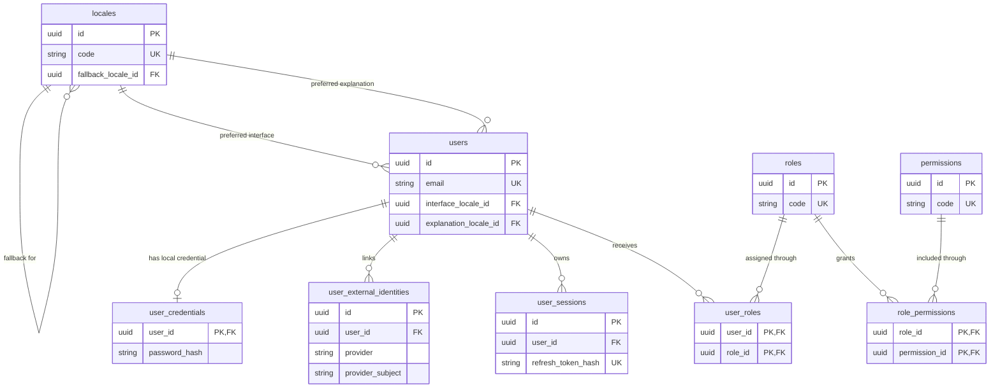
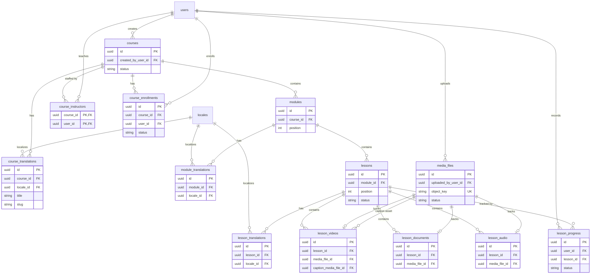
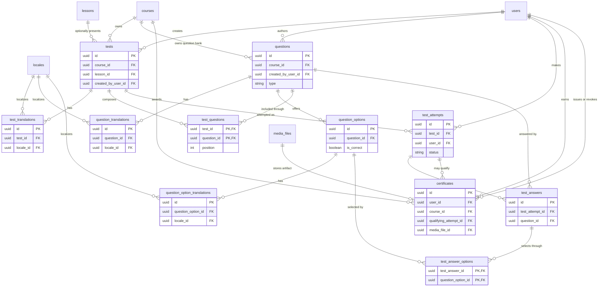
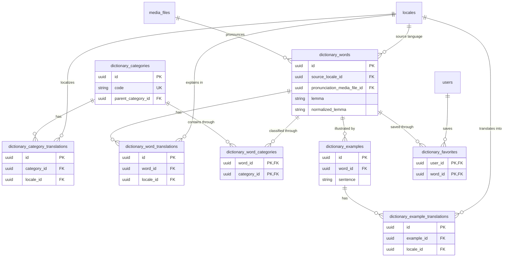
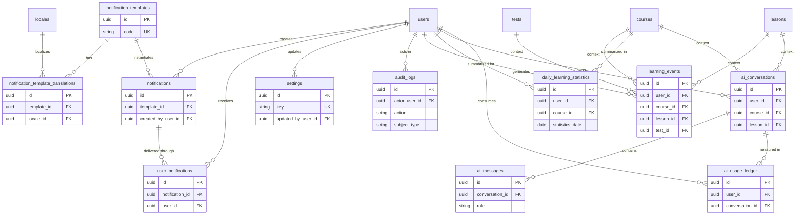

# Turk Tili LMS — Database Architecture

**Document status:** Proposed database blueprint  
**Implementation status:** No database models have been created  
**Database platform:** PostgreSQL  
**ORM direction:** Prisma  
**Default interface locale:** Uzbek, Latin script (`uz-Latn`)  
**Last updated:** July 2026

## Document purpose

This document defines the logical database architecture for Turk Tili LMS. It
is a future implementation blueprint, not an executable schema. It intentionally
contains no SQL, Prisma models, or application code.

The design supports one API-first backend serving the React web application,
Android and iOS applications, a Telegram bot, and future trusted clients. The
database is private infrastructure. Clients never connect to it directly and
never define authoritative business rules.

The blueprint uses a modular relational design:

- Identity and access control
- Learning content and enrollment
- Media and progress
- Assessments and certificates
- Dictionary
- Notifications and settings
- Audit and analytics
- AI assistance
- Localization across all user-facing domains

Table and field names are presented in the intended PostgreSQL naming style.
Exact data types, constraints, and migrations must be reviewed when the schema
is implemented.

### Module #8 progress blueprint notice

The original `lesson_progress` entries in this broad blueprint predate the
implemented course-enrollment lifecycle and the decision to exclude video
playback position from initial Module #8. The Module 8.1A review candidates
[ADR-002](./design-system/decisions/ADR-002-progress-tracking-contract.md) and
[Progress Tracking Contract](./PROGRESS_TRACKING_CONTRACT.md) propose replacing
canonical `user_id + lesson_id`, optional enrollment identity, video
`resume_position_seconds`, and one generic version with enrollment-bound
lesson/block identity, a progress root, fixed-column events, idempotency, and
separate completion/activity/curriculum versions.

Until ADR-002 is accepted, no progress schema is authorized. After acceptance,
the Module #8 contract supersedes the legacy `lesson_progress` assumptions for
Module 8.1B. Other domain sections of this database blueprint remain unaffected.

---

## 1. Database overview

PostgreSQL is the transactional system of record. It stores authoritative user
identity, permissions, learning content, enrollment, progress, assessment,
dictionary, notification, certificate, audit, analytics, and AI usage metadata.

Binary files are not stored in PostgreSQL. Images, documents, audio, videos,
captions, and generated certificate files belong in object storage. The
`media_files` table stores metadata, ownership, lifecycle state, and the opaque
object key required to locate each asset through authorized backend services.

### 1.1 Architectural goals

- Preserve strong relational integrity for identity, access, grading,
  enrollment, and certification.
- Keep domain ownership clear and avoid cross-module write coupling.
- Support Uzbek Latin as the default without embedding one language into core
  entity structures.
- Allow new interface and content languages through translation rows, not new
  columns.
- Preserve immutable assessment, certificate, and audit history.
- Support safe horizontal API scaling and asynchronous workers.
- Make common reads indexable and bounded.
- Keep personal data and security credentials isolated and auditable.
- Allow eventual consistency for analytics, notifications, search indexes,
  media processing, and AI usage aggregation.

### 1.2 Consistency boundaries

Use strong database transactions for:

- User creation and credential initialization
- Role and permission assignment
- Course enrollment state changes
- Lesson progress transitions that determine eligibility
- Test submission and authoritative scoring
- Certificate eligibility and issuance
- Notification creation and recipient assignment
- Transactional outbox publication when introduced

Eventual consistency is acceptable for:

- Search indexes
- Video and audio processing
- Notification delivery
- Statistics aggregates
- AI provider usage reconciliation
- CDN and object-storage deletion

### 1.3 Language architecture

The platform distinguishes:

- **Interface locale:** the language used by the application UI
- **Explanation locale:** the language used for definitions and explanations
- **Learning content locale:** the language of a course or lesson
- **Target language:** Turkish initially, with future language expansion

`locales` is the canonical locale registry. Translatable content lives in
dedicated translation tables with a unique parent-and-locale constraint. Core
tables contain language-neutral identity, lifecycle, ordering, ownership, and
policy fields.

The required default locale is `uz-Latn`. Locale codes use BCP 47-compatible
values such as `uz-Latn`, `tr`, and `en`.

### 1.4 Domain ownership

| Domain         | Owned tables                                                                                                             |
| -------------- | ------------------------------------------------------------------------------------------------------------------------ |
| Localization   | `locales` and all `*_translations` tables                                                                                |
| Identity       | `users`, `user_credentials`, `user_external_identities`, `user_sessions`                                                 |
| Access control | `roles`, `permissions`, `user_roles`, `role_permissions`                                                                 |
| Learning       | `courses`, `course_instructors`, `course_enrollments`, `modules`, `lessons`                                              |
| Media          | `media_files`, `lesson_videos`, `lesson_documents`, `lesson_audio`                                                       |
| Progress       | `lesson_progress`                                                                                                        |
| Assessment     | `tests`, `questions`, `question_options`, `test_questions`, `test_attempts`, `test_answers`, `test_answer_options`       |
| Certificates   | `certificates`                                                                                                           |
| Dictionary     | `dictionary_categories`, `dictionary_words`, `dictionary_word_categories`, `dictionary_examples`, `dictionary_favorites` |
| Notifications  | `notification_templates`, `notifications`, `user_notifications`                                                          |
| Configuration  | `settings`                                                                                                               |
| Audit          | `audit_logs`                                                                                                             |
| Analytics      | `learning_events`, `daily_learning_statistics`                                                                           |
| AI assistance  | `ai_conversations`, `ai_messages`, `ai_usage_ledger`                                                                     |

---

## 2. Entity Relationship Diagrams

The logical ERD is split into domain views so it remains readable. Together,
the diagrams cover every table in this blueprint.

### 2.1 Identity, localization, and RBAC

### 2.2 Courses, lessons, media, and progress

### 2.3 Assessments and certificates

### 2.4 Dictionary

### 2.5 Notifications, operations, analytics, and AI

---

## 3. Table catalog

This blueprint contains 52 tables. The short catalog is followed by detailed
specifications for every table.

| Domain        | Table                                | Short description                            |
| ------------- | ------------------------------------ | -------------------------------------------- |
| Localization  | `locales`                            | Supported interface and content locales      |
| Identity      | `users`                              | Platform account and lifecycle identity      |
| Identity      | `user_credentials`                   | One-to-one local password credential         |
| Identity      | `user_external_identities`           | Telegram and future provider identities      |
| Access        | `roles`                              | Named authorization roles                    |
| Access        | `permissions`                        | Atomic authorization capabilities            |
| Access        | `user_roles`                         | User-to-role assignments                     |
| Access        | `role_permissions`                   | Role-to-permission assignments               |
| Identity      | `user_sessions`                      | Refresh sessions and device metadata         |
| Learning      | `courses`                            | Language-neutral course records              |
| Localization  | `course_translations`                | Localized course title and description       |
| Learning      | `course_instructors`                 | Course-to-teacher assignments                |
| Learning      | `course_enrollments`                 | Student course enrollment lifecycle          |
| Learning      | `modules`                            | Ordered course sections                      |
| Localization  | `module_translations`                | Localized module content                     |
| Learning      | `lessons`                            | Ordered learning units                       |
| Localization  | `lesson_translations`                | Localized lesson content                     |
| Media         | `media_files`                        | Object-storage asset metadata                |
| Media         | `lesson_videos`                      | Video attachments and playback metadata      |
| Media         | `lesson_documents`                   | Document attachments                         |
| Media         | `lesson_audio`                       | Audio attachments                            |
| Progress      | `lesson_progress`                    | Per-user lesson progress                     |
| Assessment    | `tests`                              | Test policies and lifecycle                  |
| Localization  | `test_translations`                  | Localized test text                          |
| Assessment    | `questions`                          | Reusable course question bank                |
| Localization  | `question_translations`              | Localized prompts and explanations           |
| Assessment    | `question_options`                   | Answer options and scoring identity          |
| Localization  | `question_option_translations`       | Localized option text                        |
| Assessment    | `test_questions`                     | Ordered test question composition            |
| Assessment    | `test_attempts`                      | Student attempt lifecycle and score          |
| Assessment    | `test_answers`                       | One answer per attempted question            |
| Assessment    | `test_answer_options`                | Selected options for an answer               |
| Certificates  | `certificates`                       | Issued and revocable achievement records     |
| Dictionary    | `dictionary_categories`              | Hierarchical dictionary taxonomy             |
| Localization  | `dictionary_category_translations`   | Localized category labels                    |
| Dictionary    | `dictionary_words`                   | Canonical word or phrase entries             |
| Localization  | `dictionary_word_translations`       | Meanings in explanation locales              |
| Dictionary    | `dictionary_word_categories`         | Word-to-category classification              |
| Dictionary    | `dictionary_examples`                | Source-language example sentences            |
| Localization  | `dictionary_example_translations`    | Localized example translations               |
| Dictionary    | `dictionary_favorites`               | Student saved vocabulary                     |
| Notifications | `notification_templates`             | Stable notification definitions              |
| Localization  | `notification_template_translations` | Localized notification templates             |
| Notifications | `notifications`                      | Immutable notification instances             |
| Notifications | `user_notifications`                 | Recipient delivery and read state            |
| Configuration | `settings`                           | Typed platform configuration                 |
| Audit         | `audit_logs`                         | Immutable security and administrative audit  |
| Analytics     | `learning_events`                    | Append-only canonical learning events        |
| Analytics     | `daily_learning_statistics`          | Per-user daily aggregates                    |
| AI            | `ai_conversations`                   | User-owned AI conversation context           |
| AI            | `ai_messages`                        | Ordered AI conversation messages             |
| AI            | `ai_usage_ledger`                    | Provider usage, latency, and cost accounting |

---

## 4. Detailed table specifications

### 4.1 Localization and identity

#### `locales`

- **Purpose:** Canonical registry of supported interface, explanation, and
  learning-content locales.
- **Primary key:** `id`, UUID.
- **Important fields:** `code`, `display_name`, `native_name`, `text_direction`,
  `is_enabled`, `is_default`, `fallback_locale_id`, `created_at`, `updated_at`.
- **Foreign keys:** `fallback_locale_id` references `locales.id` and is nullable.
- **Relationships:** One locale may be the fallback for many locales and may
  localize many users, translations, courses, lessons, dictionary records, and
  notifications.
- **Indexes:** Unique `code`; partial unique index allowing only one default
  locale; index on `(is_enabled, code)`; index on `fallback_locale_id`.

#### `users`

- **Purpose:** Authoritative platform account, profile-level identity, status,
  and locale preferences.
- **Primary key:** `id`, UUID.
- **Important fields:** `email`, `phone_number`, `display_name`, `status`,
  `email_verified_at`, `phone_verified_at`, `interface_locale_id`,
  `explanation_locale_id`, `last_login_at`, `deleted_at`, `created_at`,
  `updated_at`.
- **Foreign keys:** `interface_locale_id` and `explanation_locale_id` reference
  `locales.id`.
- **Relationships:** One user may have one credential, many external identities,
  sessions, roles, enrollments, progress rows, attempts, certificates,
  favorites, notifications, events, audit actions, media uploads, and AI
  conversations.
- **Indexes:** Case-insensitive unique active email; unique normalized phone
  number when present; indexes on `status`, `deleted_at`, and
  `(status, created_at)`; locale preference indexes only if reporting requires
  them.

#### `user_credentials`

- **Purpose:** Isolates the local password credential and security state from
  general account data.
- **Primary key:** `user_id`, UUID, which is also the foreign key.
- **Important fields:** `password_hash`, `password_changed_at`,
  `failed_attempt_count`, `locked_until`, `requires_password_change`,
  `created_at`, `updated_at`.
- **Foreign keys:** `user_id` references `users.id`.
- **Relationships:** Exactly zero or one local credential per user. Users
  authenticated exclusively by an external provider may have none.
- **Indexes:** Primary key on `user_id`; optional index on `locked_until` for
  security operations. Password hashes are never indexed or searchable.

#### `user_external_identities`

- **Purpose:** Links a user to Telegram or a future OpenID/OAuth identity
  without using a mutable username as identity.
- **Primary key:** `id`, UUID.
- **Important fields:** `provider`, `provider_subject`, `provider_username`,
  `linked_at`, `last_used_at`, `metadata`, `created_at`, `updated_at`.
- **Foreign keys:** `user_id` references `users.id`.
- **Relationships:** Many external identities may belong to one user. A
  provider subject belongs to at most one platform user.
- **Indexes:** Unique `(provider, provider_subject)`; unique
  `(user_id, provider, provider_subject)`; index on `user_id`; optional provider
  index for operational lookup.

#### `roles`

- **Purpose:** Stores stable role definitions such as Admin, Teacher, and
  Student.
- **Primary key:** `id`, UUID.
- **Important fields:** `code`, `name`, `description`, `is_system`,
  `created_at`, `updated_at`.
- **Foreign keys:** None.
- **Relationships:** Many users may receive many roles through `user_roles`;
  many permissions may be granted through `role_permissions`.
- **Indexes:** Unique `code`; index on `is_system`.

#### `permissions`

- **Purpose:** Stores atomic backend authorization capabilities such as
  `courses.publish` and `assessments.grade`.
- **Primary key:** `id`, UUID.
- **Important fields:** `code`, `resource`, `action`, `description`,
  `created_at`, `updated_at`.
- **Foreign keys:** None.
- **Relationships:** Many permissions may belong to many roles through
  `role_permissions`.
- **Indexes:** Unique `code`; index on `(resource, action)`.

#### `user_roles`

- **Purpose:** Assigns roles to users with attribution and optional expiry.
- **Primary key:** Composite `(user_id, role_id)`.
- **Important fields:** `assigned_by_user_id`, `assigned_at`, `expires_at`.
- **Foreign keys:** `user_id` and `assigned_by_user_id` reference `users.id`;
  `role_id` references `roles.id`.
- **Relationships:** Resolves the many-to-many relationship between users and
  roles.
- **Indexes:** Primary key `(user_id, role_id)`; index on `role_id`; index on
  `assigned_by_user_id`; partial index on `expires_at` for active expiring
  assignments.

#### `role_permissions`

- **Purpose:** Grants atomic permissions to roles.
- **Primary key:** Composite `(role_id, permission_id)`.
- **Important fields:** `granted_by_user_id`, `granted_at`.
- **Foreign keys:** `role_id` references `roles.id`; `permission_id` references
  `permissions.id`; `granted_by_user_id` references `users.id`.
- **Relationships:** Resolves the many-to-many relationship between roles and
  permissions.
- **Indexes:** Primary key `(role_id, permission_id)`; reverse index on
  `(permission_id, role_id)`; index on `granted_by_user_id`.

#### `user_sessions`

- **Purpose:** Represents revocable web, mobile, and trusted-client refresh
  sessions.
- **Primary key:** `id`, UUID.
- **Important fields:** `refresh_token_hash`, `token_family_id`, `client_type`,
  `device_name`, `ip_hash`, `user_agent_summary`, `last_used_at`, `expires_at`,
  `revoked_at`, `revocation_reason`, `created_at`.
- **Foreign keys:** `user_id` references `users.id`; `replaced_by_session_id`
  may self-reference `user_sessions.id`.
- **Relationships:** Many sessions belong to one user; a rotated session may
  point to its replacement.
- **Indexes:** Unique `refresh_token_hash`; index on `(user_id, revoked_at,
expires_at)`; index on `token_family_id`; index on `expires_at` for cleanup.

### 4.2 Learning content and enrollment

#### `courses`

- **Purpose:** Language-neutral course identity, ownership, level, lifecycle,
  and publication policy.
- **Primary key:** `id`, UUID.
- **Important fields:** `code`, `level`, `status`, `visibility`,
  `created_by_user_id`, `published_at`, `archived_at`, `deleted_at`,
  `created_at`, `updated_at`.
- **Foreign keys:** `created_by_user_id` references `users.id`.
- **Relationships:** One course has many translations, instructors,
  enrollments, modules, tests, certificates, learning events, and statistics.
- **Indexes:** Unique `code`; indexes on `(status, visibility, published_at)`,
  `created_by_user_id`, `level`, and `deleted_at`; partial index for published,
  non-deleted courses.

#### `course_translations`

- **Purpose:** Stores locale-specific course title, summary, description, slug,
  and search metadata.
- **Primary key:** `id`, UUID.
- **Important fields:** `title`, `summary`, `description`, `slug`,
  `search_text`, `translation_status`, `published_at`, `created_at`,
  `updated_at`.
- **Foreign keys:** `course_id` references `courses.id`; `locale_id` references
  `locales.id`; optional `translated_by_user_id` and `reviewed_by_user_id`
  reference `users.id`.
- **Relationships:** Many translations belong to one course; exactly one
  translation is allowed per course and locale.
- **Indexes:** Unique `(course_id, locale_id)`; unique `(locale_id, slug)` among
  active translations; full-text index on `search_text`; indexes on
  `(locale_id, translation_status)` and reviewer workflow fields.

#### `course_instructors`

- **Purpose:** Assigns teachers to a course with a scoped instructional role.
- **Primary key:** Composite `(course_id, user_id)`.
- **Important fields:** `instructor_role`, `assigned_by_user_id`, `assigned_at`,
  `removed_at`.
- **Foreign keys:** `course_id` references `courses.id`; `user_id` and
  `assigned_by_user_id` reference `users.id`.
- **Relationships:** Resolves the many-to-many relationship between courses and
  teacher users.
- **Indexes:** Primary key `(course_id, user_id)`; reverse index on
  `(user_id, course_id)`; partial active-assignment indexes by course and user.

#### `course_enrollments`

- **Purpose:** Tracks a user's course access and enrollment lifecycle.
- **Primary key:** `id`, UUID.
- **Important fields:** `status`, `enrollment_source`, `enrolled_at`,
  `started_at`, `completed_at`, `expires_at`, `unenrolled_at`,
  `assigned_by_user_id`, `created_at`, `updated_at`.
- **Foreign keys:** `course_id` references `courses.id`; `user_id` and optional
  `assigned_by_user_id` reference `users.id`.
- **Relationships:** Many users enroll in many courses; the row carries
  lifecycle attributes that make a simple composite join insufficient.
- **Indexes:** Unique `(course_id, user_id)` for the current enrollment model;
  indexes on `(user_id, status)`, `(course_id, status)`, `expires_at`, and
  `completed_at`.

#### `modules`

- **Purpose:** Defines ordered, language-neutral sections within a course.
- **Primary key:** `id`, UUID.
- **Important fields:** `position`, `status`, `is_required`, `available_from`,
  `created_at`, `updated_at`, `deleted_at`.
- **Foreign keys:** `course_id` references `courses.id`.
- **Relationships:** Many modules belong to one course; one module has many
  translations and lessons.
- **Indexes:** Unique active `(course_id, position)`; index on
  `(course_id, status, position)`; index on `deleted_at`.

#### `module_translations`

- **Purpose:** Stores localized module title and description.
- **Primary key:** `id`, UUID.
- **Important fields:** `title`, `description`, `translation_status`,
  `created_at`, `updated_at`.
- **Foreign keys:** `module_id` references `modules.id`; `locale_id` references
  `locales.id`; optional translator and reviewer fields reference `users.id`.
- **Relationships:** Many translations belong to one module; one per locale.
- **Indexes:** Unique `(module_id, locale_id)`; index on
  `(locale_id, translation_status)`.

#### `lessons`

- **Purpose:** Defines an ordered learning unit and its progression policy.
- **Primary key:** `id`, UUID.
- **Important fields:** `position`, `lesson_type`, `status`,
  `estimated_duration_seconds`, `is_required`, `completion_policy`,
  `published_at`, `deleted_at`, `created_at`, `updated_at`.
- **Foreign keys:** `module_id` references `modules.id`.
- **Relationships:** Many lessons belong to one module; one lesson has many
  translations, media attachments, progress rows, tests, events, and AI
  conversation contexts.
- **Indexes:** Unique active `(module_id, position)`; indexes on
  `(module_id, status, position)`, `lesson_type`, `published_at`, and
  `deleted_at`.

#### `lesson_translations`

- **Purpose:** Stores localized lesson title, summary, and structured learning
  content.
- **Primary key:** `id`, UUID.
- **Important fields:** `title`, `summary`, `content`, `translation_status`,
  `content_version`, `published_at`, `created_at`, `updated_at`.
- **Foreign keys:** `lesson_id` references `lessons.id`; `locale_id` references
  `locales.id`; optional translator and reviewer fields reference `users.id`.
- **Relationships:** Many translations belong to one lesson; exactly one row
  exists per lesson, locale, and active content version policy.
- **Indexes:** Unique `(lesson_id, locale_id)` for the current version; indexes
  on `(locale_id, translation_status)`, `published_at`; optional full-text index
  for approved searchable content.

### 4.3 Media and progress

#### `media_files`

- **Purpose:** Stores metadata and lifecycle state for object-storage assets;
  never stores the binary payload.
- **Primary key:** `id`, UUID.
- **Important fields:** `object_key`, `storage_provider`, `bucket`,
  `original_filename`, `mime_type`, `detected_mime_type`, `byte_size`,
  `checksum_sha256`, `status`, `visibility`, `scan_status`, `metadata`,
  `uploaded_at`, `ready_at`, `deleted_at`, `created_at`, `updated_at`.
- **Foreign keys:** `uploaded_by_user_id` references `users.id`.
- **Relationships:** One media file may back one specialized lesson asset,
  dictionary pronunciation, or certificate artifact. A user may upload many
  files.
- **Indexes:** Unique `object_key`; index on `checksum_sha256`; indexes on
  `(status, created_at)`, `(scan_status, created_at)`, `uploaded_by_user_id`,
  `deleted_at`, and cleanup-relevant lifecycle timestamps.

#### `lesson_videos`

- **Purpose:** Attaches processed video to a lesson and stores playback-specific
  metadata.
- **Primary key:** `id`, UUID.
- **Important fields:** `title`, `position`, `duration_seconds`,
  `stream_manifest_key`, `processing_status`, `is_required`,
  `minimum_watch_percent`, `created_at`, `updated_at`.
- **Foreign keys:** `lesson_id` references `lessons.id`; `media_file_id`
  references `media_files.id`; optional `caption_media_file_id`,
  `transcript_media_file_id`, and `thumbnail_media_file_id` reference
  `media_files.id`.
- **Relationships:** Many videos may belong to one lesson; each source video row
  has one primary media file and optional derived text or image assets.
- **Indexes:** Unique `media_file_id`; unique `(lesson_id, position)`; indexes on
  `(lesson_id, processing_status)` and `caption_media_file_id`.

#### `lesson_documents`

- **Purpose:** Attaches a document, worksheet, or downloadable resource to a
  lesson.
- **Primary key:** `id`, UUID.
- **Important fields:** `title`, `position`, `document_type`, `is_downloadable`,
  `is_required`, `created_at`, `updated_at`.
- **Foreign keys:** `lesson_id` references `lessons.id`; `media_file_id`
  references `media_files.id`; optional `locale_id` references `locales.id`.
- **Relationships:** Many documents may belong to one lesson; one document row
  uses one media file.
- **Indexes:** Unique `media_file_id`; unique `(lesson_id, position)`; indexes on
  `(lesson_id, document_type)` and `locale_id`.

#### `lesson_audio`

- **Purpose:** Attaches pronunciation, dialogue, listening exercise, or other
  audio to a lesson.
- **Primary key:** `id`, UUID.
- **Important fields:** `title`, `position`, `audio_type`, `duration_seconds`,
  `is_required`, `created_at`, `updated_at`.
- **Foreign keys:** `lesson_id` references `lessons.id`; `media_file_id`
  references `media_files.id`; optional `transcript_media_file_id` references
  `media_files.id`; optional `locale_id` references `locales.id`.
- **Relationships:** Many audio rows may belong to one lesson; each row has one
  primary media file.
- **Indexes:** Unique `media_file_id`; unique `(lesson_id, position)`; indexes on
  `(lesson_id, audio_type)` and `locale_id`.

#### `lesson_progress`

**Legacy blueprint entry:** This per-user model and its video resume field are
not the Module #8 implementation target. They are retained only to show the
earlier database concept.

The Module 8.1A candidate instead proposes:

- one enrollment progress root per enrollment lifecycle;
- lesson progress unique by enrollment and lesson;
- sparse block progress unique by enrollment and block;
- fixed-column progress events;
- actor-scoped idempotency records;
- lesson-only resume metadata on the enrollment progress root;
- separate completion, activity, and curriculum versions.

Exact proposed fields, relations, indexes, retention status, constraints,
preflight, and backfill boundaries are maintained in
[Progress Tracking Contract](./PROGRESS_TRACKING_CONTRACT.md). No Prisma model
or migration may be created until ADR-002 receives recorded approval.

### 4.4 Assessments

#### `tests`

- **Purpose:** Defines assessment policy, availability, timing, scoring, and
  publication state.
- **Primary key:** `id`, UUID.
- **Important fields:** `status`, `test_type`, `attempt_limit`,
  `time_limit_seconds`, `passing_score_percent`, `randomize_questions`,
  `randomize_options`, `feedback_policy`, `available_from`, `available_until`,
  `published_at`, `deleted_at`, `created_at`, `updated_at`.
- **Foreign keys:** `course_id` references `courses.id`; optional `lesson_id`
  references `lessons.id`; `created_by_user_id` references `users.id`.
- **Relationships:** A course has many tests; a lesson may present many tests; a
  test has translations, question assignments, and attempts.
- **Indexes:** Indexes on `(course_id, status)`, `(lesson_id, status)`,
  `created_by_user_id`, availability timestamps, and `deleted_at`.

#### `test_translations`

- **Purpose:** Stores localized test title, instructions, and completion
  message.
- **Primary key:** `id`, UUID.
- **Important fields:** `title`, `instructions`, `completion_message`,
  `translation_status`, `created_at`, `updated_at`.
- **Foreign keys:** `test_id` references `tests.id`; `locale_id` references
  `locales.id`; optional translator and reviewer fields reference `users.id`.
- **Relationships:** Many translations belong to one test; one per locale.
- **Indexes:** Unique `(test_id, locale_id)`; index on
  `(locale_id, translation_status)`.

#### `questions`

- **Purpose:** Stores language-neutral question identity, type, grading policy,
  and reusable question-bank metadata.
- **Primary key:** `id`, UUID.
- **Important fields:** `type`, `status`, `difficulty`, `default_points`,
  `answer_policy`, `grading_policy`, `created_at`, `updated_at`, `deleted_at`.
- **Foreign keys:** `course_id` references `courses.id`;
  `created_by_user_id` references `users.id`; optional `media_file_id`
  references `media_files.id`.
- **Relationships:** A course owns many questions; questions have translations
  and options and may appear in many tests through `test_questions`.
- **Indexes:** Indexes on `(course_id, status, type)`, `created_by_user_id`,
  `difficulty`, `media_file_id`, and `deleted_at`; optional searchable tags
  require a separately reviewed classification strategy.

#### `question_translations`

- **Purpose:** Stores localized question prompts, hints, and answer
  explanations.
- **Primary key:** `id`, UUID.
- **Important fields:** `prompt`, `hint`, `explanation`,
  `translation_status`, `created_at`, `updated_at`.
- **Foreign keys:** `question_id` references `questions.id`; `locale_id`
  references `locales.id`; optional translator and reviewer fields reference
  `users.id`.
- **Relationships:** Many translations belong to one question; one per locale.
- **Indexes:** Unique `(question_id, locale_id)`; index on
  `(locale_id, translation_status)`; optional full-text index for question-bank
  authoring search.

#### `question_options`

- **Purpose:** Stores stable option identity, correctness, score weight, and
  ordering independently from localized text.
- **Primary key:** `id`, UUID.
- **Important fields:** `position`, `is_correct`, `score_weight`,
  `matching_key`, `created_at`, `updated_at`.
- **Foreign keys:** `question_id` references `questions.id`; optional
  `media_file_id` references `media_files.id`.
- **Relationships:** Many options belong to one question; one option has many
  translations and may be selected by many answers.
- **Indexes:** Unique `(question_id, position)`; indexes on `question_id` and
  `media_file_id`. Correctness fields must never be exposed through student
  read queries before policy permits.

#### `question_option_translations`

- **Purpose:** Stores locale-specific answer option labels.
- **Primary key:** `id`, UUID.
- **Important fields:** `label`, `translation_status`, `created_at`,
  `updated_at`.
- **Foreign keys:** `question_option_id` references `question_options.id`;
  `locale_id` references `locales.id`.
- **Relationships:** Many translations belong to one option; one per locale.
- **Indexes:** Unique `(question_option_id, locale_id)`; index on
  `(locale_id, translation_status)`.

#### `test_questions`

- **Purpose:** Composes a test from reusable questions and captures ordering and
  test-specific scoring overrides.
- **Primary key:** Composite `(test_id, question_id)`.
- **Important fields:** `position`, `points_override`, `is_required`,
  `section_key`, `created_at`.
- **Foreign keys:** `test_id` references `tests.id`; `question_id` references
  `questions.id`.
- **Relationships:** Resolves the many-to-many relationship between tests and
  questions.
- **Indexes:** Primary key `(test_id, question_id)`; unique
  `(test_id, position)`; reverse index on `(question_id, test_id)`.

#### `test_attempts`

- **Purpose:** Stores a student's immutable assessment session, timing, state,
  score, and question snapshot reference strategy.
- **Primary key:** `id`, UUID.
- **Important fields:** `attempt_number`, `status`, `started_at`,
  `submitted_at`, `graded_at`, `expires_at`, `raw_score`, `maximum_score`,
  `score_percent`, `passed`, `question_snapshot`, `grading_version`,
  `created_at`, `updated_at`.
- **Foreign keys:** `test_id` references `tests.id`; `user_id` references
  `users.id`; optional `enrollment_id` references `course_enrollments.id`;
  optional `graded_by_user_id` references `users.id`.
- **Relationships:** Many attempts belong to a test and user; one attempt has
  many answers and may qualify certificates.
- **Indexes:** Unique `(test_id, user_id, attempt_number)`; indexes on
  `(user_id, status, started_at)`, `(test_id, status, submitted_at)`,
  `enrollment_id`, `graded_by_user_id`, and `passed`.

#### `test_answers`

- **Purpose:** Stores one answer and its authoritative grading result for each
  question in an attempt.
- **Primary key:** `id`, UUID.
- **Important fields:** `text_answer`, `numeric_answer`, `answer_payload`,
  `awarded_points`, `is_correct`, `requires_manual_review`,
  `teacher_feedback`, `answered_at`, `graded_at`, `created_at`, `updated_at`.
- **Foreign keys:** `test_attempt_id` references `test_attempts.id`;
  `question_id` references `questions.id`; optional `graded_by_user_id`
  references `users.id`; optional `response_media_file_id` references
  `media_files.id`.
- **Relationships:** One attempt has many answers; each question has many
  historical answers; selected options are stored through
  `test_answer_options`.
- **Indexes:** Unique `(test_attempt_id, question_id)`; indexes on
  `question_id`, `(requires_manual_review, graded_at)`, `graded_by_user_id`, and
  `response_media_file_id`.

#### `test_answer_options`

- **Purpose:** Stores one or more selected options for choice, matching, or
  ordering answers.
- **Primary key:** Composite `(test_answer_id, question_option_id)`.
- **Important fields:** `selected_position`, `matched_to_key`, `created_at`.
- **Foreign keys:** `test_answer_id` references `test_answers.id`;
  `question_option_id` references `question_options.id`.
- **Relationships:** Resolves the many-to-many relationship between answers and
  selected question options.
- **Indexes:** Primary key `(test_answer_id, question_option_id)`; reverse index
  on `(question_option_id, test_answer_id)`.

### 4.5 Certificates

#### `certificates`

- **Purpose:** Stores verified course achievement, issuance, artifact, and
  revocation state.
- **Primary key:** `id`, UUID.
- **Important fields:** `certificate_number`, `verification_code`,
  `recipient_name_snapshot`, `course_title_snapshot`, `template_version`,
  `status`, `issued_at`, `revoked_at`, `revocation_reason`,
  `artifact_checksum`, `created_at`, `updated_at`.
- **Foreign keys:** `user_id` references `users.id`; `course_id` references
  `courses.id`; optional `qualifying_attempt_id` references
  `test_attempts.id`; optional `media_file_id` references `media_files.id`;
  optional `issued_by_user_id` and `revoked_by_user_id` reference `users.id`.
- **Relationships:** A user and course may have multiple historical certificate
  records because reissue and revocation are retained; a certificate has at
  most one artifact file.
- **Indexes:** Unique `certificate_number`; unique `verification_code`; unique
  active issuance according to `(user_id, course_id, template_version)` policy;
  indexes on `(user_id, status)`, `(course_id, status)`, `issued_at`,
  `qualifying_attempt_id`, and `media_file_id`.

### 4.6 Dictionary

#### `dictionary_categories`

- **Purpose:** Defines a hierarchical, language-neutral taxonomy for dictionary
  entries.
- **Primary key:** `id`, UUID.
- **Important fields:** `code`, `position`, `is_active`, `created_at`,
  `updated_at`, `deleted_at`.
- **Foreign keys:** Optional `parent_category_id` self-references
  `dictionary_categories.id`.
- **Relationships:** A category may have many child categories, translations,
  and words through `dictionary_word_categories`.
- **Indexes:** Unique active `code`; indexes on
  `(parent_category_id, position)`, `is_active`, and `deleted_at`.

#### `dictionary_category_translations`

- **Purpose:** Stores locale-specific category name and description.
- **Primary key:** `id`, UUID.
- **Important fields:** `name`, `description`, `slug`, `translation_status`,
  `created_at`, `updated_at`.
- **Foreign keys:** `category_id` references `dictionary_categories.id`;
  `locale_id` references `locales.id`.
- **Relationships:** Many translations belong to one category; one per locale.
- **Indexes:** Unique `(category_id, locale_id)`; unique `(locale_id, slug)`
  among active records; index on `(locale_id, translation_status)`.

#### `dictionary_words`

- **Purpose:** Stores the canonical source-language word or phrase, Turkish
  morphology, and editorial state.
- **Primary key:** `id`, UUID.
- **Important fields:** `lemma`, `normalized_lemma`, `part_of_speech`,
  `phonetic_text`, `difficulty_level`, `status`, `search_aliases`,
  `published_at`, `deleted_at`, `created_at`, `updated_at`.
- **Foreign keys:** `source_locale_id` references `locales.id`; optional
  `pronunciation_media_file_id` references `media_files.id`; optional
  `created_by_user_id`, `reviewed_by_user_id` reference `users.id`.
- **Relationships:** One word has translations, categories, examples,
  favorites, and optional pronunciation media.
- **Indexes:** Unique active `(source_locale_id, normalized_lemma,
part_of_speech)`; indexes on `(source_locale_id, status)`,
  `difficulty_level`, `pronunciation_media_file_id`, and `deleted_at`;
  trigram index on `normalized_lemma`; full-text or GIN index on approved search
  aliases.

#### `dictionary_word_translations`

- **Purpose:** Stores a word's localized meaning, grammatical note, and usage
  guidance in an explanation locale.
- **Primary key:** `id`, UUID.
- **Important fields:** `definition`, `short_definition`, `grammar_note`,
  `usage_note`, `translation_status`, `published_at`, `created_at`,
  `updated_at`.
- **Foreign keys:** `word_id` references `dictionary_words.id`; `locale_id`
  references `locales.id`; optional translator and reviewer fields reference
  `users.id`.
- **Relationships:** Many translations belong to one word; one per explanation
  locale under the current meaning model.
- **Indexes:** Unique `(word_id, locale_id)`; index on
  `(locale_id, translation_status)`; full-text index on localized definitions.
  Multiple senses may require a future dedicated sense table before
  implementation if editorial requirements demand it.

#### `dictionary_word_categories`

- **Purpose:** Assigns words to one or more dictionary categories.
- **Primary key:** Composite `(word_id, category_id)`.
- **Important fields:** `assigned_at`, `assigned_by_user_id`.
- **Foreign keys:** `word_id` references `dictionary_words.id`; `category_id`
  references `dictionary_categories.id`; optional `assigned_by_user_id`
  references `users.id`.
- **Relationships:** Resolves the many-to-many relationship between words and
  categories.
- **Indexes:** Primary key `(word_id, category_id)`; reverse index on
  `(category_id, word_id)`; index on `assigned_by_user_id`.

#### `dictionary_examples`

- **Purpose:** Stores a source-language usage example for a word.
- **Primary key:** `id`, UUID.
- **Important fields:** `sentence`, `normalized_sentence`, `difficulty_level`,
  `position`, `status`, `created_at`, `updated_at`, `deleted_at`.
- **Foreign keys:** `word_id` references `dictionary_words.id`; optional
  `audio_media_file_id` references `media_files.id`; optional
  `created_by_user_id` references `users.id`.
- **Relationships:** Many examples belong to one word; one example has many
  translations and optional pronunciation audio.
- **Indexes:** Unique active `(word_id, position)`; indexes on
  `(word_id, status)`, `audio_media_file_id`, and `deleted_at`; optional
  full-text index on `normalized_sentence`.

#### `dictionary_example_translations`

- **Purpose:** Stores locale-specific translations and explanatory notes for an
  example sentence.
- **Primary key:** `id`, UUID.
- **Important fields:** `translated_sentence`, `note`, `translation_status`,
  `created_at`, `updated_at`.
- **Foreign keys:** `example_id` references `dictionary_examples.id`;
  `locale_id` references `locales.id`; optional translator and reviewer fields
  reference `users.id`.
- **Relationships:** Many translations belong to one example; one per locale.
- **Indexes:** Unique `(example_id, locale_id)`; index on
  `(locale_id, translation_status)`.

#### `dictionary_favorites`

- **Purpose:** Stores a user's saved vocabulary and optional learning state.
- **Primary key:** Composite `(user_id, word_id)`.
- **Important fields:** `learning_status`, `next_review_at`, `review_interval`,
  `ease_factor`, `last_reviewed_at`, `created_at`, `updated_at`.
- **Foreign keys:** `user_id` references `users.id`; `word_id` references
  `dictionary_words.id`.
- **Relationships:** Resolves the many-to-many relationship between users and
  words and carries spaced-review state.
- **Indexes:** Primary key `(user_id, word_id)`; indexes on
  `(user_id, next_review_at)`, `(user_id, learning_status)`, and
  `(word_id, learning_status)` for aggregate reporting.

### 4.7 Notifications and configuration

#### `notification_templates`

- **Purpose:** Defines stable notification event types and delivery policy
  independently from translated text.
- **Primary key:** `id`, UUID.
- **Important fields:** `code`, `category`, `default_channel_policy`,
  `is_mandatory`, `is_active`, `version`, `created_at`, `updated_at`.
- **Foreign keys:** None.
- **Relationships:** One template has many translations and notification
  instances.
- **Indexes:** Unique `(code, version)`; index on `(is_active, category)`.

#### `notification_template_translations`

- **Purpose:** Stores localized notification subject and body templates.
- **Primary key:** `id`, UUID.
- **Important fields:** `subject_template`, `body_template`,
  `short_body_template`, `translation_status`, `created_at`, `updated_at`.
- **Foreign keys:** `template_id` references `notification_templates.id`;
  `locale_id` references `locales.id`.
- **Relationships:** Many translations belong to one template version; one per
  locale.
- **Indexes:** Unique `(template_id, locale_id)`; index on
  `(locale_id, translation_status)`.

#### `notifications`

- **Purpose:** Stores an immutable notification event and safe rendering
  variables before recipient delivery.
- **Primary key:** `id`, UUID.
- **Important fields:** `event_type`, `payload`, `priority`, `scheduled_at`,
  `expires_at`, `created_at`.
- **Foreign keys:** Optional `template_id` references
  `notification_templates.id`; optional `created_by_user_id` references
  `users.id`.
- **Relationships:** One notification may have many recipient rows in
  `user_notifications`.
- **Indexes:** Indexes on `(scheduled_at, priority)`, `template_id`,
  `created_by_user_id`, `event_type`, and `expires_at`.

#### `user_notifications`

- **Purpose:** Stores per-recipient locale, channel, delivery, read, and archive
  state for a notification.
- **Primary key:** `id`, UUID.
- **Important fields:** `locale_code_snapshot`, `channel`, `delivery_status`,
  `provider_message_id`, `rendered_subject`, `rendered_body`, `delivered_at`,
  `failed_at`, `failure_code`, `read_at`, `archived_at`, `created_at`,
  `updated_at`.
- **Foreign keys:** `notification_id` references `notifications.id`; `user_id`
  references `users.id`.
- **Relationships:** Many recipient rows belong to one notification and one
  user.
- **Indexes:** Unique `(notification_id, user_id, channel)`; indexes on
  `(user_id, read_at, created_at)`, `(delivery_status, created_at)`,
  `provider_message_id`, and `archived_at`.

#### `settings`

- **Purpose:** Stores typed platform-level configuration that must be
  changeable without deployment.
- **Primary key:** `id`, UUID.
- **Important fields:** `key`, `value`, `value_type`, `description`,
  `is_public`, `version`, `created_at`, `updated_at`.
- **Foreign keys:** Optional `updated_by_user_id` references `users.id`.
- **Relationships:** A user may be recorded as the actor who last updated many
  settings. User preferences do not belong here.
- **Indexes:** Unique `key`; indexes on `is_public` and
  `updated_by_user_id`. Secret configuration must not be stored in this table.

### 4.8 Audit and analytics

#### `audit_logs`

- **Purpose:** Provides immutable evidence of security-sensitive,
  administrative, and high-impact domain actions.
- **Primary key:** `id`, UUID.
- **Important fields:** `action`, `subject_type`, `subject_id`,
  `request_correlation_id`, `ip_hash`, `user_agent_summary`,
  `before_summary`, `after_summary`, `metadata`, `occurred_at`.
- **Foreign keys:** Optional `actor_user_id` references `users.id` with
  null-preserving deletion behavior.
- **Relationships:** A user may act in many audit events. Subject references are
  intentionally logical so historical audit does not depend on mutable domain
  rows.
- **Indexes:** Indexes on `(actor_user_id, occurred_at)`,
  `(subject_type, subject_id, occurred_at)`, `(action, occurred_at)`,
  `request_correlation_id`, and time-based archival or partition key.

#### `learning_events`

- **Purpose:** Append-only canonical stream of learning activity used for
  analytics, not for replacing transactional progress or grading.
- **Primary key:** `id`, UUID.
- **Important fields:** `event_type`, `event_version`, `occurred_at`,
  `received_at`, `source_client`, `idempotency_key`, `properties`.
- **Foreign keys:** `user_id` references `users.id`; optional `course_id`,
  `lesson_id`, `test_id`, and `test_attempt_id` reference their domain tables.
- **Relationships:** A user and learning resources may generate many events.
- **Indexes:** Unique `(source_client, idempotency_key)` when supplied; indexes
  on `(user_id, occurred_at)`, `(course_id, occurred_at)`,
  `(lesson_id, occurred_at)`, `(test_id, occurred_at)`, `event_type`, and the
  time-based partition key.

#### `daily_learning_statistics`

- **Purpose:** Stores recomputable daily aggregates for fast student and teacher
  dashboards.
- **Primary key:** `id`, UUID.
- **Important fields:** `statistics_date`, `active_seconds`,
  `lessons_started`, `lessons_completed`, `tests_submitted`,
  `average_test_score`, `words_reviewed`, `streak_qualified`,
  `aggregation_version`, `calculated_at`.
- **Foreign keys:** `user_id` references `users.id`; optional `course_id`
  references `courses.id`.
- **Relationships:** Many daily rows belong to one user and optionally one
  course.
- **Indexes:** Unique `(user_id, course_id, statistics_date)` with an explicit
  representation for all-course totals; indexes on `(course_id,
statistics_date)` and `(user_id, statistics_date)`.

### 4.9 AI assistance

#### `ai_conversations`

- **Purpose:** Stores a user-owned AI learning conversation and its authorized
  course or lesson context.
- **Primary key:** `id`, UUID.
- **Important fields:** `purpose`, `title`, `status`, `model_policy_key`,
  `last_message_at`, `archived_at`, `deleted_at`, `created_at`, `updated_at`.
- **Foreign keys:** `user_id` references `users.id`; optional `course_id`
  references `courses.id`; optional `lesson_id` references `lessons.id`;
  optional `interface_locale_id` and `explanation_locale_id` reference
  `locales.id`.
- **Relationships:** One user owns many conversations; one conversation has many
  messages and usage ledger entries.
- **Indexes:** Indexes on `(user_id, status, last_message_at)`, `course_id`,
  `lesson_id`, `archived_at`, and `deleted_at`.

#### `ai_messages`

- **Purpose:** Stores ordered, policy-filtered messages in an AI conversation.
- **Primary key:** `id`, UUID.
- **Important fields:** `sequence_number`, `role`, `content`,
  `content_classification`, `model_name`, `prompt_version`, `safety_status`,
  `provider_request_id`, `created_at`.
- **Foreign keys:** `conversation_id` references `ai_conversations.id`;
  optional `parent_message_id` self-references `ai_messages.id`.
- **Relationships:** Many messages belong to one conversation; a message may
  reference a parent for regeneration or branching.
- **Indexes:** Unique `(conversation_id, sequence_number)`; indexes on
  `parent_message_id`, `provider_request_id`, `(safety_status, created_at)`, and
  time-based retention queries.

#### `ai_usage_ledger`

- **Purpose:** Records AI request usage, latency, outcome, and cost for quotas,
  operations, and reconciliation.
- **Primary key:** `id`, UUID.
- **Important fields:** `provider`, `model_name`, `operation`,
  `input_token_count`, `output_token_count`, `estimated_cost_minor`,
  `currency_code`, `latency_ms`, `status`, `failure_code`,
  `provider_request_id`, `occurred_at`.
- **Foreign keys:** `user_id` references `users.id`; optional
  `conversation_id` references `ai_conversations.id`; optional
  `message_id` references `ai_messages.id`.
- **Relationships:** One user and conversation may have many usage entries.
- **Indexes:** Unique provider request identity when available; indexes on
  `(user_id, occurred_at)`, `(conversation_id, occurred_at)`,
  `(provider, model_name, occurred_at)`, and `(status, occurred_at)`.

---

## 5. Relationship summary

### 5.1 One-to-one relationships

- `users` to `user_credentials`: a user has zero or one local password
  credential; a credential belongs to exactly one user.
- `media_files` to a specialized asset row is logically one-to-zero-or-one per
  specialization through unique `media_file_id` values.
- `certificates` to the generated `media_files` artifact is zero-or-one until
  generation completes, then one while the certificate is active.

One-to-one relationships should use a unique foreign key. A shared primary key
is preferred when the child has no identity outside the parent, as with
`user_credentials`.

### 5.2 One-to-many relationships

Key one-to-many relationships include:

- Locale to translations
- User to sessions and external identities
- Course to modules, tests, enrollments, and certificates
- Module to lessons
- Lesson to video, document, audio, progress, test, and event rows
- Test to attempts
- Question to options and historical answers
- Attempt to answers
- Dictionary word to translations and examples
- Notification to recipient delivery rows
- Conversation to messages and usage records

The “one” side must not be hard-deleted when immutable or legally relevant
children require its identity.

### 5.3 Many-to-many relationships

Many-to-many relationships are represented by explicit join tables:

| Left entity      | Join table                   | Right entity          |
| ---------------- | ---------------------------- | --------------------- |
| Users            | `user_roles`                 | Roles                 |
| Roles            | `role_permissions`           | Permissions           |
| Courses          | `course_instructors`         | Teacher users         |
| Courses          | `course_enrollments`         | Student users         |
| Tests            | `test_questions`             | Questions             |
| Test answers     | `test_answer_options`        | Question options      |
| Dictionary words | `dictionary_word_categories` | Dictionary categories |
| Users            | `dictionary_favorites`       | Dictionary words      |
| Notifications    | `user_notifications`         | Recipient users       |

Join tables contain only relationship attributes and use composite primary keys
when the relationship itself has no independent lifecycle. Relationships with
state or history, such as enrollments and notification delivery, use their own
UUID identity.

---

## 6. Cascade and referential action rules

Cascade behavior must be explicit in every future relation. The default is
`RESTRICT` for authoritative history and `CASCADE` only for inseparable owned
children.

### 6.1 Recommended hard-delete cascades

Hard-delete cascade is appropriate for data that cannot meaningfully exist
without its parent and has not entered immutable history:

- Translation rows when their unpublished parent is hard-deleted
- `user_credentials` and active `user_sessions` when a never-activated user is
  physically purged
- Pure join rows such as `user_roles`, `role_permissions`,
  `course_instructors`, `test_questions`, `test_answer_options`,
  `dictionary_word_categories`, and `dictionary_favorites`
- Unpublished lesson asset attachment rows when the owning draft lesson is
  physically purged

### 6.2 Restrict deletion

Use restrictive behavior where history, integrity, or auditability matters:

- Users referenced by submitted attempts, certificates, or audit history
- Courses referenced by enrollments, attempts, certificates, or statistics
- Tests referenced by attempts
- Questions and options referenced by submitted answers or attempt snapshots
- Media referenced by published content or certificates
- Locales referenced by translations or user preferences

The service must archive or anonymize these records instead of deleting them.

### 6.3 Set-null behavior

Use nullable attribution fields with set-null behavior for:

- `created_by_user_id`, `reviewed_by_user_id`, `graded_by_user_id`,
  `issued_by_user_id`, and `revoked_by_user_id` when the actor account is later
  anonymized
- `audit_logs.actor_user_id`, while preserving the immutable actor snapshot or
  safe identifier in audit metadata
- Optional contextual links in analytics or AI usage after retention-based
  cleanup

Set-null must not erase the fact that an action occurred.

### 6.4 Object storage

Database deletion never assumes object deletion succeeded. Deleting media is a
two-phase lifecycle:

1. Mark the asset deleted or pending deletion transactionally.
2. Process object deletion asynchronously and record the outcome.

---

## 7. Soft delete strategy

Soft deletion is selective, not universal.

### 7.1 Soft-deleted tables

Use `deleted_at` for records that require recovery, reference preservation, or
delayed object cleanup:

- `users`
- `courses`
- `modules`
- `lessons`
- `tests`
- `questions`
- `dictionary_categories`
- `dictionary_words`
- `dictionary_examples`
- `media_files`
- `ai_conversations`

All normal queries must exclude soft-deleted rows unless an authorized
administrative workflow explicitly requests them. Unique constraints for
reusable identifiers should use an active-row policy where PostgreSQL and the
migration design allow it.

### 7.2 Status instead of soft delete

Use lifecycle status, revocation, or archival rather than `deleted_at` for:

- Roles and permissions
- Sessions
- Enrollments
- Attempts and answers
- Certificates
- Notifications and recipient deliveries
- Audit logs
- Learning events and statistics

### 7.3 Hard deletion

Hard deletion is reserved for:

- Unpublished draft data without historical references
- Expired sessions after retention
- Abandoned uploads after quarantine retention
- Regenerable analytics aggregates
- Personal data erased under an approved retention and anonymization process

Hard deletion jobs must be bounded, observable, idempotent, and tested.

---

## 8. UUID strategy

- Use database-generated or application-generated UUIDv7 for primary entity
  identifiers when supported by the selected PostgreSQL and Prisma versions.
- UUIDv7 provides non-guessable public identifiers with better index locality
  than random UUIDv4.
- Use UUIDv4 only when an integration or runtime cannot safely generate UUIDv7.
- Never expose sequential integers as public resource identifiers.
- Pure join tables may use composite UUID foreign keys as their primary key.
- Public verification and authentication tokens are separate random values and
  must not reuse database IDs.
- `certificate_number`, `verification_code`, refresh tokens, reset tokens, and
  idempotency keys have independent uniqueness and entropy requirements.
- UUID generation policy must be consistent across API and worker processes.

Changing UUID strategy after production launch is a significant migration and
requires an architecture decision.

---

## 9. Timestamp strategy

- Store instants in UTC using timezone-aware PostgreSQL timestamps.
- API responses use ISO 8601 UTC values.
- Clients render times in the user's selected timezone and locale.
- Standard mutable tables use `created_at` and `updated_at`.
- `created_at` is immutable.
- `updated_at` changes only when persisted business data changes.
- Lifecycle fields use explicit names such as `published_at`, `submitted_at`,
  `graded_at`, `revoked_at`, and `deleted_at`.
- Date-only reporting dimensions, such as `statistics_date`, use a date value
  with a documented reporting timezone.
- Duration uses an explicit unit in the field name, such as
  `duration_seconds` or `latency_ms`.
- Server or database time is authoritative for security, testing limits,
  certificates, and audit.
- Client-reported event time may be retained separately from server receipt
  time and must never override authoritative timestamps.

---

## 10. Naming conventions

### 10.1 Tables and columns

- Table names: plural `snake_case`.
- Column names: `snake_case`.
- Primary key: `id` except documented shared or composite keys.
- Foreign key: `<referenced_entity>_id`.
- Boolean fields: `is_*`, `has_*`, or `requires_*`.
- Timestamps: `*_at`.
- Dates: `*_date`.
- Counts: `*_count`.
- Durations: include the unit.
- Status fields: domain-specific status name or `status` when unambiguous.
- Translation tables: `<entity>_translations`.
- Pure join tables: names of both joined entities in a stable, documented order.

### 10.2 Constraints and indexes

Future migrations should use predictable names:

- Primary key: `<table>_pkey`
- Unique constraint: `<table>_<columns>_key`
- Foreign key: `<table>_<column>_fkey`
- General index: `<table>_<columns>_idx`
- Check constraint: `<table>_<rule>_check`

Names should remain within PostgreSQL identifier limits and communicate intent.

### 10.3 Vocabulary

Use the same domain terms in the database, API, code, and documentation.
Avoid abbreviations unless they are universally understood. Do not use reserved
SQL words for new tables or fields.

---

## 11. Index strategy

### 11.1 General rules

- Every primary key and unique constraint creates or requires an index.
- Every frequently traversed foreign key should have an index.
- Composite indexes must follow actual filter and sort order.
- Use partial indexes for active, published, unread, unrevoked, or non-deleted
  subsets when they materially reduce index size.
- Avoid redundant indexes whose leading columns duplicate an existing index.
- Review write amplification before indexing high-volume event tables.
- Validate important queries with real execution plans and representative data.
- Index changes require measured justification.

### 11.2 Query patterns to support

- Active user lookup by normalized email or phone
- Permission resolution by user
- Active sessions by user and expiry
- Published course discovery by locale, level, and visibility
- Ordered modules and lessons
- Current enrollment and progress by user
- Teacher course assignments
- Test composition and student attempt history
- Manual grading queue
- Dictionary prefix, fuzzy, and full-text lookup
- Unread notifications by user
- Pending notification and media jobs
- Certificate verification
- Audit lookup by actor, subject, action, and time
- Learning events and aggregates by user, course, and date
- AI usage by user, provider, model, and time

### 11.3 High-volume tables

`audit_logs`, `learning_events`, `user_notifications`, `ai_messages`, and
`ai_usage_ledger` may grow quickly. Their indexes must be narrow, intentional,
and compatible with retention or partitioning. Do not index arbitrary JSON
properties without a demonstrated query.

---

## 12. Search strategy

### 12.1 Initial PostgreSQL search

Use PostgreSQL capabilities first:

- Full-text search for localized course, lesson, question, and dictionary
  content
- Trigram indexes for fuzzy dictionary word lookup
- Prefix indexes for normalized lemmas and slugs
- Locale-specific search vectors when language configuration supports them
- Explicit fallback to a simple configuration when a locale-specific analyzer
  is unavailable

### 12.2 Turkish search

Turkish search must account for:

- Dotted `i` and dotless `ı`
- Correct Turkish-aware case folding
- Unicode normalization
- Diacritics
- Common typing variations
- Lemma versus inflected form
- Exact-match ranking above fuzzy matches

Never overwrite display text with normalized search text. Store or generate a
separate normalized representation.

### 12.3 Multilingual search

- Search within the requested locale first.
- Apply documented locale fallback only when appropriate.
- Keep search documents separated by locale.
- Do not combine translations into an ambiguous language-neutral vector.
- Rank published, reviewed content above drafts.
- Authorization filters must be applied before returning private course
  content.

### 12.4 Dedicated search engine

Introduce a separate search service only when PostgreSQL cannot meet measured
relevance, morphology, filtering, latency, or scale requirements. PostgreSQL
remains the source of truth. Search indexing must be asynchronous, replayable,
versioned, and tolerant of duplicate events.

---

## 13. Security considerations

### 13.1 Access boundaries

- Only backend API and approved worker identities may access PostgreSQL.
- Web, mobile, and Telegram clients never receive database credentials.
- Production application roles must not be PostgreSQL superusers or owners.
- Migration, read-only reporting, application, and backup identities should
  have separate least-privilege grants.
- Network access should be private and encrypted.

### 13.2 Sensitive data

- Password hashes are isolated in `user_credentials`.
- Refresh tokens, verification tokens, and reset tokens are stored only as
  hashes.
- Provider secrets and application secrets never belong in database settings.
- Minimize personal data and define retention before adding new fields.
- Encrypt especially sensitive values at the application or managed-database
  layer when the threat model requires it.
- Do not store raw IP addresses indefinitely; use a documented truncation,
  hashing, or short-retention policy.

### 13.3 Authorization and enumeration

- Repository queries must include ownership or scope filters, not only ID
  lookup followed by optimistic assumptions.
- UUIDs reduce casual enumeration but never replace authorization.
- Correct-answer fields must be selected only for authorized grading and
  feedback operations.
- Certificate public verification exposes only approved snapshot fields.
- Teacher analytics must be constrained to assigned courses and students.

### 13.4 Audit and privacy

- Audit records are append-only and access-controlled.
- Audit metadata must avoid secrets and unnecessary payload copies.
- Analytics and AI records must follow documented retention and user-deletion
  policy.
- Account deletion should anonymize retained academic or legal history where
  full deletion would destroy required integrity.
- Backups inherit the same confidentiality classification as primary data.

### 13.5 Injection and integrity

- Use Prisma parameterization by default.
- Raw SQL requires review, parameter binding, tests, and a documented reason.
- Validate all JSON payloads before persistence.
- Database constraints backstop API validation.
- Do not rely on client-provided role, score, completion, ownership, timestamp,
  or certificate status.

---

## 14. Scalability considerations

### 14.1 Application scaling

- Keep API nodes stateless.
- Use a managed connection pool sized for total API and worker concurrency.
- Avoid creating a database connection per request.
- Apply timeouts and bounded transactions.
- Queue long-running media, notification, analytics, certificate, and AI work.

### 14.2 Read scaling

- Optimize queries and indexes before adding replicas.
- Use read replicas only for stale-tolerant views such as analytics or public
  catalog reads.
- Never route session validation, permission changes, attempt submission, or
  certificate issuance to a lagging replica.
- Cache only when authorization scope, invalidation, and freshness are defined.

### 14.3 Partitioning

Consider time-based partitioning when measured volume justifies it:

- `audit_logs` by `occurred_at`
- `learning_events` by `occurred_at`
- `ai_usage_ledger` by `occurred_at`
- Potentially `user_notifications` by `created_at`

Partitioning is not required at initial scale. Introduce it before a table's
size makes migration operationally risky, and test Prisma compatibility and
retention procedures.

### 14.4 Archival and retention

- Sessions: remove after expiry and security retention.
- Quarantined media: remove after a short failed-upload window.
- Notification delivery details: archive after product and compliance needs
  expire.
- Audit records: retain according to security policy.
- Raw learning events: retain long enough for replay, then aggregate and archive
  according to privacy policy.
- AI content and usage: use explicit, minimal retention.
- Statistics aggregates: rebuildable and safe to replace by aggregation
  version.

### 14.5 Avoiding distributed complexity

The initial implementation should remain a modular monolith with one
PostgreSQL source of truth. Domain tables and repositories must still maintain
clear ownership so a module can be extracted later if independent scale,
reliability, compliance, or team ownership makes that worthwhile.

Cross-module events should use a transactional outbox when asynchronous
consumers are introduced. Consumers must be idempotent.

---

## 15. Implementation guardrails

Before converting this blueprint into Prisma models:

1. Confirm product rules for course enrollment, question reuse, scoring,
   dictionary senses, certificate reissue, and notification preferences.
2. Confirm the supported PostgreSQL and Prisma versions and UUIDv7 strategy.
3. Create an ADR for authentication credential and refresh-session storage.
4. Threat-model identity, RBAC, assessments, file uploads, and public
   certificate verification.
5. Validate all status vocabularies and lifecycle transitions.
6. Decide which lesson content structures require normalized tables versus
   validated JSON.
7. Define data retention, anonymization, backup, and restore policies.
8. Define migration order by domain rather than creating every table in one
   release.
9. Add database integration tests for constraints, transactions, deletion
   behavior, locale uniqueness, and authorization query scopes.
10. Review query plans using representative data before production launch.

This document must be updated when an implemented schema intentionally differs
from the blueprint. The database implementation must never be generated
mechanically from this document without domain review, migrations, tests, and
security approval.
