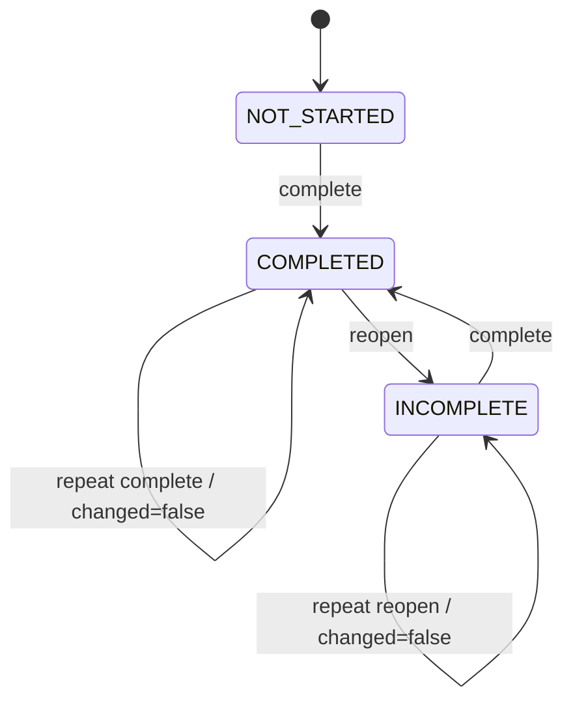
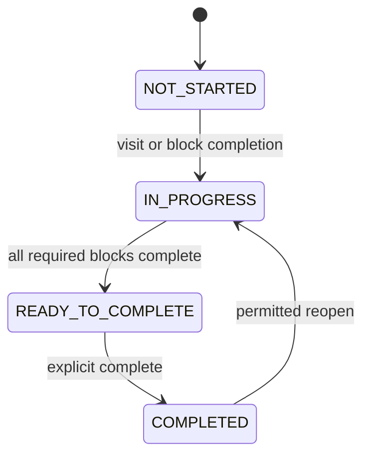
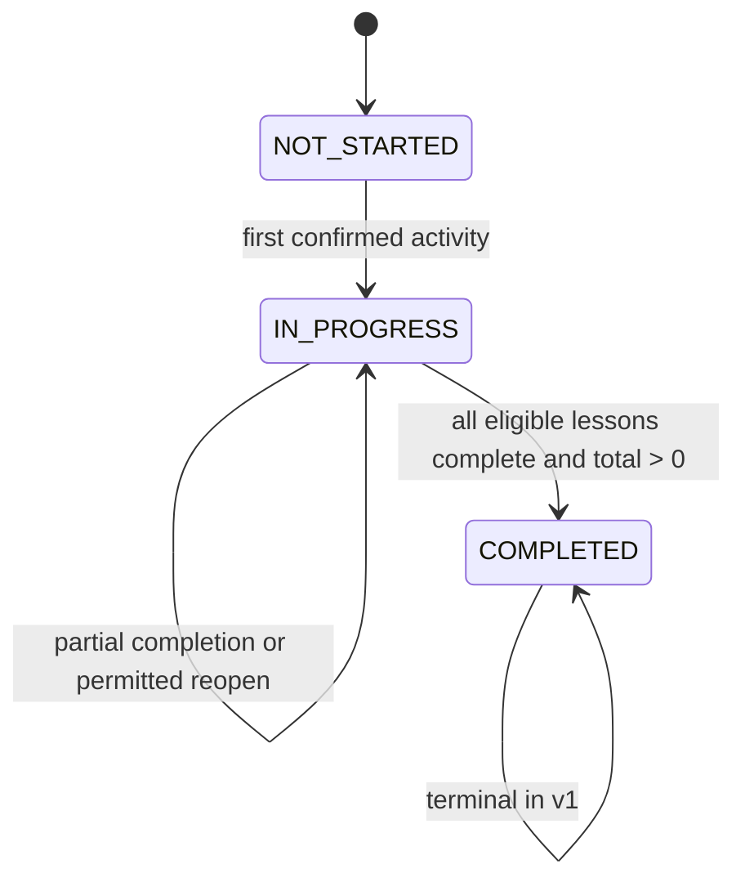

# Module #8 — Progress Tracking Contract

- **Milestone:** Module 8.1A — Contract Approval
- **Status:** Review candidate; human approval pending
- **Date:** 2026-07-26
- **Runtime status:** Not implemented
- **OpenAPI:** [progress-tracking.v1.yaml](./openapi/progress-tracking.v1.yaml)
- **ADR:** [ADR-002](./design-system/decisions/ADR-002-progress-tracking-contract.md)

## 1. Authority and scope

This document defines the proposed implementation-independent contract baseline
for Module #8. It covers product policy, domain vocabulary, data design, API
DTOs, errors, RBAC, capabilities, aggregates, resume behavior, concurrency,
idempotency, security, privacy, and future tests.

It authorizes no Prisma change, migration, permission seed, runtime endpoint,
frontend feature, package installation, or deployment. Module 8.1B begins only
after this contract and ADR receive recorded human approval.

The contract follows the existing `/api/v1` base path, success envelope, error
envelope, bearer authentication, service-level authorization, and explicit DTO
patterns. It is designed for web, Android, iOS, and Telegram clients.

Initial scope:

- block and lesson completion and permitted reopen;
- section and course aggregates;
- last visited lesson and backend-selected resume target;
- completion timestamps and completed-course history;
- student self-service contract;
- future teacher/admin reporting boundaries.

Excluded:

- video playback position, watch percentage, or block offsets;
- streaks, achievements, mastery, quiz, assignment, or certificate rules;
- public progress-event history;
- client-calculated canonical progress;
- progress override tools;
- offline mutation queues;
- report export and chart packages.

## 2. Repository evidence and conflict resolution

The current application:

- mounts versioned routes under `/api/v1`;
- returns `{ success, message, data }` for successful feature responses;
- returns `{ success: false, code, message, details? }` for failures;
- recognizes `AUTHENTICATION_REQUIRED` and `INVALID_ACCESS_TOKEN`;
- enforces role and permission middleware and repeats resource policy in
  services;
- uses serializable enrollment transactions and bounded retry for genuine
  PostgreSQL serialization conflicts;
- models ACTIVE, SUSPENDED, CANCELLED, and COMPLETED enrollment states;
- models published/archived/deleted lessons, published/deleted sections, and
  visible/required/deleted content blocks;
- uses Axios in the frontend and currently has no server-state cache.

The earlier database blueprint describes `user_id + lesson_id` uniqueness and
video resume seconds. ADR-002 explicitly supersedes those assumptions upon
acceptance because they conflict with enrollment lifecycle identity and the
approved initial-scope exclusion of playback position.

The Design System remains approval-pending in repository text. Contract work may
proceed, but no tag alone establishes normative approval and no Module #8
frontend implementation may begin before its contract gate is recorded.

## 3. Domain vocabulary

| Concept                  | Definition                                                                           |
| ------------------------ | ------------------------------------------------------------------------------------ |
| Enrollment progress root | One concurrency, activity, aggregate, and snapshot root for one enrollment lifecycle |
| Block progress           | Sparse current completion state for one enrollment and content block                 |
| Lesson progress          | Activity and explicit completion state for one enrollment and lesson                 |
| Section progress         | Synchronously calculated projection over eligible lessons                            |
| Course progress          | Enrollment-level authoritative projection and lifecycle completion state             |
| Resume target            | Backend-selected eligible incomplete lesson for an ACTIVE enrollment                 |
| Curriculum version       | Course-owned version of published eligibility and deterministic order                |
| Completion version       | Optimistic version for canonical completion state and aggregates                     |
| Activity version         | Version for accepted last-visited changes                                            |
| Progress event           | Internal fixed-column completion/reopen history                                      |
| Frozen snapshot          | Terminal aggregate values retained for CANCELLED or COMPLETED enrollment             |

Canonical identity:

- lesson: `enrollmentId + lessonId`;
- block: `enrollmentId + blockId`.

No tenant or organization boundary currently exists. A future tenant model must
add explicit tenant scope rather than infer it from existing IDs.

## 4. Product policies

### Eligible curriculum

An eligible lesson:

- belongs to the enrollment course;
- is `PUBLISHED` and not soft-deleted;
- belongs to a published, nondeleted section.

A completion-addressable block:

- belongs to an eligible lesson;
- is visible and not soft-deleted.

An aggregate-eligible block is completion-addressable and `isRequired=true`.

### Completion and reopen

- The owning student may manually complete an eligible block.
- Optional blocks may be completed and reopened.
- Optional blocks do not enter denominators and do not block lesson completion.
- Lesson completion is explicit.
- Every aggregate-eligible block must be `COMPLETED` before its lesson completes.
- A lesson with zero required blocks may be explicitly completed.
- Opening or visiting a lesson never completes it.
- A completed block or lesson may reopen only while the enrollment remains
  ACTIVE and course progress is not terminal.
- Ordinary repeated complete or reopen returns success with `changed=false`.
- Completing the final eligible lesson automatically and atomically completes
  the course enrollment when `totalEligibleLessons > 0`.
- A zero-eligible-lesson course never auto-completes.
- Completed course progress cannot reopen in v1.

### Enrollment states

| Enrollment state | Read progress           | Mutate completion    | Record activity | Resume                 | Snapshot                                            |
| ---------------- | ----------------------- | -------------------- | --------------- | ---------------------- | --------------------------------------------------- |
| ACTIVE           | Yes                     | Capability-dependent | Yes             | Yes when target exists | Current                                             |
| SUSPENDED        | Yes                     | No                   | No              | No                     | Preserved and reconciled against current curriculum |
| CANCELLED        | Yes, own/scoped history | No                   | No              | No                     | Frozen at cancellation                              |
| COMPLETED        | Yes                     | No                   | No              | No                     | Frozen at 100 percent                               |

### Content access

Progress access, content access, and progress mutation are independent policy
dimensions. A COMPLETED enrollment may permit `Qayta ko‘rish` under content and
media access rules. This revisit changes no last visit, activity timestamp,
completion timestamp, aggregate, resume target, or canonical progress.

`Qayta ochish` is reserved for an actual progress-state transition.

### Re-enrollment

- Cancellation followed by enrollment creates a new progress root and no
  automatic carry-over.
- Suspension followed by reactivation keeps the same root.
- Completed enrollment remains terminal under the current enrollment lifecycle.

### Curriculum revisions

`curriculumVersion` changes for:

1. Section publish or unpublish.
2. Section soft delete or restore.
3. Section reorder.
4. Lesson publish or archive.
5. Lesson soft delete or restore.
6. Lesson move or reorder.
7. Block visibility change.
8. Block required-flag change.
9. Block soft delete or restore.
10. Block reorder.
11. Addition of a section, lesson, or block that immediately enters the
    published eligible curriculum.

Draft-only edits with no effect on published eligibility or deterministic order
do not increment it.

ACTIVE and SUSPENDED progress follows the current version. A stale mutation is
rejected and refreshed; the server never merges curriculum versions. CANCELLED
and COMPLETED snapshots remain frozen.

### Retention and legacy data

Proposed, not production-approved:

- idempotency records: 24 hours;
- detailed block/lesson events: 13 months after terminal enrollment;
- canonical course completion evidence: approved legal/business period.

Module 8.1B requires a target-environment preflight. Existing historical
curriculum may be impossible to reconstruct exactly. Any approximation,
unknown-data marker, or exclusion from backfill requires explicit product and
data-owner approval; it must never be hidden.

## 5. State machines

### Block progress



`NOT_STARTED` has no current-state row. `INCOMPLETE` and `COMPLETED` have one.
Only `COMPLETED` enters completed counts.

### Lesson progress



`READY_TO_COMPLETE` is derived. Reopening a lesson is forbidden after automatic
course completion.

### Enrollment mutation eligibility

```mermaid
stateDiagram-v2
    [*] --> ACTIVE
    ACTIVE --> SUSPENDED
    ACTIVE --> CANCELLED
    ACTIVE --> COMPLETED
    SUSPENDED --> ACTIVE
    SUSPENDED --> CANCELLED

    ACTIVE: progress mutation eligible
    SUSPENDED: read-only; no resume
    CANCELLED: frozen read-only history
    COMPLETED: frozen terminal progress
```



### Course completion



## 6. Data-model proposal for Module 8.1B

This section is a logical proposal, not Prisma schema or migration code.

### Course extension

Add a positive `curriculumVersion`, initially `1`. It changes only for the
approved trigger list in this contract.

### Enrollment progress root

Proposed fields:

- UUID primary key;
- unique enrollment ID;
- nullable last visited lesson ID and last visited timestamp;
- nullable first activity timestamp;
- completion version, initially `0`;
- activity version, initially `0`;
- curriculum version represented by the current snapshot;
- completed/eligible block counts;
- completed/eligible lesson counts;
- integer course percentage;
- nullable frozen-snapshot timestamp;
- created and updated timestamps.

Relations to enrollment and last-visited lesson use restrictive history-safe
behavior. Counts are nonnegative, completed counts cannot exceed totals,
percentage is `0..100`, and paired last-visited fields are both null or both
non-null.

### Lesson progress

Proposed fields:

- UUID primary key;
- enrollment ID;
- lesson ID;
- current persisted state `IN_PROGRESS` or `COMPLETED`;
- curriculum version of the latest completion-state mutation;
- first and last activity timestamps;
- nullable current completion timestamp;
- created and updated timestamps.

Unique identity is enrollment plus lesson. Relations use restrictive behavior.
`READY_TO_COMPLETE` and `NOT_STARTED` remain derived.

### Block progress

Proposed fields:

- UUID primary key;
- enrollment ID;
- block ID;
- current state `INCOMPLETE` or `COMPLETED`;
- curriculum version of the latest mutation;
- nullable current completion timestamp;
- created and updated timestamps.

Unique identity is enrollment plus block. No row represents `NOT_STARTED`.
Relations use restrictive behavior.

### Progress event

Proposed fixed columns:

- UUID ID;
- enrollment ID;
- nullable actor user ID;
- event type;
- nullable lesson and block IDs constrained by event type;
- previous and new states;
- curriculum version;
- resulting completion version;
- nullable idempotency record reference or nonreversible key hash;
- nullable request correlation ID;
- occurred timestamp;
- nullable completed/eligible block and lesson counts and percentage for
  terminal course-completion evidence.

No unrestricted JSON payload is part of v1. Events have no public history API
and use no soft deletion.

### Idempotency record

Proposed fields:

- UUID ID;
- actor user ID;
- enrollment ID;
- key;
- operation;
- SHA-256 request fingerprint;
- successful response status and response envelope;
- resulting completion/activity versions;
- created and expiry timestamps.

Uniqueness is actor plus key. Expired records are removed only by a bounded,
observable, idempotent maintenance process.

### Persisted and calculated values

- Enrollment aggregate snapshots are proposed for persistence.
- Lesson and section projections may be calculated synchronously.
- A nonfrozen snapshot is authoritative only when its curriculum version matches
  the course version.
- A mismatch must reconcile before returning authoritative data.
- CANCELLED and COMPLETED snapshots do not reconcile against later curriculum.

### Module 8.1B preflight

Before migration:

- identify the target environment and database owner;
- confirm migration status and schema drift;
- verify backup and restore;
- count enrollment states and known development identities;
- inspect curriculum and enrollment reference integrity;
- find rows that would violate proposed constraints;
- determine whether historical snapshots can be reconstructed;
- measure batch size, lock time, and maintenance requirements;
- dry-run against a sanitized target copy.

## 7. Authoritative aggregates

For one lesson:

```text
completedEligibleBlocks =
  count(required, visible, nondeleted blocks with current COMPLETED state)

totalEligibleBlocks =
  count(required, visible, nondeleted blocks in the eligible lesson)

lessonPercentage =
  if totalEligibleBlocks = 0:
    100 when lesson state is COMPLETED, otherwise 0
  else:
    floor(completedEligibleBlocks * 100 / totalEligibleBlocks)
```

For one section:

```text
completedLessons =
  count(eligible lessons with explicit COMPLETED state)

totalEligibleLessons =
  count(published, nondeleted lessons in the published, nondeleted section)

sectionPercentage =
  0 when totalEligibleLessons = 0
  otherwise floor(completedLessons * 100 / totalEligibleLessons)
```

For one course:

```text
completedLessons =
  count(COMPLETED eligible lessons across eligible sections)

totalEligibleLessons =
  count(eligible lessons across eligible sections)

coursePercentage =
  0 when totalEligibleLessons = 0
  otherwise floor(completedLessons * 100 / totalEligibleLessons)

courseCompleted =
  enrollment was atomically set to COMPLETED
  AND totalEligibleLessons > 0
  AND completedLessons = totalEligibleLessons
```

Rules:

- Percentages are integers in `0..100`.
- Optional blocks never enter denominators.
- Unpublished, archived, invisible, or deleted content is excluded.
- A course displays canonical 100 percent only when authoritative enrollment
  completion is confirmed.
- Clients display returned values and never recalculate or round them.

## 8. Resume-learning rules

For one enrollment:

1. Return null unless enrollment is ACTIVE.
2. Return null when the course is unavailable.
3. Build the eligible incomplete lesson list.
4. Order by section position, lesson position, then lesson UUID.
5. Return the last-visited lesson when it remains eligible and incomplete.
6. If last visited is completed, return the first later incomplete lesson.
7. Otherwise return the earliest incomplete eligible lesson.
8. Return null when no valid incomplete lesson exists.

For global resume:

1. Consider ACTIVE enrollments with valid targets.
2. Prefer the most recent `lastVisitedAt`.
3. When no visit history exists, use earliest `enrolledAt`, then course UUID.
4. Return null when no enrollment has a valid target.

Resume never contains video seconds, block offsets, or watch percentages.
Frontend clients must not reproduce the ordering algorithm.

## 9. DTO contract

OpenAPI is the exact machine-readable source. This section documents semantic
shape and nullability.

### Enums

- `BlockProgressState`: `NOT_STARTED | INCOMPLETE | COMPLETED`
- `LessonProgressState`:
  `NOT_STARTED | IN_PROGRESS | READY_TO_COMPLETE | COMPLETED`
- `CourseProgressState`: `NOT_STARTED | IN_PROGRESS | COMPLETED`
- `EnrollmentStatus`: `ACTIVE | SUSPENDED | CANCELLED | COMPLETED`
- `ProgressUnavailableReason`:
  `ENROLLMENT_SUSPENDED | ENROLLMENT_CANCELLED | ENROLLMENT_COMPLETED |
COURSE_UNAVAILABLE | LESSON_UNAVAILABLE | CONTENT_BLOCK_UNAVAILABLE | null`

### Formats

- IDs: UUID strings.
- Timestamps: ISO 8601 UTC `date-time` strings.
- Percentages: integers from 0 through 100.
- Versions: nonnegative integers, except curriculum version starts at `1`.
- Counts: nonnegative integers.

### Capability DTO

Every course-level progress response provides explicit booleans:

- `canReadProgress`;
- `canAccessCourseContent`;
- `canNavigateCurriculum`;
- `canDownloadPermittedMedia`;
- `canRecordActivity`;
- `canResumeLearning`;
- `canCompleteBlock`;
- `canReopenBlock`;
- `canCompleteLesson`;
- `canReopenLesson`;
- nullable `unavailableReason`.

Clients must not infer a capability from role, enrollment status, or hidden
navigation.

### Core DTOs

`BlockProgressDto` includes block identity/type/title/position/required state,
current progress state, nullable completion time, and block mutation
capabilities.

`LessonProgressDto` includes lesson and section identity, order, state, block
counts, percentage, activity/completion timestamps, blocks, and lesson mutation
capabilities.

`SectionProgressDto` includes identity, order, lesson counts, percentage, state,
and lessons.

`ResumeLearningDto` includes enrollment, course, section, and lesson references;
nullable last activity; course percentage; and nullable unavailability reason.

`CourseProgressSummaryDto` includes enrollment/course identity, enrollment and
course-progress states, three versions, counts, percentage, timestamps, nullable
resume target, and capabilities.

`CourseProgressDto` adds total block counts, sections, and `calculatedAt`.

`ProgressMutationResultDto` includes resulting versions, `changed`, affected
lesson, authoritative course summary, and nullable resume target.

`CompletedCourseDto` includes frozen curriculum version, 100 percent, frozen
lesson counts, and completion time.

`StudentProgressSummaryDto` includes generation time, nullable global resume
target, active/completed counts, and a bounded list of active course summaries.

Teacher/admin reporting DTOs are future Module 8.4 boundaries. They expose
permitted student identity, enrollment state, counts, percentage, activity and
completion timestamps, pagination, and explicit reporting capabilities. They do
not expose sessions, tokens, password state, private audit payloads,
idempotency, or internal progress events.

No public DTO is a Prisma record.

## 10. API operations

The OpenAPI contract defines:

Student:

- `GET /me/progress`
- `GET /me/enrollments/{enrollmentId}/progress`
- `GET /me/enrollments/{enrollmentId}/progress/resume`
- `GET /me/progress/completed-courses`
- `POST /me/enrollments/{enrollmentId}/progress/blocks/{blockId}/complete`
- `POST /me/enrollments/{enrollmentId}/progress/blocks/{blockId}/reopen`
- `POST /me/enrollments/{enrollmentId}/progress/lessons/{lessonId}/complete`
- `POST /me/enrollments/{enrollmentId}/progress/lessons/{lessonId}/reopen`
- `PUT /me/enrollments/{enrollmentId}/progress/last-visited-lesson`

Future Module 8.4 boundaries:

- `GET /courses/{courseId}/progress`
- `GET /courses/{courseId}/progress/enrollments/{enrollmentId}`
- `GET /progress`
- `GET /progress/enrollments/{enrollmentId}`

No export operation is available.

## 11. Error catalog

| Code                                     | HTTP | Stable Uzbek Latin message                                                   | Retry                         | Refresh  | Audit/log expectation |
| ---------------------------------------- | ---: | ---------------------------------------------------------------------------- | ----------------------------- | -------- | --------------------- |
| `AUTHENTICATION_REQUIRED`                |  401 | `Davom etish uchun tizimga kirish talab qilinadi.`                           | After login                   | No       | Authentication log    |
| `INVALID_ACCESS_TOKEN`                   |  401 | `Kirish sessiyasi yaroqsiz yoki muddati tugagan.`                            | After refresh/login           | No       | Authentication log    |
| `ACCESS_DENIED`                          |  403 | `Bu amal uchun ruxsat yetarli emas.`                                         | No                            | No       | Denial threshold      |
| `COURSE_SCOPE_DENIED`                    |  403 | `Bu kurs sizga biriktirilmagan.`                                             | No                            | No       | Privacy access denial |
| `PROGRESS_SCOPE_DENIED`                  |  403 | `Bu o‘qish jarayonini ko‘rishga ruxsat yetarli emas.`                        | No                            | No       | Privacy access denial |
| `REOPEN_NOT_PERMITTED`                   |  403 | `Bu elementni qayta ochishga ruxsat berilmagan.`                             | No                            | Yes      | Denial threshold      |
| `ENROLLMENT_NOT_FOUND`                   |  404 | `Enrollment topilmadi.`                                                      | No                            | No       | Enumeration threshold |
| `LESSON_NOT_FOUND`                       |  404 | `Dars topilmadi.`                                                            | No                            | No       | Enumeration threshold |
| `CONTENT_BLOCK_NOT_FOUND`                |  404 | `Dars materiali topilmadi.`                                                  | No                            | No       | Enumeration threshold |
| `ENROLLMENT_NOT_ACTIVE`                  |  409 | `O‘qish jarayonini o‘zgartirish uchun enrollment faol bo‘lishi kerak.`       | After state change            | Yes      | Domain log            |
| `ENROLLMENT_SUSPENDED`                   |  409 | `O‘qish jarayoni vaqtincha to‘xtatilgan.`                                    | No                            | Yes      | Domain log            |
| `ENROLLMENT_CANCELLED`                   |  409 | `Kursdan chiqilgan. Jarayonni o‘zgartirib bo‘lmaydi.`                        | No                            | Yes      | Domain log            |
| `ENROLLMENT_COMPLETED`                   |  409 | `Kurs yakunlangan. Jarayonni o‘zgartirib bo‘lmaydi.`                         | No                            | Yes      | Domain log            |
| `COURSE_UNAVAILABLE`                     |  409 | `Kurs hozir o‘qish uchun mavjud emas.`                                       | Later                         | Yes      | Operational log       |
| `LESSON_UNAVAILABLE`                     |  409 | `Dars hozir o‘qish uchun mavjud emas.`                                       | Later                         | Yes      | Operational log       |
| `CONTENT_BLOCK_UNAVAILABLE`              |  409 | `Dars materiali hozir mavjud emas.`                                          | Later                         | Yes      | Operational log       |
| `LESSON_COMPLETION_REQUIREMENTS_NOT_MET` |  409 | `Darsni tugallash uchun majburiy materiallarni yakunlang.`                   | After completing requirements | Yes      | No                    |
| `INVALID_PROGRESS_TRANSITION`            |  409 | `O‘qish jarayoni uchun bu o‘tish mumkin emas.`                               | No                            | Yes      | Domain log            |
| `CURRICULUM_VERSION_CONFLICT`            |  409 | `Kurs tarkibi yangilandi. Jarayonni qayta yuklang.`                          | After refresh                 | Required | Domain log            |
| `COMPLETION_VERSION_CONFLICT`            |  409 | `O‘qish jarayoni boshqa qurilmada yangilangan. Ma’lumotlarni qayta yuklang.` | After refresh                 | Required | Domain log            |
| `IDEMPOTENCY_KEY_CONFLICT`               |  409 | `Takroriy so‘rov kaliti boshqa amal uchun ishlatilgan.`                      | New key after review          | No       | Security log          |
| `VALIDATION_ERROR`                       |  422 | `Kiritilgan ma’lumotlarni tekshiring.`                                       | After correction              | No       | No                    |
| `RATE_LIMIT_EXCEEDED`                    |  429 | `Juda ko‘p so‘rov yuborildi. Birozdan so‘ng qayta urinib ko‘ring.`           | After `Retry-After`           | No       | Abuse threshold       |
| `INTERNAL_SERVER_ERROR`                  |  500 | `Serverda ichki xatolik yuz berdi.`                                          | Safe GET only                 | No       | Error log             |

Ordinary repeated completion/reopen is not an error. It returns success with
`changed=false`.

## 12. RBAC and capability matrix

Proposed permissions for Module 8.1B seeding:

- `progress.self_read`
- `progress.self_complete`
- `progress.self_reopen`
- `progress.self_record_visit`
- `progress.course.read`
- `progress.read`
- future `progress.export`

| Action                          | Permission                   | Scope                                 | State restriction          | Audit                  |
| ------------------------------- | ---------------------------- | ------------------------------------- | -------------------------- | ---------------------- |
| Read own summary/detail/history | `progress.self_read`         | Actor owns enrollment                 | Retained states            | No AuditLog            |
| Complete block/lesson           | `progress.self_complete`     | Actor owns resource and enrollment    | ACTIVE                     | Progress event         |
| Reopen block/lesson             | `progress.self_reopen`       | Actor owns resource and enrollment    | ACTIVE, nonterminal course | Progress event         |
| Record last visit               | `progress.self_record_visit` | Actor owns eligible lesson/enrollment | ACTIVE                     | No completion event    |
| Teacher list/detail             | `progress.course.read`       | Current `course.teacherId`            | All retained states        | Privacy access logging |
| Admin list/detail               | `progress.read`              | Permission-scoped platform view       | All retained states        | Privacy access logging |
| Future export                   | `progress.export`            | Explicit filters and approved scope   | Step-up required           | Immutable AuditLog     |

Route middleware is the first boundary. Services must repeat role, permission,
ownership, course scope, enrollment state, publication, and time-bound role
checks.

## 13. Concurrency contract

Future mutation transaction:

1. Begin PostgreSQL `SERIALIZABLE`.
2. Lock enrollment.
3. Re-read ownership and ACTIVE status.
4. Lock course and verify curriculum version and availability.
5. Get/create and lock the progress root.
6. Find or reserve actor-scoped idempotency.
7. Compare expected completion version when applicable.
8. Read and validate affected lesson/block inside the transaction.
9. Lock affected child progress.
10. Apply transition.
11. Recalculate authoritative aggregates.
12. Increment completion or activity version exactly once.
13. Atomically complete enrollment when final lesson conditions hold.
14. Insert fixed-column progress event when completion state changed.
15. Store replay response.
16. Commit.

Expected outcomes:

| Race                                          | Outcome                                                                                                           |
| --------------------------------------------- | ----------------------------------------------------------------------------------------------------------------- |
| Same key, same request                        | One commit; later call replays the same authoritative success                                                     |
| Different keys, same completion version       | One commit; loser receives `COMPLETION_VERSION_CONFLICT`                                                          |
| Completion versus reopen                      | One commit; loser refreshes after version conflict                                                                |
| Completion versus suspension                  | Enrollment lock orders outcomes; suspension first rejects mutation, completion first may commit before suspension |
| Completion versus curriculum change           | Course lock/version orders outcomes; stale version is rejected                                                    |
| Visit versus completion                       | Separate activity/completion versions avoid false optimistic conflict; row locks preserve atomic state            |
| Cancelled old enrollment versus re-enrollment | Distinct enrollment IDs and progress roots; no cross-replay                                                       |

Retry is bounded to three attempts and applies only to confirmed PostgreSQL
serialization or relevant unique races. Business, version, authorization, and
validation conflicts are never silently retried as writes.

## 14. Idempotency contract

- Header: `Idempotency-Key`.
- Required on every completion, reopen, and last-visit mutation.
- Allowed characters: ASCII letters, numbers, `.`, `_`, `:`, `-`.
- Length: 16 through 128 characters.
- Client-generated UUIDv4 or UUIDv7 is recommended.
- Uniqueness scope: authenticated actor plus key.
- Fingerprint inputs: API version, operation ID, actor ID, normalized path
  identifiers, normalized body, curriculum version, and expected completion
  version when present.
- Same actor/key/fingerprint replays the stored successful status and envelope.
- Same actor/key with a different fingerprint returns
  `IDEMPOTENCY_KEY_CONFLICT`.
- Another actor never receives or learns the first actor’s stored response.
- Failed transactions persist no successful idempotency result.
- Authentication, session validity, authorization, and actor identity are
  revalidated before replay.
- Proposed expiry is 24 hours and requires operational approval.

## 15. Frontend consumption contract

Axios remains the transport. React Query and frontend Zod are proposed for
Module 8.3, subject to engineering approval and bundle-budget verification.
This should become the shared server-state standard for future API-heavy
features, not a Module #8 exception.

Frontend responsibilities:

- validate DTOs at the API boundary;
- map DTOs to explicit view models;
- use capability flags rather than infer permission;
- preserve last confirmed aggregates while a mutation is pending;
- never optimistically calculate canonical counts or percentages;
- replace affected cache data from mutation results;
- roll back local pending state on failure;
- refetch curriculum and progress on version conflict;
- announce completion and failure through a polite live region;
- distinguish initial load, background refresh, stale, offline, and unavailable
  state.

The frontend must not import Prisma or backend implementation types.

## 16. Security and privacy

- Validate enrollment, lesson, and block association together to prevent IDOR.
- Student out-of-scope resource access returns a nonenumerating not-found or
  scope-denied response according to the approved endpoint policy.
- Teacher permission is insufficient without current course ownership.
- Admin role is insufficient without explicit permission.
- Revalidate current authorization before idempotent replay.
- Never log authorization headers, idempotency response bodies, tokens,
  passwords, private event payloads, or unnecessary learning detail.
- Restrict search to 100 characters and page size to 100.
- Proposed rate limits combine identity and network source:
  - completion/reopen: 60 per minute;
  - lesson completion/reopen: 30 per minute;
  - last visit: 120 per minute;
  - reporting lists: 30 per minute.
- Exact limits require load and security review.
- Export is unavailable in initial Module #8.
- Future export requires permission, step-up proof, bounded filters, expiry,
  audit, and CSV-injection neutralization for cells beginning with `=`, `+`,
  `-`, `@`, tab, or carriage return.
- Retention remains pending privacy/legal approval.
- Progress events are internal and are not an analytics warehouse or public
  event stream.

## 17. Testing contract

### Unit

- policies and direct service authorization;
- state transitions and repeated operations;
- eligible/optional block rules;
- aggregate formulas, floor rounding, and zero denominators;
- resume ordering and null behavior;
- capabilities;
- error mapping;
- DTO presenters and field minimization.

### Route and integration

- authentication and invalid token;
- permissions and ownership;
- teacher/admin scope;
- strict validation;
- headers and versions;
- pagination, search, filter, and sort limits;
- response envelopes;
- production error redaction.

### PostgreSQL

- simultaneous completion;
- completion versus reopen;
- completion versus suspension;
- completion versus curriculum revision;
- visit versus completion;
- rollback of state, aggregate, event, and idempotency;
- unique identities and CHECK constraints;
- actor-isolated replay;
- stale completion and curriculum versions;
- automatic course completion;
- cancelled re-enrollment isolation;
- restrictive foreign keys;
- migration and legacy backfill.

### Contract

- OpenAPI 3.1 parse and lint;
- operation IDs and security metadata;
- examples conform to schemas;
- runtime response DTOs match OpenAPI;
- error catalog and nullability match implementation;
- student/teacher/admin field boundaries.

### Frontend

- runtime response validation;
- DTO-to-view-model mapping;
- query-key isolation;
- pending and last-confirmed state;
- success reconciliation and rollback;
- conflict refetch;
- capability-driven controls;
- suspended/cancelled/completed presentation;
- 100-percent display;
- accessible announcements and reduced motion.

### Manual

- student complete/reopen/course-completion flow;
- repeated network retry;
- two browser tabs and web/mobile sequence;
- suspension during mutation;
- curriculum revision during mutation;
- cancelled re-enrollment;
- completed content revisit without progress changes;
- teacher/admin scope;
- 320 through 1536 px responsive checks;
- keyboard and supported screen-reader checks.

## 18. Approval checklist

### Supported by current repository evidence

- API-first backend authority.
- Enrollment lifecycle and terminal COMPLETED state.
- Repository → Service → Controller separation.
- Explicit DTOs and stable Uzbek Latin errors.
- Service-level permission and resource policy.
- Serializable transactions with bounded genuine-conflict retry.
- Capability-driven frontend behavior.
- No playback position, streaks, achievements, client percentages, or chart
  package in initial Module #8.
- Accessibility and responsive requirements.

### Accepted during architecture review

- 8.1A/8.1B milestone split.
- Enrollment-bound progress identity.
- Separate content access and progress mutation.
- Completion/activity/curriculum versions.
- Sparse tri-state block progress.
- Explicit lesson completion and optional-block rules.
- Automatic terminal course completion with a nonzero lesson denominator.
- Frozen CANCELLED and COMPLETED snapshots.
- Fixed-column progress events.
- Backend-authoritative resume.
- Actor-scoped idempotency.
- React Query and frontend Zod as proposed shared standards.

### Still requiring recorded approval

- Product: eligibility, reopen, content access, cancelled history, empty lesson,
  and re-enrollment policy.
- Architecture/backend/database: logical data model, lock order, version bump
  integration, automatic enrollment completion boundary.
- Data owner: legacy backfill and historical limitations.
- Security: rate limits, replay, reporting scope, future step-up/export.
- Privacy/legal: detailed event and canonical completion retention.
- Accessibility: capability states, live announcements, Course Player revisit
  and completion interactions.
- Frontend engineering: React Query, Zod, and bundle budgets.
- Governance: applicable Design System approval record.

Module 8.1B remains blocked until these decisions are recorded and this contract
is approved.
