# Turk Tili LMS — Project Architecture

**Document status:** Initial architecture baseline  
**Project stage:** Foundation  
**Last updated:** July 2026  
**Primary audience:** Product owners, architects, developers, DevOps engineers, and security reviewers

## Document purpose

This document defines the target architecture for Turk Tili LMS and records the
boundaries that future implementation should preserve. It describes planned
capabilities without creating database models or implying that unimplemented
features already exist.

The following terms are used throughout:

- **Current** — available in the initial repository.
- **Target** — the recommended production architecture.
- **Future** — a capability that should be validated before implementation.

Architecture changes that affect API contracts, security boundaries, data
ownership, or infrastructure should be recorded as Architecture Decision
Records (ADRs) and linked from this document.

---

## 1. Project overview

Turk Tili LMS is a Turkish language learning platform designed to serve several
client applications through one backend:

- A React web application
- Native or cross-platform Android and iOS applications
- A Telegram bot
- Future administrative and integration clients

The platform will provide structured learning content, assessments,
vocabulary tools, progress tracking, teaching workflows, notifications,
certificates, and an AI-assisted learning experience.

The repository currently contains an npm workspace with:

- A React, Vite, TypeScript, Tailwind CSS frontend
- A Node.js, Express, TypeScript backend
- A versioned REST API foundation
- Prisma configured for PostgreSQL without application models
- Shared development, formatting, linting, and build commands

The backend is the authoritative boundary for business rules and data access.
Clients present user experiences but do not connect to PostgreSQL or implement
authoritative learning, authorization, or certificate rules.

---

## 2. Project goals

### 2.1 Product goals

- Make Turkish language learning accessible across web, mobile, and Telegram.
- Support guided learning from beginner through advanced proficiency levels.
- Give teachers tools to create, organize, publish, and evaluate content.
- Give administrators control over users, platform policy, moderation, and
  operations.
- Enable a non-programmer platform owner to perform all normal content, user,
  course, design, and operational management through a secure graphical admin
  panel after handoff.
- Provide students with consistent progress across all supported clients.
- Support localized interfaces and content as the audience grows.

### 2.2 Architecture goals

- Maintain one reusable API and one source of truth for business rules.
- Scale application components independently.
- Keep domain modules cohesive and minimize coupling between them.
- Make security and authorization consistent for every client.
- Provide explicit API contracts that can evolve without breaking older
  clients unexpectedly.
- Support observability, auditability, backup, and disaster recovery.
- Allow asynchronous workloads such as media processing, notifications,
  statistics aggregation, and certificate generation.

### 2.3 Quality attributes

| Attribute         | Architectural response                                                           |
| ----------------- | -------------------------------------------------------------------------------- |
| Maintainability   | Feature-oriented backend and frontend modules with explicit ownership            |
| Scalability       | Stateless API nodes, external object storage, queues, and worker processes       |
| Security          | Central authentication, RBAC, validation, audit trails, and least privilege      |
| Reliability       | Health checks, retries, idempotency, backups, and graceful degradation           |
| Performance       | CDN delivery, caching, pagination, database indexing, and precomputed statistics |
| Portability       | Standards-based REST API and container-friendly services                         |
| Accessibility     | Responsive, keyboard-accessible, semantic web UI with WCAG targets               |
| Localization      | Locale-independent domain data and structured translation resources              |
| Owner operability | Secure graphical administration of routine business operations without code      |

### 2.4 Current non-goals

The foundation does not yet implement authentication, user accounts, lessons,
tests, administration, payments, or production infrastructure. These
capabilities should be delivered incrementally according to the roadmap.

---

## 3. Technology stack

### 3.1 Current stack

| Layer               | Technology          | Responsibility                                |
| ------------------- | ------------------- | --------------------------------------------- |
| Monorepo            | npm workspaces      | Dependency and script coordination            |
| Web frontend        | React               | Component-based user interface                |
| Frontend tooling    | Vite                | Development server and production bundling    |
| Language            | TypeScript          | Static typing across frontend and backend     |
| Routing             | React Router        | Browser navigation and route composition      |
| Styling             | Tailwind CSS        | Responsive design system utilities            |
| HTTP client         | Axios               | Typed API communication                       |
| Backend runtime     | Node.js             | Server runtime                                |
| Web framework       | Express             | REST routing and middleware                   |
| ORM                 | Prisma              | Future typed PostgreSQL access and migrations |
| Database            | PostgreSQL          | Planned transactional system of record        |
| Validation          | Zod                 | Environment and future request validation     |
| Security middleware | Helmet and CORS     | HTTP headers and cross-origin policy          |
| Logging             | Pino HTTP           | Structured request logs                       |
| Quality tools       | ESLint and Prettier | Static analysis and formatting                |
| Version control     | Git                 | Source history and collaboration              |

### 3.2 Target supporting infrastructure

The following components are architectural recommendations, not current
dependencies:

| Component                         | Purpose                                                                |
| --------------------------------- | ---------------------------------------------------------------------- |
| Redis-compatible cache            | Rate limiting, short-lived cache, distributed locks, and queue support |
| Message queue                     | Notification, media, certificate, statistics, and AI jobs              |
| S3-compatible object storage      | Images, documents, audio, video, and generated certificates            |
| CDN                               | Global delivery of frontend assets and public media                    |
| Email/SMS/push providers          | Multi-channel notifications                                            |
| Media processing service          | Video transcoding, thumbnails, and audio normalization                 |
| OpenTelemetry-compatible platform | Traces, metrics, and correlated logs                                   |
| Secrets manager                   | Production credentials, keys, and provider secrets                     |

Provider choices should remain replaceable behind adapter interfaces.

---

## 4. Folder structure

### 4.1 Current repository

```text
TurkTiliLMS/
├── frontend/
│   ├── src/
│   │   ├── lib/
│   │   ├── pages/
│   │   ├── services/
│   │   ├── styles/
│   │   ├── App.tsx
│   │   └── main.tsx
│   └── package.json
├── backend/
│   ├── prisma/
│   │   └── schema.prisma
│   ├── src/
│   │   ├── config/
│   │   ├── controllers/
│   │   ├── middlewares/
│   │   ├── modules/
│   │   ├── routes/
│   │   ├── services/
│   │   ├── utils/
│   │   ├── app.ts
│   │   └── server.ts
│   └── package.json
├── docs/
├── package.json
└── README.md
```

### 4.2 Target frontend organization

As the frontend grows, code should be organized primarily by product feature,
with shared infrastructure kept separate:

```text
frontend/src/
├── app/                 Application bootstrap, providers, and route registry
├── features/            Authentication, courses, tests, dictionary, and other features
├── components/          Reusable presentation components
├── layouts/             Public, student, teacher, and admin shells
├── lib/                 API client, storage, telemetry, and utilities
├── hooks/               Reusable React hooks
├── services/            Cross-feature client services
├── styles/              Global styles and design tokens
├── types/               Shared client-side types
└── locales/             Interface translation resources
```

Each feature may contain its own routes, components, hooks, API adapter, types,
and validation schemas. Features must not import private internals from other
features.

### 4.3 Target backend organization

The existing top-level structure should evolve toward cohesive domain modules:

```text
backend/src/
├── config/              Validated runtime configuration
├── middlewares/         Cross-cutting HTTP behavior
├── modules/
│   └── <domain>/
│       ├── <domain>.routes.ts
│       ├── <domain>.controller.ts
│       ├── <domain>.service.ts
│       ├── <domain>.repository.ts
│       ├── <domain>.schemas.ts
│       ├── <domain>.types.ts
│       └── index.ts
├── infrastructure/      Database, queues, storage, mail, cache, and providers
├── routes/              API version composition
├── utils/               Small domain-independent utilities
├── app.ts               Express application assembly
└── server.ts            Process lifecycle and network listener
```

Controllers should remain thin. Business decisions belong in services or
domain policies, while repositories encapsulate persistence queries.

---

## 5. API-first architecture

Every supported client communicates with the platform through the same
versioned API. No client receives direct database credentials or privileged
storage credentials.

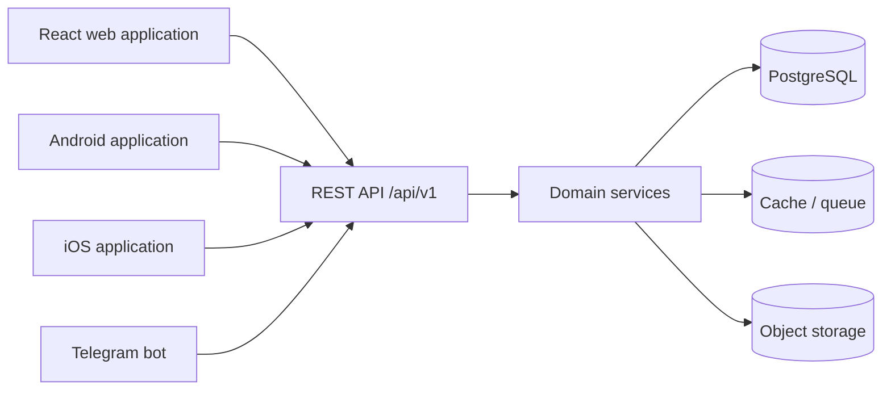

### 5.1 Core principles

- The API owns validation, authorization, business rules, and transactions.
- API responses use stable, documented resource representations.
- Client-specific presentation concerns do not leak into domain services.
- Long-running work is accepted by the API and completed asynchronously.
- Mutating operations that may be retried should support idempotency.
- Collection endpoints use consistent filtering, sorting, and pagination.
- Error responses use a predictable shape with a machine-readable code, safe
  message, validation details where applicable, and request correlation ID.

### 5.2 Contract management

An OpenAPI document should become the canonical external contract before
mobile and bot clients are developed. Generated client types may be used, but
generated files must not replace server-side validation.

Backward-compatible API additions are preferred. Breaking changes require a
new version and a documented migration window.

---

## 6. User roles

The initial role model contains Admin, Teacher, and Student. A person may hold
more than one role if future product requirements permit it.

### 6.1 Admin

Administrators manage platform-wide operations:

- Manage accounts, role assignments, and account status.
- Review and moderate courses, media, dictionary contributions, and reports.
- Configure supported languages, categories, system settings, and policies.
- View operational statistics and audit history.
- Manage certificate templates and notification templates.
- Investigate security events and revoke sessions.

High-risk administrative operations should require recent authentication,
explicit audit records, and optionally multi-factor authentication.

### 6.2 Teacher

Teachers own instructional workflows within their assigned scope:

- Create and manage courses, modules, lessons, exercises, and assessments.
- Upload supporting files and submit media for processing.
- Publish content when granted the appropriate permission.
- Enroll or manage assigned students when permitted.
- Review attempts, provide feedback, and inspect learning analytics.
- Contribute dictionary entries subject to moderation rules.

Teachers must not automatically receive platform administration permissions.

### 6.3 Student

Students consume learning experiences:

- Browse and enroll in available courses.
- Complete lessons, exercises, and tests.
- Save vocabulary and use dictionary features.
- View their own progress, statistics, certificates, and notifications.
- Use the AI assistant within configured limits.
- Continue learning across web, mobile, and Telegram-linked experiences.

Students may access only their own private learning data unless a deliberate
sharing feature is introduced.

### 6.4 Capability summary

| Capability                   |        Admin |          Teacher |       Student |
| ---------------------------- | -----------: | ---------------: | ------------: |
| Manage platform settings     |          Yes |               No |            No |
| Assign roles                 |          Yes |               No |            No |
| Create learning content      | Policy-based |              Yes |            No |
| Publish learning content     |          Yes | Permission-based |            No |
| Review assigned students     |          Yes | Permission-based | Own data only |
| Complete lessons and tests   |     Optional |         Optional |           Yes |
| View system-wide analytics   |          Yes |               No |            No |
| View course analytics        |          Yes | Assigned courses | Own data only |
| Issue or revoke certificates |          Yes | Permission-based |            No |

### 6.5 Admin-managed platform architecture

The final platform owner is not a programmer. Owner operability is therefore a
product and architecture requirement, not an optional administrative
convenience. After deployment and handoff, every normal business operation must
be available through a secure graphical admin panel without source editing,
direct database access, shell commands, or access to deployment secrets.

The admin panel is a protected feature area of the React application. It uses
versioned REST APIs and the same domain services, validation, authorization,
transactions, and audit rules as every other client.

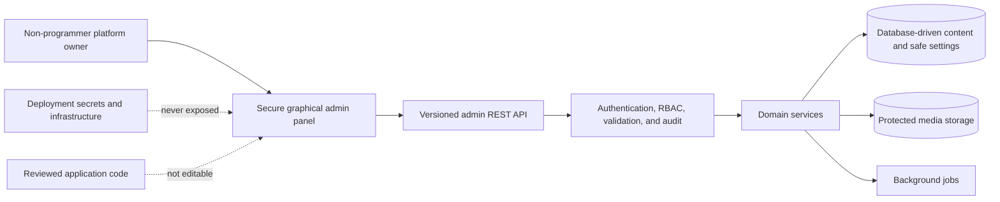

#### 6.5.1 User management

Subject to granular permissions, administrators can:

- Create users and start a secure activation or password-setup flow.
- Edit permitted profile, contact, and locale fields.
- Deactivate, suspend, restore, delete, or anonymize users according to
  retention policy.
- Assign and revoke Admin, Teacher, and Student roles.
- Start password resets without seeing or setting plaintext passwords.
- Revoke active sessions.
- View safe account activity, role history, security events, and recent
  administrative actions.

Suspension, restoration, role changes, session revocation, password-reset
initiation, and deletion are audited. Deletion workflows explain which
academic, certificate, or audit records must be retained or anonymized.

#### 6.5.2 Course and lesson management

Administrators can:

- Create, edit, reorder, publish, unpublish, archive, restore, and delete
  courses.
- Create, edit, reorder, and manage modules and lessons.
- Assign instructors and configure supported access and visibility policies.
- Upload, replace, reorder, and remove video, PDF, audio, image, caption,
  transcript, and attachment assets.
- Preview unpublished content.
- Manage translations and see missing or stale locale variants.
- Move editorial content through `draft`, `review`, `approved`, `published`,
  and `archived` states.

Stable identifiers and content history prevent a routine edit from changing the
meaning of completed learning, submitted tests, or issued certificates.
Publishing and unpublishing require specific permissions and audit events.

#### 6.5.3 Test management

Administrators can:

- Create, edit, duplicate, archive, and publish tests.
- Create question-bank entries and localized prompts.
- Manage answer options, correct-answer policy, points, and explanations.
- Set passing scores, attempt limits, time limits, availability windows,
  randomization, and feedback policy.
- Preview tests without exposing answer keys to unauthorized users.
- View, filter, and export permitted results.
- Review or route manual-grading work.

Published questions use versioning or immutable attempt snapshots. Correct
answers are sensitive assessment data protected by dedicated permissions.
Exports apply the same privacy and course scope as interactive reports.

#### 6.5.4 Dictionary management

Administrators can:

- Create, edit, reorder, archive, restore, and delete categories.
- Create and edit words, meanings, translations, examples, grammar metadata,
  pronunciation audio, and images.
- Manage editorial review and publication states.
- Preview Turkish-aware search normalization.
- Import and export dictionary data through validated formats.
- Preview row-level import errors before committing a batch.

Imports run as bounded, observable jobs and are safely retryable. Dictionary
management supports multiple explanation locales without changing the core
word identity.

#### 6.5.5 Website content management

A bounded content-management module controls:

- Homepage sections and order
- Banners and announcements
- Navigation links
- Footer content
- Contact details
- Social links
- Appropriate visible Uzbek marketing and interface content
- Localized variants and publication scheduling where required

Editable page content uses typed section schemas and approved presentation
variants. The owner can change content, assets, order, visibility, and schedule
but cannot inject arbitrary HTML, CSS, JavaScript, database queries, or
executable templates.

Stable interface labels tied to application behavior remain in a controlled
translation workflow. They are not turned into unrestricted content fields.

#### 6.5.6 Design settings

The admin panel may expose a curated and validated design-settings schema:

- Logo and favicon assets
- Primary and accent colors
- Approved banners
- Supported light, dark, or system theme mode
- Additional reviewed design tokens with safe bounds

Design changes are previewable and versioned where rollback is useful. Values
are allowlisted and validated. Arbitrary CSS, JavaScript, remote scripts,
unsanitized markup, and executable theme code are prohibited.

#### 6.5.7 Certificate management

Administrators can:

- Create, preview, version, activate, and archive certificate templates.
- Configure approved signature and seal assets.
- Configure issuer names and titles.
- Define completion and assessment eligibility through typed rules.
- Configure certificate numbering through a bounded pattern system.
- Issue, reissue, revoke, and verify certificates under separate permissions.

Template changes do not alter previously issued artifacts. Issuance,
reissuance, and revocation are immutable, auditable operations.

#### 6.5.8 Notification management

Administrators can:

- Create and schedule announcements.
- Create, preview, version, activate, and archive localized templates.
- Target selected roles, courses, groups, or individual users.
- Preview content and estimated recipient count.
- Confirm large or irreversible sends.
- Inspect queued, delivered, failed, read, and canceled states.

Recipient resolution, privacy policy, localization, and provider delivery happen
on the backend. Templates cannot contain executable code or provider
credentials.

#### 6.5.9 Statistics and reports

Permission-scoped dashboards expose:

- Student progress
- Test results and grading state
- Course completion
- Active users
- Recent activity
- Relevant media, notification, and background-job health

Permitted reports may be exported through asynchronous jobs. Exports use
field-level privacy, audit the actor and scope, expire after a bounded period,
and never expose data beyond the administrator's course or platform
permissions.

#### 6.5.10 System settings

Safe business configuration is edited through typed and validated forms. Every
editable setting has a documented type, default, constraints, owner,
visibility, and runtime effect.

The admin panel never exposes:

- Database connection strings or passwords
- JWT signing keys or refresh-token secrets
- API keys
- Object-storage credentials
- Email, push, Telegram, or AI provider credentials
- Server, network, deployment, backup, or environment credentials

Secrets and infrastructure configuration remain in the deployment secrets
system. The admin panel is not a generic key-value or environment editor.

#### 6.5.11 Audit and safety

- Important actions record actor, action, target, timestamp, request
  correlation ID, and safe before-and-after summaries.
- Deletion, suspension, unpublishing, certificate revocation, role changes,
  bulk operations, and broad notifications require explicit confirmation.
- Soft deletion and restoration are preferred when recovery or historical
  references justify them.
- Destructive and irreversible effects are clearly labeled.
- Optimistic concurrency or version checks prevent silent stale overwrites.
- Every admin input is validated on both client and server.
- Every operation enforces RBAC and object-level policy.
- Uploads use format allowlists, size limits, signature validation, quarantine,
  malware scanning, and authorized delivery.
- Administrator-provided code, scripts, commands, SQL, CSS, and JavaScript are
  never executed.

#### 6.5.12 Extensibility boundary

Database-driven configuration is used for content and safe business settings
the owner is expected to change. Core security rules, domain invariants,
executable behavior, integration logic, and infrastructure remain in reviewed
application code.

**Owner-managed without code:**

- Routine user lifecycle, role, course, lesson, test, dictionary, and media
  management
- Homepage, banner, navigation, footer, contact, social, and localized business
  content
- Approved logo, favicon, color, banner, and theme options
- Certificate templates and controlled issuance operations
- Announcements, notification templates, targeting, and delivery review
- Safe application settings
- Statistics review, permitted report export, audit review, and routine
  operational monitoring

**Developer-managed:**

- Entirely new modules, workflows, page-section types, or algorithms
- New database entities, fields, constraints, and migrations
- Infrastructure, deployment, backups, scaling, and networking
- New external integrations and provider credential setup
- Authentication, RBAC semantics, cryptography, and core security policy
- New executable behavior or design-token capabilities
- Dependency upgrades and source-code changes
- Privileged incident response

The platform intentionally does not provide a general-purpose no-code code
editor. Extensibility means well-defined schemas and new modules, not arbitrary
runtime code execution.

---

## 7. Authentication architecture

Authentication proves identity; it does not by itself grant access to a
resource.

### 7.1 Target authentication flow

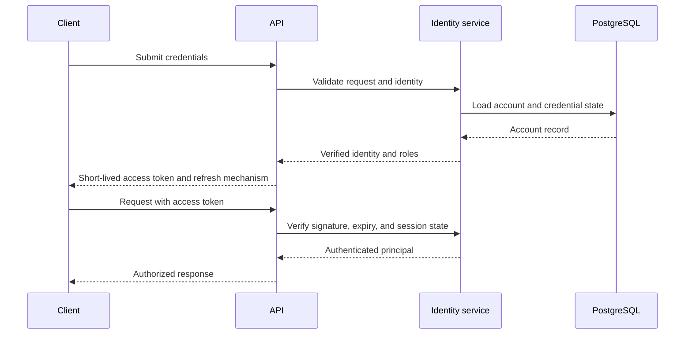

### 7.2 Credential and token strategy

- Passwords should be hashed with a modern adaptive algorithm such as
  Argon2id, using reviewed parameters and per-password salts.
- Access tokens should be short-lived and signed with rotated keys.
- Refresh tokens should be opaque, stored as hashes, rotated on use, and
  grouped into revocable session families.
- The web client should prefer secure, `HttpOnly`, `SameSite` cookies for
  refresh credentials.
- Mobile applications should store refresh credentials in platform secure
  storage.
- Access credentials must never be placed in URLs, logs, analytics events, or
  browser local storage.
- Password reset and email verification tokens should be single-use,
  short-lived, and stored in hashed form.

### 7.3 Session controls

The identity module should support:

- Session listing and individual or global revocation
- Refresh-token reuse detection
- Account lockout or throttling after suspicious attempts
- Email or phone verification state
- Administrative suspension
- Optional multi-factor authentication
- Authentication event auditing

Telegram authentication should use a separate identity-linking flow rather
than treating a Telegram username as proof of platform identity.

### 7.4 Secure browser-session transport

The implemented web transport keeps access tokens in frontend memory and
stores browser refresh credentials only in a scoped `HttpOnly` cookie.
Cookie-mode authentication is explicitly selected, protected by exact-origin
CORS and trusted `Origin`/`Referer` validation, and never mixed with the legacy
JSON body-token transport. Refresh rotation, reuse detection, session-family
revocation, and hashed database storage remain authoritative backend rules.

The complete cookie, CORS, CSRF, compatibility, deployment, and restoration
contract is defined in
[Secure Browser Session Transport](./SECURE_BROWSER_SESSION_TRANSPORT.md).

---

## 8. Authorization and RBAC

Role-Based Access Control (RBAC) provides broad capabilities, while resource
ownership and assignment policies provide fine-grained decisions.

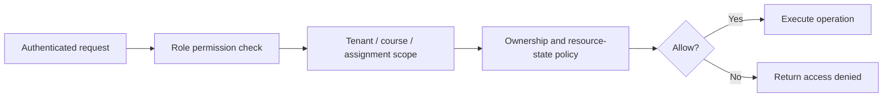

### 8.1 Permission model

Permissions should use explicit action names such as:

- `users.read`
- `users.manage`
- `courses.create`
- `courses.publish`
- `assessments.grade`
- `statistics.course.read`
- `certificates.issue`

Roles map to permissions. API handlers should check permissions rather than
hard-coding role names throughout business logic.

### 8.2 Policy dimensions

An authorization decision may consider:

- Authenticated user ID
- Assigned roles and permissions
- Resource owner
- Course or class assignment
- Enrollment state
- Content publication state
- Organization or tenant scope if multi-tenancy is introduced
- Administrative impersonation state
- Time-bound grants

Default behavior is deny. Frontend route guards improve user experience but
never replace backend enforcement.

### 8.3 Audit requirements

Role changes, permission changes, content publication, grading overrides,
certificate revocation, user suspension, and data exports should create
immutable audit events containing actor, action, target, timestamp, request ID,
and safe change metadata.

---

## 9. Database modules

PostgreSQL is the planned transactional source of truth. The following modules
describe data ownership only; this document intentionally defines no Prisma
models.

| Module           | Responsibility                                                                | Example data concepts                           |
| ---------------- | ----------------------------------------------------------------------------- | ----------------------------------------------- |
| Identity         | Accounts, credentials, sessions, verification, and external identity links    | Account, session, verification challenge        |
| Access control   | Roles, permissions, assignments, and scoped grants                            | Role, permission, role assignment               |
| Learning content | Courses, modules, lessons, content blocks, and publication lifecycle          | Course, lesson, content version                 |
| Enrollment       | Course access and cohort or class membership                                  | Enrollment, class, teacher assignment           |
| Progress         | Enrollment-bound completion, aggregates, lesson resume, and future extensions | Progress root, completion state, activity event |
| Assessment       | Tests, questions, answer options, attempts, grading, and feedback             | Assessment, question, attempt                   |
| Dictionary       | Words, meanings, examples, pronunciation, tags, and saved vocabulary          | Entry, translation, favorite                    |
| Media            | Upload metadata, processing status, variants, and access policy               | Asset, media variant, processing job            |
| Notification     | Preferences, templates, deliveries, and read state                            | Notification, delivery, preference              |
| Statistics       | Events, aggregates, snapshots, and reporting dimensions                       | Learning event, daily aggregate                 |
| Certificate      | Eligibility, issuance, revocation, template, and verification                 | Certificate, verification record                |
| AI assistant     | Conversations, messages, usage limits, and safety metadata                    | Conversation, message, usage ledger             |
| Localization     | Supported locales and translatable domain content                             | Locale, content translation                     |
| Audit            | Security-sensitive and administrative activity                                | Audit event                                     |
| Website content  | Typed sections, navigation, banners, contact details, and publication         | Content section, navigation item                |
| Design settings  | Allowlisted brand assets and theme tokens                                     | Brand configuration, theme version              |
| Configuration    | Typed owner-editable business settings                                        | Setting definition, setting value               |

### 9.1 Data design principles

- Each module owns its writes and exposes behavior through services.
- Cross-module foreign keys may preserve integrity, but direct cross-module
  writes should be avoided.
- Primary identifiers exposed through APIs should be non-sequential and hard
  to enumerate.
- Timestamps should be stored in UTC and rendered in the user's locale.
- User-generated text should preserve Unicode and be normalized where search
  requires it.
- Soft deletion is appropriate only where recovery or audit requirements
  justify its complexity.
- Personally identifiable information should be minimized and classified.
- Database indexes should follow observed query patterns, not speculation.
- Schema migrations must be version-controlled and reviewed.

### 9.2 Transaction and event boundaries

Strong consistency should be used for identity, permissions, grading,
enrollment, certificate eligibility, and billing if introduced. Statistics,
notifications, search indexing, and media processing may use eventual
consistency.

The transactional outbox pattern should publish reliable domain events without
requiring a distributed database transaction.

---

## 10. Frontend architecture

The React frontend is a client of the REST API. It should not duplicate
authoritative backend rules.

### 10.1 Application layers

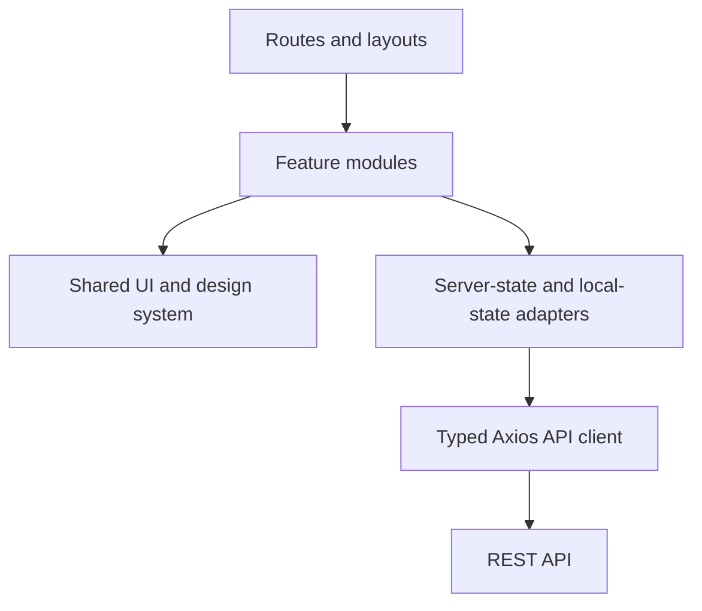

### 10.2 Routing

Recommended route groups:

- Public routes for landing pages, course discovery, and authentication
- Student routes for learning, tests, dictionary, progress, and certificates
- Teacher routes for content authoring, grading, and course analytics
- Admin routes for platform operations

Route-level code splitting should reduce the initial bundle. Authorization
metadata may control navigation visibility, but the API remains authoritative.

### 10.3 State management

State should be separated by source:

- **Server state:** API resources, caching, invalidation, loading, and retries
- **URL state:** Filters, pagination, selected tabs, and shareable navigation
- **Form state:** Input values, validation, and submission state
- **Local UI state:** Dialog visibility and ephemeral interaction state
- **Persistent preferences:** Theme, locale, accessibility choices, and safe
  non-sensitive settings

Authentication credentials and sensitive profile data should not be persisted
in insecure browser storage.

### 10.4 Design system and accessibility

Tailwind design tokens should define color, typography, spacing, elevation,
focus states, and breakpoints. Shared components should include consistent
loading, empty, error, and permission-denied states.

The frontend should target WCAG 2.2 AA, including keyboard navigation, visible
focus, semantic headings, labels, contrast, reduced motion, and captions or
transcripts for media.

### 10.5 API integration

The Axios layer should centralize:

- Base URL and timeouts
- Authentication attachment and safe refresh coordination
- Correlation IDs
- Consistent error normalization
- Request cancellation
- Locale and client-version headers

Feature modules should expose domain-specific API functions instead of calling
Axios directly from presentation components.

### 10.6 Admin panel architecture

The admin panel should be a route-level feature area with reusable
administrative primitives:

- Permission-aware navigation
- Searchable, filterable, paginated resource tables
- Typed forms with client and server validation
- Draft previews and status workflows
- Media upload and processing-status controls
- Translation and locale-completeness views
- Confirmation dialogs for destructive or high-impact actions
- Optimistic concurrency conflict handling
- Soft-delete and restoration views
- Audit history panels
- Asynchronous job and export status

Admin screens use the same design system and meet the same responsive and WCAG
2.2 AA targets as learner screens. Permission-denied, empty, loading, partial,
conflict, error, and successful completion states are designed explicitly.

The admin panel consumes versioned admin API functions through the shared Axios
client. It contains no Prisma access, provider credentials, secret fields,
arbitrary code editor, or alternative business-rule implementation.

---

## 11. Backend architecture

The backend is a modular monolith at the current stage. This provides clear
domain boundaries without the operational complexity of microservices.

### 11.1 Request lifecycle

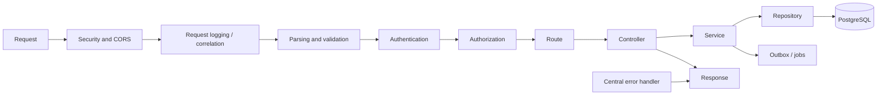

### 11.2 Layer responsibilities

- **Routes:** Map HTTP methods and paths to controller operations.
- **Controllers:** Convert validated HTTP input into service calls and map
  results to HTTP responses.
- **Services:** Enforce business rules, authorization policies, and transaction
  boundaries.
- **Repositories:** Encapsulate Prisma queries and persistence mapping.
- **Schemas:** Validate request parameters, bodies, query strings, and provider
  payloads.
- **Infrastructure adapters:** Integrate queues, storage, email, AI, and other
  external systems.
- **Middleware:** Apply cross-cutting HTTP concerns.

### 11.3 Dependency rules

- Domain services must not import Express request or response types.
- Controllers must not contain direct Prisma queries.
- Infrastructure providers must be accessed through narrow interfaces.
- Modules should not mutate another module's data through its repository.
- Circular module dependencies are prohibited.
- Shared utilities must remain domain-independent and small.

### 11.4 Asynchronous workers

Workers should run separately from API processes while sharing domain packages
or contracts. Candidate workloads include:

- Notification delivery
- File malware scanning
- Video transcoding
- Statistics aggregation
- Search indexing
- Certificate generation
- AI request processing

Jobs require retry limits, exponential backoff, dead-letter handling,
idempotency, and observable status.

### 11.5 Admin command architecture

Admin endpoints are transport adapters over the same domain services used by
public, student, teacher, mobile, and bot clients. They do not form a privileged
shortcut around domain rules.

Each owner-manageable resource should provide:

- Permission-scoped list and detail queries
- Create and validated update commands
- Explicit lifecycle transitions
- Preview where publication or delivery is involved
- Soft delete, restoration, or archival when applicable
- Bounded import and export jobs
- Audit recording for sensitive changes
- Optimistic concurrency for editable records

High-volume or long-running operations return a job identity and complete
asynchronously. Every job exposes status, safe failure information, retry
policy, and initiating administrator.

---

## 12. API versioning

The current API prefix is `/api/v1`.

### 12.1 Versioning rules

- Major versions appear in the URL.
- Additive fields and endpoints do not require a new major version.
- Clients must ignore unknown response fields.
- Removing or renaming fields, changing field meaning, or making optional input
  mandatory is a breaking change.
- Breaking changes require `/api/v2` or a compatible migration mechanism.
- Deprecated fields and endpoints should include documentation, telemetry, and
  a removal date.

### 12.2 Contract conventions

- Use nouns for resources and HTTP methods for actions where practical.
- Use consistent status codes and error envelopes.
- Use cursor pagination for large or frequently changing collections.
- Use ISO 8601 timestamps in UTC.
- Use explicit locale handling for translated resources.
- Support idempotency keys for retryable creation or external webhook flows.
- Publish an OpenAPI specification and change log.

Mobile releases may remain installed for long periods, so supported-version
windows must be longer than web migration windows.

---

## 13. Security architecture

Security is applied in layers and reviewed throughout delivery.

### 13.1 Application controls

- Validate all external input at the API boundary.
- Enforce authentication and authorization on the backend.
- Use parameterized Prisma queries and avoid raw SQL by default.
- Apply secure HTTP headers with Helmet.
- Configure CORS with explicit trusted origins.
- Apply endpoint-sensitive rate limits.
- Cap request body size and file size.
- Escape or sanitize untrusted rich content according to its rendering context.
- Protect cookie-based state-changing requests against CSRF.
- Redact secrets, tokens, cookies, and sensitive personal data from logs.

### 13.2 Infrastructure controls

- Terminate TLS using modern protocols.
- Keep databases, caches, and queues on private networks.
- Store secrets in a managed secrets service.
- Use separate service identities with least-privilege access.
- Encrypt managed data at rest.
- Restrict production access and record privileged actions.
- Scan dependencies, containers, and uploaded files.
- Maintain tested backups and recovery procedures.

### 13.3 Security operations

The platform should maintain:

- Structured security and audit events
- Dependency and secret scanning in CI
- Vulnerability response and patch timelines
- Key rotation procedures
- Incident response contacts and playbooks
- Data retention and deletion policies
- Abuse reporting and moderation workflows

Security-sensitive failures should return safe public messages while preserving
correlated diagnostic detail in protected logs.

### 13.4 Admin security boundary

Administrative access is not a universal bypass. Permissions remain granular,
object-level authorization remains mandatory, and high-risk operations may
require recent authentication or multi-factor authentication.

Admin security controls include:

- Short session and inactivity policy appropriate to privileged access
- CSRF protection for cookie-authenticated mutations
- Rate limits and bounded bulk operations
- Confirmation for destructive and broad-impact operations
- Before-and-after audit summaries without secrets
- Safe field-level filtering in views and exports
- Strict upload controls
- No arbitrary code, SQL, CSS, JavaScript, or template execution
- No secrets or infrastructure credentials returned by any admin API

Where practical, audit review permission should be separate from the permission
to perform the audited action.

---

## 14. File upload architecture

Large files should not pass through API memory or local API disk.

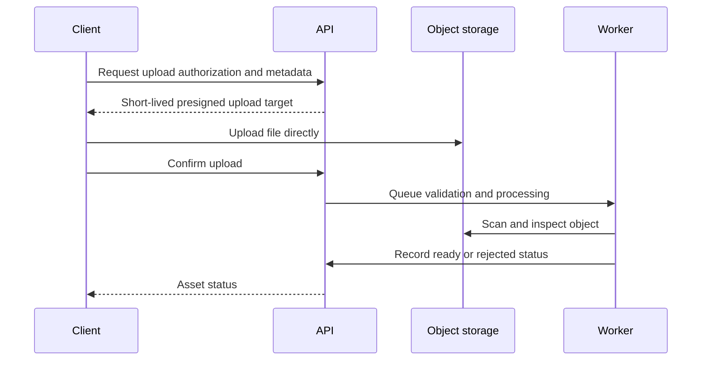

### 14.1 Upload policy

- Validate declared MIME type, extension, size, and actual file signature.
- Generate object keys on the server; never trust user-provided paths.
- Upload new files into a quarantine area.
- Scan for malware before making files available.
- Strip unsafe metadata where appropriate.
- Store original display names as metadata, not object paths.
- Use checksums to verify upload integrity.
- Define ownership and visibility independently from storage location.
- Delete abandoned uploads using lifecycle rules.

Downloads should use short-lived signed URLs or an authorized streaming
endpoint. Private student or teacher content must not use permanent public
URLs.

---

## 15. Video architecture

Video should use an asynchronous media pipeline rather than direct delivery of
unprocessed originals.

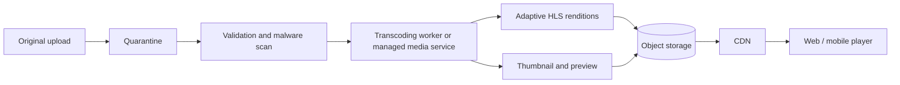

### 15.1 Processing and delivery

- Preserve the original only according to retention requirements.
- Generate adaptive bitrate renditions for varying bandwidth.
- Produce thumbnails, duration, dimensions, and processing metadata.
- Prefer HLS or an equivalent adaptive streaming protocol.
- Deliver protected content through signed CDN URLs or playback tokens.
- Keep media status explicit: uploaded, scanning, processing, ready, failed,
  or blocked.
- Retry transient failures and expose actionable failure reasons to authorized
  teachers.

### 15.2 Learning progress

Initial Module #8 uses explicit block and lesson completion plus a
backend-selected lesson resume target. It excludes playback seconds, watch
percentages, and per-tick reporting. Completion, aggregates, curriculum
versions, capabilities, and resume selection are authoritative backend domain
data. See [Progress Tracking Contract](./PROGRESS_TRACKING_CONTRACT.md).

Future media engagement may report bounded playback checkpoints rather than
every tick. That later contract must validate position, duration, access, and
plausible progression and must not silently change core Module #8 completion
semantics.

Captions and transcripts should be first-class assets with locale and review
status. Automatic transcription may assist teachers but should not be published
without quality controls.

---

## 16. Dictionary module architecture

The dictionary module supports lookup, vocabulary study, and contextual
learning.

### 16.1 Domain capabilities

- Turkish headwords and normalized search forms
- Meanings in one or more interface languages
- Part of speech and grammatical attributes
- Example sentences and translations
- Pronunciation audio and phonetic guidance
- Inflection or morphology references
- Topic, level, and curriculum tags
- Synonym, antonym, and related-word links
- Student favorites and learning status
- Teacher or editor contribution and moderation

### 16.2 Search architecture

PostgreSQL full-text and trigram search may serve the initial release. Search
normalization should handle Turkish-specific casing, including dotted and
dotless `i`, Unicode normalization, diacritics, and common typing variations.

A dedicated search engine should be introduced only when relevance, fuzzy
matching, morphology, analytics, or scale exceeds PostgreSQL capabilities.
The dictionary service should hide the search provider behind an adapter.

### 16.3 Editorial lifecycle

Entries should move through draft, review, published, and archived states.
Changes to published entries should be attributable and reviewable. User
favorites reference stable entry identities and should survive editorial
updates.

---

## 17. Test system architecture

In this section, “test system” means student assessment functionality. Automated
software testing is a separate engineering concern.

### 17.1 Assessment hierarchy

An assessment may contain sections, questions, answer definitions, scoring
rules, time limits, attempt policies, and feedback policy. Supported question
types may expand incrementally:

- Single-choice and multiple-choice
- True or false
- Matching and ordering
- Fill-in-the-blank
- Short written response
- Listening comprehension
- Speaking submission

### 17.2 Attempt lifecycle

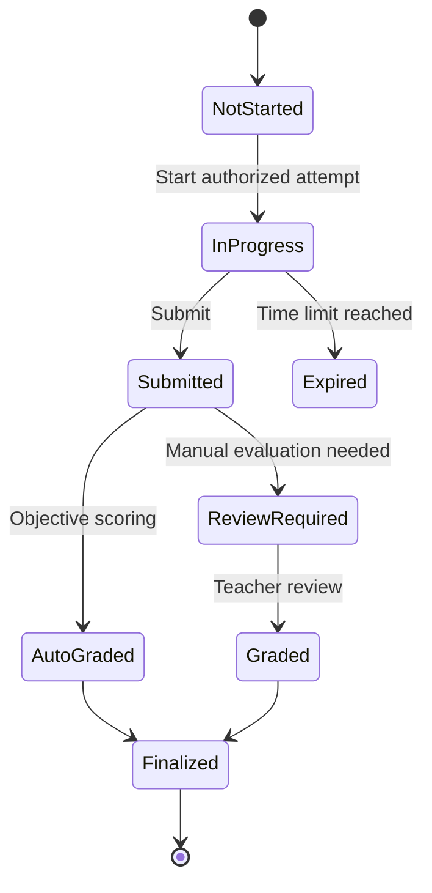

Starting an attempt should create an immutable question snapshot so later
editing does not change the meaning of an existing result. Autosave operations
should be idempotent and resilient to reconnection.

### 17.3 Scoring and integrity

- Scoring policy belongs on the backend.
- Decimal score handling and rounding must be deterministic.
- Correct answers may be hidden until allowed by feedback policy.
- Question pools may randomize selections and order.
- Time limits use server time.
- Manual grade changes require reason and audit history.
- Speaking or written answers may require moderation or teacher review.
- High-stakes testing may require additional identity and integrity controls.

---

## 18. Statistics architecture

Statistics should be derived from canonical activity rather than written
directly by clients.

### 18.1 Event flow

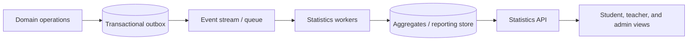

### 18.2 Statistical views

- **Student:** initial canonical progress and completion, with time spent,
  mastery, streaks, test history, and vocabulary growth deferred to separately
  approved analytics contracts
- **Teacher:** course engagement, lesson completion, question difficulty,
  score distribution, and at-risk learners
- **Admin:** active users, retention, content usage, system adoption, and
  operational trends

### 18.3 Data rules

- Define event names, schemas, owners, and versions.
- Deduplicate events using stable identifiers.
- Separate operational metrics from product analytics.
- Precompute expensive aggregates.
- Restrict teachers to assigned student populations.
- Apply privacy thresholds to group statistics where needed.
- Define timezone and reporting-period semantics explicitly.
- Support correction or replay when aggregation logic changes.

Raw event retention should be bounded by privacy, cost, and reporting
requirements.

---

## 19. Notification architecture

Notifications use an asynchronous, channel-independent service.

### 19.1 Channels

- In-app notification center
- Email
- Mobile push
- Telegram
- Future SMS for justified use cases

### 19.2 Delivery flow

Domain events create notification intents. The notification service resolves
recipient preferences, locale, template, priority, and allowed channel. Workers
then deliver through provider adapters and record outcomes.

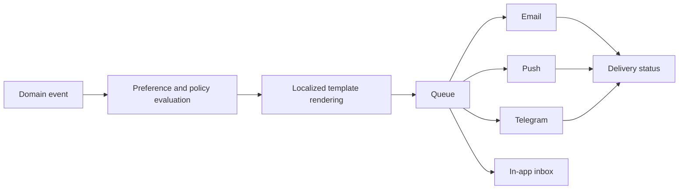

### 19.3 Reliability and policy

- Use idempotency keys to prevent duplicate notifications.
- Retry transient provider failures with backoff.
- Move permanent failures to a dead-letter workflow.
- Honor opt-out preferences except mandatory security or transactional events.
- Apply quiet hours and digest policies where appropriate.
- Keep template content versioned and previewable.
- Do not place secrets or excessive personal data in message bodies.

---

## 20. Certificate architecture

Certificates represent verified completion and must be reproducible,
auditable, and revocable.

The
[Course Completion and Certificate Eligibility Contract](./COURSE_COMPLETION_CERTIFICATE_ELIGIBILITY_CONTRACT.md)
and
[ADR-003](./design-system/decisions/ADR-003-course-completion-certificate-eligibility.md)
are the implementation authority for the boundary between canonical progress
completion, eligibility evidence, and the future certificate lifecycle.
Completion, eligibility, and certificate issuance are separate authoritative
states; a displayed 100 percent value must never be treated as certificate
eligibility by a client.

The Module 8.6A
[Certificate Issuance and Lifecycle Contract](./CERTIFICATE_ISSUANCE_LIFECYCLE_CONTRACT.md)
and
[ADR-004](./design-system/decisions/ADR-004-certificate-issuance-lifecycle.md)
are Review Candidates for issuance, artifact, verification, and revocation.
They are documentation only until architecture approval and phased
implementation.

### 20.1 Issuance flow

1. A course or program defines an eligibility policy.
2. The certificate service evaluates canonical progress and assessment data.
3. An administrator completes target-bound step-up authentication and confirms
   the exact eligible evidence.
4. The service renders, stages, and finalizes an immutable private PDF outside
   the serializable issuance transaction.
5. The transaction revalidates all evidence and captures recipient/course
   snapshots, template version, number, token hash, issuance time, and artifact
   checksum.
6. The committed artifact is made available through authorized download.
7. A public verification endpoint exposes only approved certificate details.

The initial Module 8.6 contract permits a textual URL referencing an opaque
verification token. QR generation is deferred and must never embed private
student data, sessions, or internal identifiers.

### 20.2 Integrity and lifecycle

- Certificate numbers are unique, human-readable public identifiers and are not
  authentication secrets; public verification uses a separate high-entropy
  token stored only as a hash.
- Generated documents should include a cryptographic digest or verifiable
  signature if external authenticity is important.
- Template versions must be retained for historical reproducibility.
- Revocation records should preserve reason, actor, and timestamp.
- Reissue is deferred; a future contract must preserve the original and link a
  new certificate through explicit supersession.
- Public verification must reveal the minimum required information.
- Public verification pages use no-referrer/noindex controls, no third-party
  resources, and infrastructure path redaction; recipient-name suppression is
  separate from immutable certificate history.
- Generated certificate PDFs are private, immutable, checksum-verified, and
  capped at 10 MiB.
- Module 8.6D implements the internal artifact foundation with a direct typed
  PDFKit renderer, package-local Noto Sans Regular/Bold fonts, bounded
  validation, private local staging, atomic no-overwrite finalization,
  server-side SHA-256, and post-storage immutable metadata persistence. It does
  not activate issuance, download, public verification, or revocation routes.
- HTML-to-PDF, arbitrary markup/CSS, remote assets, operating-system fonts, and
  persisted pending/failed artifact states remain prohibited. See
  [Certificate Artifact Renderer Foundation](./CERTIFICATE_ARTIFACT_RENDERER_FOUNDATION.md).

---

## 21. AI Assistant architecture

The AI Assistant is a bounded educational capability, not an authoritative
grader or unrestricted database agent.

### 21.1 Target capabilities

- Explain Turkish vocabulary and grammar.
- Provide level-appropriate examples.
- Practice conversation with corrective feedback.
- Answer questions using approved course and dictionary content.
- Suggest review activities from a student's learning context.
- Assist teachers with drafts that require human review.

### 21.2 Retrieval and generation flow

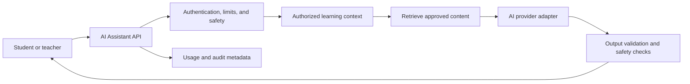

### 21.3 Guardrails

- Retrieve only content the requesting user may access.
- Do not send passwords, tokens, or unnecessary personal data to providers.
- Treat retrieved and user-provided text as untrusted input.
- Apply per-user quotas, rate limits, timeouts, and cost budgets.
- Label AI-generated content clearly.
- Provide reporting and feedback mechanisms.
- Do not use AI output as the sole basis for consequential grading.
- Require teacher review before publishing AI-generated course material.
- Record model, prompt version, safety outcome, latency, and token usage without
  logging sensitive conversation content by default.

Provider-specific SDKs should remain behind an interface so models and vendors
can change without affecting domain clients.

---

## 22. Mobile application integration

Android and iOS applications use the same `/api/v1` contract as the web
application.

### 22.1 Mobile-specific requirements

- Store refresh credentials in Keychain or Android Keystore-backed storage.
- Send client version, platform, locale, and a non-sensitive installation ID.
- Register push notification tokens per installation.
- Support deep links into courses, lessons, tests, and certificates.
- Cache safe learning content for intermittent connectivity.
- Queue offline progress changes with idempotency keys.
- Refresh signed media URLs when connectivity resumes.
- Enforce a minimum supported API or application version when necessary.

### 22.2 Offline synchronization

Offline support should be selective rather than mirroring the entire database.
Downloadable learning packages need a manifest, content version, integrity
hashes, and storage limits.

When reconnecting:

- Immutable activity events may be appended.
- Progress updates should use server-defined conflict policy.
- Assessments requiring integrity may prohibit offline submission.
- Revoked access must be enforced when the device next contacts the API.
- User-visible conflicts should be rare and explainable.

The API must remain stateless with respect to a particular mobile framework.

---

## 23. Telegram bot integration

The Telegram bot is an API client and notification channel, not a separate
source of business rules.

### 23.1 Integration flow

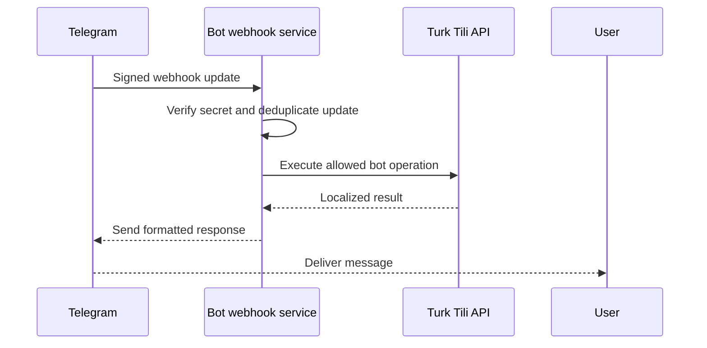

### 23.2 Identity linking

A Telegram account should be linked through a short-lived, single-use code or
authenticated deep-link flow initiated by a signed-in platform user. Store the
Telegram numeric user ID, never rely on a mutable username.

Users must be able to view and revoke linked Telegram identities.

### 23.3 Bot controls

- Use webhook secret validation and HTTPS.
- Deduplicate update IDs.
- Rate-limit commands and outbound messages.
- Keep bot tokens in a secrets manager.
- Restrict bot operations to a narrow service identity.
- Render responses using the user's preferred locale.
- Avoid exposing sensitive test answers or account information in shared chats.
- Provide `/help`, unlink, and notification preference commands.

The bot may support vocabulary practice, reminders, progress summaries, and
short learning interactions while directing complex workflows to web or mobile.

---

## 24. Multi-language architecture

The architecture separates interface localization from translatable learning
content.

### 24.1 Interface localization

Frontend and bot message catalogs should use stable translation keys. Locale
resolution may consider:

1. Explicit user preference
2. Client-provided preference
3. Browser or device locale
4. Platform default

Fallback behavior must be deterministic. Missing keys should be observable in
development and monitoring.

### 24.2 Domain content localization

Courses, lessons, dictionary meanings, notification templates, certificate
labels, and other domain content may have multiple translations with:

- Locale
- Translation status
- Author or reviewer
- Source version
- Published version
- Fallback policy

Translations should reference stable source content and become stale when the
source changes materially.

### 24.3 Locale-sensitive behavior

- Store timestamps in UTC and localize at presentation.
- Use locale-aware date, time, number, and plural formatting.
- Preserve Unicode and normalize search inputs carefully.
- Avoid concatenating translated fragments.
- Design layouts for text expansion.
- Keep right-to-left support possible even if it is not initially required.
- Treat learning language, explanation language, and interface language as
  separate user preferences.

API error codes remain language-neutral; clients may localize known messages,
while server-rendered notifications use stored locale preferences.

---

## 25. Deployment architecture

The target production deployment separates static delivery, synchronous API
traffic, background work, managed data, and external providers.

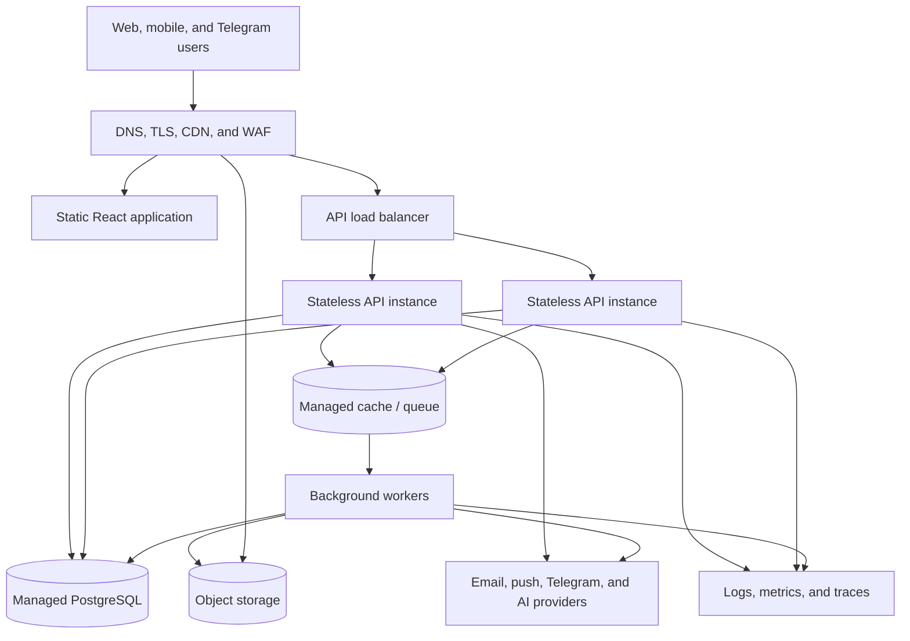

### 25.1 Environments

Maintain isolated development, staging, and production environments with
separate databases, storage, queues, secrets, provider credentials, and
observability data. Production data must not be copied into lower environments
without approved anonymization.

### 25.2 CI/CD pipeline

A target pipeline should:

1. Install dependencies from the lockfile.
2. Run formatting checks, linting, type checks, and automated tests.
3. Scan dependencies and secrets.
4. Build immutable frontend, API, and worker artifacts.
5. Validate database migrations.
6. Deploy to staging and run smoke checks.
7. Require approval for production where appropriate.
8. Apply backward-compatible migrations before dependent application changes.
9. Verify health, error rates, and key workflows after deployment.
10. Support safe rollback or forward-fix procedures.

### 25.3 Reliability

- API instances remain stateless and replaceable.
- Readiness checks prevent traffic before dependencies are usable.
- Liveness checks detect stalled processes.
- Graceful shutdown completes active requests.
- PostgreSQL uses automated backups and point-in-time recovery.
- Object storage uses lifecycle and versioning policies where justified.
- Restore procedures are tested, not merely documented.
- Deployment targets and recovery objectives should be defined before launch.

### 25.4 Observability

Every request and job should carry a correlation identifier. Logs should be
structured and redact sensitive fields. Metrics should cover latency, traffic,
errors, saturation, queue depth, job failure, database health, provider
failure, and product-critical workflows. Distributed tracing should connect
API requests, workers, and external calls.

---

## 26. Future roadmap

The roadmap is organized by dependency and risk rather than calendar dates.
Each phase should produce ADRs, API contracts, threat-model updates, and
operational runbooks where appropriate.

### Phase 1 — Foundation hardening

- Formalize response and error contracts.
- Add request schema validation and correlation IDs.
- Define OpenAPI generation and contract review.
- Add automated unit, integration, and API tests.
- Establish CI checks and dependency scanning.
- Define logging, metrics, and environment strategy.

### Phase 2 — Identity and access

- Implement accounts, secure sessions, verification, and password recovery.
- Implement RBAC permissions and policy checks.
- Add audit trails for sensitive operations.
- Build public, student, teacher, and permission-aware admin route shells.
- Deliver graphical user lifecycle, role assignment, suspension, restoration,
  password-reset initiation, session review, and account-activity workflows.
- Conduct authentication and authorization threat modeling.

### Phase 3 — Core learning

- Implement course, module, lesson, enrollment, and progress domains.
- Introduce content publication workflow.
- Deliver admin course, module, lesson, instructor, enrollment, ordering,
  publication, archival, restoration, and translation management.
- Introduce typed website content and safe design-setting management.
- Add accessible lesson rendering and resumable progress.
- Define teacher assignment and student privacy boundaries.

### Phase 4 — Assessments and dictionary

- Implement question banks, assessments, attempts, grading, and feedback.
- Add assessment snapshots and autosave.
- Implement dictionary editorial workflow and Turkish-aware search.
- Deliver complete admin assessment, question, result-export, dictionary,
  dictionary-import, and dictionary-export workflows.
- Add student vocabulary lists and review activities.

### Phase 5 — Media and notifications

- Add direct file uploads, malware scanning, and object storage.
- Introduce video processing, adaptive streaming, captions, and transcripts.
- Implement in-app, email, push, and Telegram notification orchestration.
- Deliver admin media replacement, processing review, announcements, localized
  templates, targeting, scheduling, and delivery-status workflows.
- Add queue operations, retries, and dead-letter handling.

### Phase 6 — Analytics and certificates

- Publish versioned learning events through a transactional outbox.
- Build student, teacher, and admin aggregates.
- Approve the course-completion and certificate-eligibility contract before
  schema or runtime work.
- Implement additive eligibility evidence and read-only eligibility status
  before certificate issuance.
- Define certificate generation, verification, revocation, reissue, and
  expiration separately; expiry is not part of certificate eligibility v1.
- Deliver permission-scoped admin dashboards, asynchronous report export,
  certificate-template versioning, issuance, reissuance, and revocation.
- Establish privacy and retention controls for analytics.

### Phase 7 — Mobile and Telegram

- Stabilize mobile-friendly API contracts.
- Add secure mobile sessions, push registration, deep links, and selective
  offline support.
- Implement Telegram identity linking, practice workflows, and reminders.
- Define client support and deprecation policies.

### Phase 8 — AI-assisted learning

- Introduce provider-neutral AI interfaces and usage controls.
- Build retrieval over authorized course and dictionary content.
- Add learner safety, moderation, evaluation, and teacher-review workflows.
- Measure educational effectiveness, cost, latency, and failure modes before
  expanding capabilities.

### Phase 9 — Scale and platform evolution

- Optimize observed database and search bottlenecks.
- Introduce dedicated search or analytics infrastructure only when justified.
- Expand localization and content workflows.
- Evaluate organization or tenant support if required.
- Extract services from the modular monolith only when independent scaling,
  ownership, reliability, or compliance needs justify the operational cost.

---

## Architecture governance

This document should be reviewed whenever a change introduces:

- A new domain module or external provider
- A breaking API change
- A new category of personal or sensitive data
- A change to authentication or authorization
- A new asynchronous workflow
- A new deployment dependency
- A material change to availability or recovery expectations
- A user-facing resource without a defined graphical admin-management workflow
- A change to the boundary between owner-managed configuration and
  developer-managed code, secrets, infrastructure, or security policy

Implementation should remain simpler than the target architecture until product
requirements justify added infrastructure. Clear boundaries should be created
early; distributed operational complexity should be introduced only when
evidence requires it.
