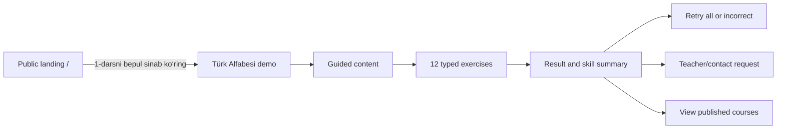

# Public Landing and Demo Lesson Contract

- **Module:** 9.5A
- **Status:** Review candidate; contract only
- **Implementation status:** `contract-only-not-available`
- **Route scope:** `/` and `/demo/turk-alfabesi`
- **API base:** `/api/v1`
- **Related ADR:**
  [ADR-006](./design-system/decisions/ADR-006-public-demo-exercise-architecture.md)
- **Machine contract:** [Public Demo OpenAPI](./openapi/public-demo.v1.yaml)

This document defines a public acquisition and learning-preview journey without
authorizing frontend, backend, Prisma, migration, seed, package, deployment, or
content-publication work. Every operation in the accompanying OpenAPI remains
unavailable until a later implementation module activates it.

## 1. Objective and boundaries

Module 9.5A specifies:

- a trustworthy Uzbek-language public landing page at `/`;
- one free, published preview lesson at `/demo/turk-alfabesi`;
- a reusable, typed exercise capability attached to real lessons;
- backend-authoritative grading and safe per-answer feedback;
- anonymous, short-lived demo attempts that never become enrollment progress;
- a completion result with skill evidence and honest next actions;
- pronunciation audio projected only from managed, reachable public media; and
- a capability-gated teacher/contact request after completion.

It does not specify or authorize:

- a second demo lesson, public enrollment, account creation, payment, group
  placement, Telegram/phone/WhatsApp integration, or automatic teacher contact;
- database tables, Prisma field names, migrations, seeds, or runtime modules;
- a high-stakes assessment system, manual grading, proctoring, certificates,
  durable achievements, leaderboards, or cross-session streaks;
- replacing the authenticated Course Player or its enrollment-progress rules;
- accepting remote audio URLs, storage paths, answer keys, or client scoring;
  or
- changing access to lessons 2 and later.

## 2. Product principles

1. **A real lesson, not a parallel microsite.** The demo resolves one real
   `Course -> Section -> published Lesson` where `isPreview=true`, then composes
   safe lesson content and attached exercises.
2. **Public projection is not authoritative state.** Read DTOs contain only
   renderable prompts, choices, media references, skills, and interaction rules.
   Correctness, normalization, scoring, randomization seeds, and accepted-answer
   definitions remain server-side.
3. **Learning before conversion.** The primary journey is explanation,
   practice, feedback, and a meaningful result. Contact is an optional final
   action, not a gate.
4. **No fake promises.** Copy must not claim guaranteed fluency, fixed outcomes,
   instant group placement, teacher availability, or unsupported statistics.
5. **Same journey for signed-in visitors.** Authentication may personalize the
   header, but it must not redirect an authenticated visitor away from `/` or
   the demo.
6. **Owner-managed content, code-owned safety.** Approved copy, lesson content,
   exercise presentation, media selection, FAQ entries, and contact-channel
   availability are manageable through typed administration in later modules.
   Scoring invariants, allowed exercise types, authorization, validation,
   retention, rate limits, and media reachability remain reviewed code policy.

## 3. Canonical public journey

The demo is usable without authentication or enrollment. The header may still
offer `Kirish`, and an authenticated visitor may navigate to their normal
role-aware destination explicitly. Neither state changes the public lesson
projection or creates enrollment progress.

## 4. Landing page contract (`/`)

### 4.1 Information hierarchy

The initial version uses this order:

1. public header with platform identity, `Kurslar`, `Kirish`, and one primary
   demo action;
2. outcome-led hero stating clearly that Turk Tili LMS supports a structured
   Turkish-learning path from A1 through C2 and offers the first lesson free;
3. learning path showing `A1`, `A2`, `B1`, `B2`, `C1`, and `C2` in order,
   without inventing prices, packages, duration, or guaranteed outcomes;
4. `Nega Turk Tili LMS?` covering interactive lessons, vocabulary,
   listening/pronunciation, quizzes and exercises, progress tracking, teacher
   support, group learning, and certificates as platform capabilities;
5. `Qanday ishlaydi?` with three steps: learn, practise, receive feedback;
6. demo preview card for `Türk Alfabesi`, level `A1`, marked
   `Birinchi dars bepul`;
7. `O‘qish qanday davom etadi?` explaining that a learner may contact a teacher
   after the demo and may later request suitable group/enrollment guidance,
   without claiming automatic placement;
8. approved FAQ disclosures;
9. capability-gated contact action; and
10. public footer with available legal/support links only.

The landing page may show published course cards only when the existing public
catalog request succeeds. A catalog error is local and must not remove the demo
entry point. Statistics, testimonials, teacher biographies, contact channels,
and legal links render only when their approved source exists.

### 4.2 Actions and states

- Primary: `1-darsni bepul sinab ko‘ring` -> `/demo/turk-alfabesi`.
- Secondary: `Tizimga kirish` -> `/login`. Authenticated visitors instead
  receive a non-forcing link to their authorized area.
- Optional tertiary discovery: `Kurslarni ko‘rish` -> `/courses` only when the
  public catalog route is available.
- Contact: hidden when no approved channel capability exists; otherwise opens a
  neutral placement/contact request flow specified for Module 9.5E.
- Initial loading reserves intrinsic media and card dimensions.
- Local dynamic failures use bounded retry without blanking static content.
- Offline state keeps readable static content and explains that the interactive
  demo requires a connection.

## 5. Demo lesson contract (`/demo/turk-alfabesi`)

### 5.1 Identity and learning outcomes

- Display title: `Türk Alfabesi`.
- Route slug: `turk-alfabesi`.
- Level: `A1` from the canonical course projection.
- Audience: first-time learners; no prior Turkish knowledge assumed.
- Estimated duration: a managed bounded value, initially 8–12 minutes.
- Learning outcomes:
  - recognize the 29-letter Turkish alphabet;
  - distinguish dotted `İ/i` and dotless `I/ı`;
  - recognize `Ç`, `Ş`, `Ğ`, `Ö`, and `Ü`;
  - connect selected letter sounds to letters and simple words; and
  - assemble a short Turkish word from letters.

The service resolves the configured demo slug to one published course, one
visible section, and one published lesson with `isPreview=true`. It fails closed
with a generic not-found response if any ancestor is unpublished, archived,
deleted, outside its visibility window, or inconsistent. It never silently
falls back to a different lesson.

### 5.2 Lesson hierarchy

1. identity, duration, learning outcomes, and a start action;
2. concise alphabet explanation and readable 29-letter reference;
3. focused explanation of Turkish-specific letters and casing;
4. uppercase/lowercase pairs;
5. optional pronunciation examples with text fallback;
6. guided mini-practice;
7. interactive demo assessment with progress and immediate feedback;
8. completion result and skill summary;
9. retry/review actions; and
10. continue-course, contact, and course-discovery actions.

The explanatory content uses the existing safe public lesson-block projection.
Exercise presentation is a separate typed projection. The delivery DTO composes
both without putting private grading definitions into lesson-block metadata.
It uses the repository's real names and nullability: section identity is
`id/title` and never invents a section slug; lesson blocks use `blockType`,
nullable `title/description/textContent`, `position`, and `isRequired`. V1 narrows
the demo union to visible `TEXT` and managed `AUDIO` blocks. Other existing
lesson-block types remain valid in the course domain but are not projected by
this demo contract until a type-specific safe public shape is approved.

### 5.3 Canonical 12-exercise authoring plan

This sequence is educational content guidance, not a public answer DTO. Actual
answer definitions stay in the private grading definition.

|   # | Type              | Learner task                                        | Skill tag              |
| --: | ----------------- | --------------------------------------------------- | ---------------------- |
|   1 | `LETTER_CHOICE`   | Select `Ş` from visually similar letters            | `special-letters`      |
|   2 | `LETTER_CHOICE`   | Identify `Ğ` in a short letter group                | `special-letters`      |
|   3 | `AUDIO_TO_LETTER` | Hear the `/ç/` sound and select its letter          | `pronunciation`        |
|   4 | `AUDIO_TO_LETTER` | Hear dotless `ı` and distinguish it from `i`        | `pronunciation`        |
|   5 | `AUDIO_TO_WORD`   | Hear `güneş` and select the matching written word   | `word-recognition`     |
|   6 | `MISSING_LETTER`  | Complete `_ocuk` with one Turkish letter            | `word-recognition`     |
|   7 | `MATCHING`        | Match `I–ı`, `İ–i`, `Ş–ş`, and `Ğ–ğ`                | `letter-case`          |
|   8 | `WORD_ASSEMBLY`   | Assemble `GÜNEŞ` from a bounded letter bank         | `word-recognition`     |
|   9 | `MULTIPLE_CHOICE` | Choose the correct Turkish alphabet letter count    | `alphabet-recognition` |
|  10 | `MULTIPLE_CHOICE` | Choose the accurate statement about `I/ı` and `İ/i` | `letter-case`          |
|  11 | `QUICK_ROUND`     | Four short recognition and sound-letter prompts     | `alphabet-recognition` |
|  12 | `QUICK_ROUND`     | Five-item final mixed challenge                     | `special-letters`      |

`QUICK_ROUND` is one exercise with an ordered list of bounded sub-prompts. Its
public sub-prompts use only the same safe primitives as the seven other types;
it is not an escape hatch for arbitrary JSON or executable content.
OpenAPI's `uniqueItems` compares whole objects, so the contract's
`x-unique-by`/`x-unique-by-each` extensions are normative service-validation
rules for unique choice, tile, match-side, sub-prompt, and submitted sub-prompt
IDs. Every `x-invariants` entry is likewise normative service validation rather
than commentary. Implementations and contract tests must enforce these rules
after schema parsing.

### 5.4 Supported exercise projections

Every exercise has `id`, `type`, `version`, localized `prompt`, optional
`instruction`, `skillTags`, positive `maxPoints`, interaction limits, and a
type-specific public payload.

Public `id` is the stable exercise aggregate UUID and public `version` is its
positive revision number. The immutable revision UUID, placement UUID, private
grading identity, and randomization metadata are never serialized. The snapshot
pins those internal identities and validates the submitted aggregate ID against
its snapshot-pinned revision before grading.

| Type              | Safe public payload                                     | Submitted response          |
| ----------------- | ------------------------------------------------------- | --------------------------- |
| `LETTER_CHOICE`   | ordered letter choices with opaque choice IDs           | one choice ID               |
| `AUDIO_TO_LETTER` | public media reference and ordered letter choices       | one choice ID               |
| `AUDIO_TO_WORD`   | public media reference and ordered word choices         | one choice ID               |
| `MISSING_LETTER`  | text segments, one blank, bounded letter choices        | one choice ID               |
| `MATCHING`        | shuffled left/right items with opaque IDs               | complete unique pair set    |
| `WORD_ASSEMBLY`   | shuffled letter tiles with unique tile IDs              | ordered tile IDs            |
| `MULTIPLE_CHOICE` | ordered text choices with opaque IDs                    | one choice ID               |
| `QUICK_ROUND`     | 2–8 typed sub-prompts and a visible time guidance value | one response per sub-prompt |

The v1 contract deliberately excludes free text, speech recording, drag-only
interaction, HTML supplied by authors, formulas, scripts, and remote embeds.
Matching and word assembly must have keyboard-operable select/move alternatives.

### 5.5 Audio roles, text alternatives, and grading secrecy

Audio has three non-interchangeable public contracts:

| Role                    | Where it appears                                                       | Pre-answer accessible text                                                             | Secrecy rule                                                                                                 |
| ----------------------- | ---------------------------------------------------------------------- | -------------------------------------------------------------------------------------- | ------------------------------------------------------------------------------------------------------------ |
| Lesson-content audio    | Existing explanatory lesson block                                      | Reviewed transcript or description                                                     | May contain the taught text because it is instruction, not a graded prompt                                   |
| Exercise-prompt audio   | `AUDIO_TO_LETTER`, `AUDIO_TO_WORD`, or an audio quick-round sub-prompt | A non-answer-bearing functional label such as `Tovushni eshiting va variantni tanlang` | Must not contain a transcript, phonetic spelling, filename, alt text, or metadata that identifies the answer |
| Terminal-feedback audio | Feedback for a terminal exercise/sub-prompt                            | Reviewed transcript or description                                                     | May reveal only the concept already permitted by terminal feedback                                           |

`TEXT_ALTERNATIVE` is not a transcript shown beside an audio exercise. It is a
separately authored, reviewed, published, and gradeable equivalent revision
that measures the same learning objective without requiring the target sound.
Each audio placement must bind an approved audio revision and an approved text
alternative with compatible skills and maximum points. The requested audio
mode is resolved before the immutable attempt snapshot is created; the snapshot
contains exactly one variant, and it cannot switch after creation. If an audio
attempt loses media availability, it fails safely and offers a new
text-alternative attempt (or reset only while the source attempt remains
valid) rather than revealing answer-bearing text in place.

Publication treats terminal-feedback media as answer-bearing by default. A
`MediaFile` with an active terminal-feedback usage cannot simultaneously have a
public lesson-content or exercise-prompt usage, and within one enabled demo
mapping it may belong to only one exercise or sub-prompt grading context. This
prevents a public or already-terminal use of the same stable media URL from
revealing feedback for a not-yet-terminal exercise.

### 5.6 Public/private split

The public lesson response must never expose:

- correct choice, pair, order, word, or normalized answer;
- per-choice correctness, weights, accepted alternatives, or comparison rules;
- private explanation variants keyed by correctness;
- randomization seed, private exercise-bank identity, grading version internals,
  or unpublished revisions; or
- storage keys, filesystem paths, provider URLs, or media ownership metadata.

Every exercise and quick-round sub-prompt schema is a closed OpenAPI 3.1
projection. Undeclared fields are rejected, including representative private
names such as `correctAnswer`, `gradingDefinition`, `normalizationRules`,
`weight`, `randomizationSeed`, and `correctness`. This is enforced at the
serialized response boundary as well as by component-schema contract tests;
omitting a property from documentation is not treated as a secrecy control.

The server stores or resolves a versioned private grading definition, grades the
submitted typed response, persists only the resulting evidence required for the
short-lived attempt, and returns a safe feedback projection. Frontend code must
not infer correctness from choice order, IDs, labels, or media identity.

## 6. Attempt and grading semantics

### 6.1 Access decision

| Option                      | Benefit                                                                           | Cost/risk                                                                                   | Decision                     |
| --------------------------- | --------------------------------------------------------------------------------- | ------------------------------------------------------------------------------------------- | ---------------------------- |
| Anonymous ephemeral attempt | Immediate learning, no unnecessary personal data, honest low-friction acquisition | Requires capability security, expiry, cleanup, and abuse controls                           | **Chosen**                   |
| Registration before start   | Durable identity and resume                                                       | Adds friction, collects data before value, and still does not replace answer/media security | Rejected for the public demo |

Registration is not required to start or finish the demo. Security is provided
by the narrow ephemeral capability and server authority, not by forcing an
account.

### 6.2 Anonymous capability

Starting the demo creates an ephemeral attempt and returns:

- a non-secret UUID `attemptId` used for routing and logs;
- a derived, pseudorandom 256-bit `attemptToken` returned only on successful
  creation or an exact idempotent replay of that creation;
- `idleExpiresAt`, `absoluteExpiresAt`, `effectiveExpiresAt`, `version`, ordered
  exercise projections, and initial progress; and
- response headers that prevent storage by shared or browser caches.

The token is generated as a domain-separated keyed derivation from the attempt
UUID, a stored random non-secret token nonce, and a versioned secret held in the
managed secrets system. Ordinary persistence retains the nonce, key version,
and a SHA-256 token digest, never the raw token. Retaining the named derivation
key through the 15-minute replay window permits exact response reconstruction
without putting a raw capability in an idempotency payload. Key rotation must
retain old key versions only for the maximum active-attempt and replay lifetime;
emergency key revocation invalidates affected attempts.

Subsequent operations require the dedicated header
`X-Demo-Attempt-Token: <attemptToken>`. The token is an unscoped bearer
capability only for that attempt. It must stay in memory, never cookies,
`Authorization`, URL parameters, local/session storage, analytics, logs, or
error text. A page reload intentionally starts a new attempt and explains the
reset. The later frontend phase must prevent the shared authentication refresh
interceptor from reading, replacing, retrying, or clearing this header. The
later backend phase must add `X-Demo-Attempt-Token`, `Range`, and
`If-None-Match` to the explicit CORS request-header allowlist
(`Idempotency-Key` is already allowed), and expose `ETag`, `Accept-Ranges`,
`Content-Range`, `Content-Disposition`, `Location`, `Idempotency-Replayed`,
`RateLimit`, `RateLimit-Policy`, and `Retry-After` to the trusted frontend
origin. Cookies and the ambient `Authorization` header are irrelevant to demo
capability validation; credentialed CORS remains restricted to the configured
origin allowlist.

Authentication cookies or bearer tokens neither grant nor replace the demo
attempt capability. This prevents accidental coupling between the public demo
and an account or enrollment.

### 6.3 Lifetime, reset, and retention

- `absoluteExpiresAt = createdAt + 2 hours`.
- `idleExpiresAt = min(lastAcceptedMutationAt + 30 minutes,
absoluteExpiresAt)`. Creation is the first accepted mutation. Only a committed
  answer, retry, or reset command may update the relevant attempt's accepted
  mutation time. Validation failures, conflicts, rate limits, and replays do
  not update it.
- `effectiveExpiresAt = min(idleExpiresAt, absoluteExpiresAt)`. Every attempt
  response returns all three timestamps. At the effective deadline an active or
  completed attempt becomes inaccessible and a valid capability receives
  `410`.
- The logical lifecycle is closed: `IN_PROGRESS -> COMPLETED` when the final
  exercise becomes terminal; `IN_PROGRESS -> ABANDONED` on reset; and
  `IN_PROGRESS|COMPLETED -> REVOKED` on mapping/ancestor revocation or security
  withdrawal. An otherwise reachable `IN_PROGRESS` or `COMPLETED` attempt is
  `EXPIRED` at its effective deadline, with canonical
  `expiredAt = effectiveExpiresAt` even if that state is materialized lazily by
  a request or cleanup worker. Retry leaves its source `COMPLETED`, increments
  the source version, and creates a child; the bounded source remains readable
  and may create another policy-allowed retry. No `SUPERSEDED` state exists in
  v1. Public result DTOs expose only `IN_PROGRESS` or `COMPLETED`.
- Every `GET` and `HEAD`, including result reads and conditional/range media
  reads, is read-only: it neither extends expiry nor increments attempt version.
  V1 has no keepalive operation.
- A completed attempt remains readable and retryable only until its effective
  expiry. Evidence is deleted within 24 hours of `completedAt`; if it never
  completes, within 24 hours of `expiredAt`; if reset or administratively
  revoked, within 24 hours of `abandonedAt` or `revokedAt`. Cleanup is
  restartable and may delete earlier after the capability becomes inaccessible.
- Idempotency replay entries have a 15-minute replay window, never extend the
  attempt, are deleted with their owning attempt or command lineage, and never
  survive 24 hours after the relevant terminal timestamp.
- Retry lineage is a random opaque identifier copied to each child, not an
  account or durable learner identity. A nullable parent-attempt reference is
  diagnostic only and must not keep parent evidence past its retention deadline;
  cleanup may clear that reference after the child's deep copy exists. The bare
  lineage identifier contains no answers or token material and is deleted within
  24 hours after the last attempt in the lineage reaches a terminal timestamp.
- Reset accepts only `IN_PROGRESS`, atomically marks the source `ABANDONED`,
  makes its capability invalid for every normal operation, and creates a fresh
  unrelated attempt. The sole
  exception is exact replay of the successful reset command as defined below.
  Retry creates a child in the same rate-limit lineage with a fresh token.
- Expired, abandoned, or revoked capabilities return one generic
  `410` and cannot be revived outside that bounded exact-reset replay.

No email, phone number, account ID, enrollment ID, full IP address, advertising
identifier, fingerprint, or third-party analytics identifier belongs to the
attempt. Abuse keys use a rotating server-secret HMAC of a normalized network
address, are isolated from product analytics, and expire within 24 hours.

### 6.4 Submission, concurrency, and idempotency

Attempt creation, answer, retry, and reset all require an `Idempotency-Key`.
Answer, retry, and reset also require `expectedVersion`.

- Creation keys are cryptographically random client-generated UUIDv4 values;
  predictable or user-authored keys are invalid. This prevents two unrelated
  clients behind one network HMAC from colliding into the same token-bearing
  replay. Capability-authorized command keys are 16–128 visible ASCII
  characters. Creation scope is the normalized demo slug plus the privacy-safe
  network HMAC; command scope is the attempt UUID plus operation kind. A key is
  not global.
- The canonical fingerprint is the operation kind, normalized path identity,
  resolved request locale/audio mode, and canonical validated JSON body,
  excluding transport-only headers and the capability itself.
- The same scope, key, and fingerprint within 15 minutes replays the original
  status, safe headers, body, child attempt UUID, and reconstructed child token;
  it performs no new mutation and does not extend expiry.
- Reusing a key in the same scope with a different fingerprint during the
  replay window returns `409 IDEMPOTENCY_KEY_REUSED`. After the window, a key
  may be treated as new only when the governing attempt is still valid; clients
  must generate a new key per intended command.
- Idempotency persistence stores the fingerprint, response metadata, created
  attempt reference/token derivation metadata, and safe response fields. It
  must not store a raw token or private grader data.
- For reset only, the source token digest remains in a constant-time checked,
  replay-only authorization slot for the successful reset's scope, key, and
  fingerprint until the 15-minute replay window closes. It can replay that
  response but cannot authorize result, answer, retry, another reset, or a
  changed request. This resolves lost-response replay without reviving the old
  capability.
- A stale attempt version returns `409 ATTEMPT_VERSION_CONFLICT` with no grade
  and requires a result refresh.
- Only the next server-authorized exercise may be submitted.
- Each standard exercise permits at most two submissions. Quick-round
  sub-prompts are submitted atomically as one bounded response.
- Concurrent requests are serialized by the attempt service. Exactly one state
  transition and point award may commit.

Creation returns version 1. A committed answer increments that attempt once. A
committed retry increments the completed source once and creates its child at
version 1. A committed reset increments the source once as it becomes abandoned
and creates its replacement at version 1. An idempotent replay returns the
original versions; validation/conflict/rate-limit failures and every read change
none. The command transaction compares `expectedVersion`, records idempotency,
changes source state/version when applicable, creates any child, and awards
points atomically.

The service validates the exercise and every choice/tile/sub-prompt ID against
the immutable attempt snapshot before grading. Validation, expired-state, and
conflict failures do not reveal whether a candidate answer was close or correct.

Capability error ordering is deterministic. A missing, malformed, or
wrong-length `X-Demo-Attempt-Token` returns generic `401` before attempt lookup.
For a well-formed token, an unknown attempt UUID and a digest that does not match
that attempt are indistinguishable generic `404` responses. A matching token
for an expired, abandoned, or revoked attempt returns generic
`410`, subject only to the exact reset replay exception above.

### 6.5 Feedback and scoring

The first correct submission earns full exercise points. A correct second
submission earns half points, rounded down to an integer but at least one point
when `maxPoints > 0`. A terminal incorrect exercise earns zero. The first
incorrect response returns an instructional hint without revealing the answer;
the terminal response may reveal the correct concept and explanation for that
exercise only.

Standard multi-skill attribution has no private weight. Maximum and earned
points are split by a public deterministic algorithm: divide the exercise total
equally across skill tags in canonical skill-registry order; distribute any
integer remainder one point at a time in that order. Earned points use the same
proportions with largest fractional remainder and registry order as the tie
breaker, so attributed earned points always sum to the exercise award. A
terminal correct exercise increments `correctCount` once for every tagged
skill; a terminal incorrect exercise increments `exerciseCount` but not
`correctCount` for each tagged skill. Publication requires
`maxPoints >= skillTags.length`, so every tagged skill has positive evidence.

`QUICK_ROUND` is an explicit exception to the two-submission standard exercise
rule. It accepts one atomic response and is immediately terminal. Its 2–8
sub-prompts have unique opaque IDs, one registered skill each, and points
assigned by dividing the exercise maximum across ordered sub-prompts with the
same quotient/remainder rule. Each correct sub-prompt earns its full share; an
incorrect sub-prompt earns zero, so partial scoring is allowed. The quick round
requires `maxPoints >= subPrompts.length`, and every sub-prompt skill must appear
in the parent exercise's `skillTags`; conversely, every parent skill must be used
by at least one sub-prompt, so the parent list equals the unique sub-prompt skill
set. The quick round
exercise outcome is `CORRECT` only when every sub-prompt is correct, otherwise
`INCORRECT`. It changes streak once: all correct increments the streak; any
incorrect resets it. Terminal feedback and review contain a safe breakdown by
`subPromptId`, skill, outcome, and points, never a pre-answer correctness field.
An incorrect-only retry includes the whole quick round when any sub-prompt was
incorrect and does not carry the parent streak or previously earned points.
For per-skill counters, each quick-round sub-prompt contributes one evidence
unit to its skill's `exerciseCount` and contributes one `correctCount` only when
correct; a standard exercise contributes one unit to each tagged skill. At the
attempt level, the whole quick round remains exactly one correct/incorrect
exercise.

An answer response contains:

- `outcome`: `CORRECT`, `INCORRECT_RETRY_ALLOWED`, or `INCORRECT_FINAL`;
- points earned for that exercise and updated attempt totals;
- localized positive or corrective feedback and optional explanation;
- a short Turkish example and replay-audio capability when approved media is
  pedagogically useful;
- `canRetry`, next exercise identity, current question number, total questions,
  streak, XP, and completion state; and
- terminal review details only for the exercise just completed.

Streak is consecutive first-try correct exercises within the current attempt.
XP equals awarded points and has no monetary value, durable profile meaning, or
cross-session persistence. Progress, question count, streak, XP, and completion
use text as well as visuals. There are no loot boxes, loss framing, countdown
pressure, leaderboards, daily obligations, or misleading scarcity.

Example correct feedback: `Ajoyib! Ş turk alifbosidagi alohida harf.` Example
incorrect feedback: `Hali emas. S va Ş tovushlariga yana e’tibor bering.` Copy
is supportive, specific, and never punitive.

### 6.6 Result derivation

The backend derives:

- `totalPoints`, `earnedPoints`, and
  `percentage = floor(earnedPoints * 100 / totalPoints)`;
- terminal `correctCount`, `incorrectCount`, and `exerciseCount`;
- per-exercise outcome, earned/max points, attempts used, skill tags, and safe
  review feedback;
- per-skill earned/max points, percentage, correct/total counts, and level;
- all skills tied for highest percentage as `strongestSkills`; and
- skills below 70 percent as `skillsToPractice`.

While an attempt is in progress, `completedCount`, `correctCount`, and
`incorrectCount` count terminal exercises only; a first incorrect submission
that still allows retry is not counted. `perExercise` contains terminal
exercises only. `perSkill` contains only skills with terminal evidence, and
`strongestSkills` and `skillsToPractice` are empty when no terminal skill
evidence exists. At completion, `correctCount + incorrectCount = exerciseCount`
and every exercise and skill in the snapshot has terminal evidence.

The initial closed skill vocabulary is `alphabet-recognition`,
`special-letters`, `pronunciation`, `letter-case`, and `word-recognition`.
Adding a skill is an additive contract/content change with localized display
copy; authors cannot invent unregistered tags.

Skill levels are `STRONG` at 80–100, `DEVELOPING` at 50–79, and `PRACTICE` at
0–49. A completed standard attempt has exactly 12 terminal exercises. A retry
attempt may contain only the server-selected incorrect subset, so its totals are
specific to that retry and never overwrite the original result.

The completion heading is
`Tabriklaymiz! Siz birinchi darsni tugatdingiz.` The result offers:

- `Hammasini qayta ishlash` (new attempt containing every exercise in the
  completed parent snapshot; 12 after a standard attempt);
- `Xatolarni qayta ishlash` when there are incorrect exercises;
- `Javoblarni ko‘rib chiqish` for safe per-exercise review;
- `Kurslarni ko‘rish`; and
- a capability-gated primary continuation message:
  `Kursni davom ettirish uchun o‘qituvchi bilan bog‘laning.`

## 7. Managed demo media delivery

Audio uses two non-interchangeable resource-authorization surfaces:

- `GET|HEAD /public/demo-lessons/{demoSlug}/media/{mediaId}` serves only
  explanatory lesson-block audio that remains referenced by the resolved,
  currently published preview lesson's visible public projection. It never
  serves exercise prompts or terminal feedback.
- `GET|HEAD /public/demo-attempts/{attemptId}/media/{mediaId}` requires the
  matching `X-Demo-Attempt-Token` and an unexpired, non-revoked deep snapshot.
  It may serve snapshot exercise-prompt audio. It may serve terminal-feedback
  audio only after the corresponding exercise or quick-round sub-prompt is
  terminal and that safe feedback is authorized for serialization; the URL is
  never serialized earlier. Missing/malformed, unknown/nonmatching, and gone
  capability handling follows section 6.4 without a media-state oracle.

The attempt route preserves prompt/feedback media needed by an in-flight
attempt across ordinary placement revisions and ends at effective expiry.
Mapping/ancestor unpublication or explicit security withdrawal revokes it
immediately. A previously observed terminal-feedback URL cannot authorize a
different attempt or a pre-terminal state. Knowing a media or attempt ID is
insufficient on both surfaces.

Because native audio elements cannot attach the capability header, the frontend
must fetch attempt media through its isolated demo API function, create a
memory-only object URL for playback, and revoke that URL on replacement or
unmount. It must never move the capability into a media URL, cookie, service
worker cache, or persistent browser storage. Public explanatory lesson audio may
use its headerless lesson-media URL directly.

Both endpoints:

- permit only the managed-audio v1 MIME types already supported by repository
  policy: MP3 (`audio/mpeg`) and WAV (`audio/wav`), after server-side inspection;
- set `Content-Type`, `Content-Length`, `Accept-Ranges`, strong `ETag`,
  `X-Content-Type-Options: nosniff`, and safe content disposition;
- support a single byte `Range` on `GET` only, with `206` and `416`, and
  rejects multipart ranges. `HEAD` ignores no hidden mutation and returns the
  same headers a full `GET` would return without a body; it does not accept
  `Range`;
- use `Cache-Control: public, max-age=0, must-revalidate` for current explanatory
  lesson media and `Cache-Control: private, no-store` for capability-protected
  attempt media. `If-None-Match` is supported on lesson, media `GET`, and media
  `HEAD`; an authorized match returns bodyless `304`;
- derive the strong media validator from immutable managed file identity,
  inspected byte length/content digest, MIME, and the relevant public lesson
  revision or immutable attempt-snapshot usage/state, so byte replacement,
  reference, authorization-state, or publication changes change the validator;
- never redirect to arbitrary author-provided URLs or expose storage paths;
- apply the media limits in section 10 and deployment-level bandwidth caps;
  and
- return a generic not-found response when reachability or media state fails.

The current storage adapter exposes only whole-object open semantics. Module
9.5C must extend the provider-neutral boundary with `stat(media)` and
`openRange(media, start, end)` capabilities; controllers must not depend on a
local path or one storage vendor. `stat` supplies inspected size, MIME, and a
strong content validator source. `openRange` streams exactly the authorized
inclusive range without loading the whole object. A provider that cannot
preserve these semantics is not valid for either route.

Audio never autoplays. Lesson and terminal-feedback controls expose their
reviewed transcript or description. Exercise-prompt controls expose only the
non-answer-bearing accessible label defined in section 5.5, plus play/pause,
replay, and an error state. Audio-only knowledge is avoided through the
pre-snapshot `TEXT_ALTERNATIVE`, never by exposing a prompt transcript.

## 8. Access, progress, and later lessons

- The demo is public because the canonical lesson is published and
  `isPreview=true`; it is not public because of a frontend route flag.
- Lessons 2 and later remain governed by the backend enrollment and lesson
  access policy. Hidden IDs and authenticated state must not bypass it.
- Demo answers, XP, streak, result, and skill evidence never create or mutate
  `EnrollmentProgress`, lesson completion, course completion, certificate
  eligibility, resume targets, or learner analytics.
- A later Module 9.5F may allow an authenticated, enrolled learner to consume
  the same reusable exercise definition through the real Course Player. That
  integration must create its own authorized learning-attempt/progress evidence
  and cannot promote an anonymous demo result by matching identity or network.
- The public endpoint may reuse the existing safe lesson projection internally,
  but it must not broaden existing media-download or unpublished-content access.

Publication changes use two explicit rules. If the demo mapping is disabled or
its course, section, or lesson becomes non-public, deleted, archived, outside
visibility, or no longer preview-enabled, new lesson reads/attempts/media fail
closed and every active mapped attempt becomes `REVOKED`; a matching capability
then receives generic `410`. If a placement is reordered/archived or an
exercise revision is archived after a snapshot, existing attempts continue
from their immutable deep snapshots while new attempts use the new curriculum.
An explicit security withdrawal of an exercise revision or media file is the
exception: it revokes every affected unexpired attempt. Retry/reset creation
always rechecks current demo reachability; no child is created from a currently
non-public or security-withdrawn source.

## 9. Contact and placement boundary

After completion, the UI may offer a teacher/contact request only when the
server returns an approved capability. Module 9.5A defines the boundary; Module
9.5E owns runtime.

- Initial channel candidates are Telegram, phone, WhatsApp, or a first-party
  request form, each separately enabled through typed settings.
- Copy says the learner is requesting information or placement guidance. It
  must not claim automatic placement, guaranteed response time, reserved group,
  or enrollment.
- The demo attempt token, answer history, IP-derived abuse key, and result are
  not sent to a third party.
- If a future form collects contact details, it requires an explicit privacy
  notice, purpose, retention, validation, rate limit, consent where applicable,
  provider adapter, audit boundary, and owner-visible management workflow.
- External channel links must be allowlisted and constructed server-side from
  typed settings; authors cannot provide arbitrary scripts or URLs.

The response is a closed discriminated union. `UNAVAILABLE` has
`available=false` and no label or channels. `AVAILABLE` has `available=true`, a
localized label, and at least one unique allowlisted channel. Mixed states such
as unavailable-with-channels or available-without-label are invalid.

## 10. Abuse controls and threat model

These limits are contract defaults. Production implementation requires a
shared, atomic limiter; per-process memory is insufficient.

| Operation                 |                          Limit | Key                              |
| ------------------------- | -----------------------------: | -------------------------------- |
| Read demo lesson          |                      60/minute | privacy-safe network HMAC        |
| Create/reset attempt      |                  10/15 minutes | privacy-safe network HMAC        |
| Submit answer             | 60/5 minutes and 120/5 minutes | attempt and network HMAC         |
| Read result               |                      30/minute | attempt                          |
| Create retry              |             5/hour and 20/hour | attempt lineage and network HMAC |
| Read lesson/attempt media | 120/minute and 30/minute/media | network HMAC                     |

Every limited response uses `429`, a stable code, `Retry-After`, and standard
rate-limit headers without exposing the key. Limits are applied before expensive
grading or media work.

| Threat                        | Required control                                                                                                                        |
| ----------------------------- | --------------------------------------------------------------------------------------------------------------------------------------- |
| Answer-key harvesting         | No keys in reads; capability/state-gated terminal media; bounded submissions; per-exercise terminal reveal only; lineage/network limits |
| Choice-ID guessing            | Opaque per-version IDs; strict snapshot membership; no semantic information in IDs                                                      |
| Duplicate point awards        | Idempotency fingerprint; expected version; serialized state transition; immutable terminal outcome                                      |
| Token theft or leakage        | 256-bit token, digest-only storage, memory-only client handling, TLS, no logs/URLs/analytics, 30-minute idle expiry                     |
| Attempt enumeration           | UUID is not authority; uniform `404/410`; capability required; no account discovery                                                     |
| Media scraping                | Resource reachability on every request, MIME allowlist, range limits, cache validators, bandwidth and request limits                    |
| Unpublished-content exposure  | Recheck course, section, lesson, publication, preview, deletion, and visibility state on every projection/media read                    |
| Enrollment-progress pollution | Separate anonymous namespace and service; no enrollment/account foreign association or promotion path                                   |
| Cross-site mutation           | Non-ambient custom authorization header; explicit CORS; no cookies accepted as attempt authority                                        |
| Malicious authored content    | Typed fields, length/count limits, plain text rendering, managed media only, no HTML/script/remote URL payloads                         |
| Personal tracking             | No PII/fingerprint/third-party analytics; rotating network HMAC; 24-hour deletion                                                       |

Unexpected failures use correlation IDs and safe Uzbek fallback messages.
Structured logs may contain operation, outcome, latency, attempt UUID, exercise
UUID, and correlation ID, but never token, response payload, correct answer,
audio URL, raw IP, or authored personal content.

## 11. Accessibility, responsiveness, and localization

- The initial interface locale registry is `uz-Latn`, `tr`, `en`, and `ru`, with
  `uz-Latn` as default. Turkish learning text is independently marked
  `lang="tr"`.
- Lesson `GET` negotiates from `Accept-Language`; attempt commands carry one
  requested interface locale. Resolution is exact supported tag, then an
  approved base-language alias, then the content's configured fallback chain,
  then `uz-Latn`. Lesson reads expose the first supported request after alias
  normalization as `requestedLocale`, or `null` when the header is absent or
  contains no supported preference. Attempt responses echo their validated
  supported `requestedLocale`. Every response exposes `resolvedLocale`; each
  localized field exposes its actual locale. Unsupported preferences do not
  change grading or identifiers.
- All author-visible strings are localized fields with fallback policy. IDs,
  grading rules, and error codes are locale-neutral.
- The page works from 320 px to wide desktop without horizontal scrolling.
  Content uses a readable centered column; result details stack before becoming
  a two-column layout.
- Exactly one `h1` identifies the lesson. Exercise changes announce question
  number, feedback, points, and completion through deliberate live regions
  without repeated or overlapping announcements.
- Choice controls use native inputs or equivalent semantics. Focus moves to the
  feedback heading after submission and to the next prompt only after the
  learner continues.
- Matching and assembly provide non-drag keyboard controls. Pointer targets are
  at least 44 by 44 CSS pixels.
- Color, sound, animation, and position are never the only carrier of state.
  Reduced-motion preference removes celebratory movement while retaining the
  completion message.
- Time guidance in quick rounds is motivational only in v1; it does not expire
  the response or reduce points. Learners can pause between prompts.
- Lesson/terminal audio controls expose reviewed transcripts; pre-answer prompt
  audio exposes only its non-answer-bearing label. All retain a visible error
  state. Captions are required if future media adds speech-bearing video.
- Long translations, 200 percent zoom, forced colors, screen readers, and
  keyboard-only journeys are release gates.

## 12. Visual design direction

The public journey is a modern educational product, not a dashboard clone or a
children's game. It uses strong typography, clear hierarchy, generous spacing,
Turkish-language learning identity, restrained red brand accents, purposeful
interactive lesson cards, and calm feedback surfaces. Celebration is
professional and brief. Mobile, tablet, and desktop layouts use the same
information priority. Module 9.5 does not redesign student, teacher, or admin
dashboards.

## 13. API summary

All paths are relative to `/api/v1`; all are
`contract-only-not-available` in Module 9.5A.

The lesson `GET` accepts `If-None-Match` and returns bodyless `304` when its
strong projection validator matches. Its validator covers demo mapping,
canonical course/section/lesson public identity, visible demo blocks, active
placements/order, selected published exercise presentations, localization,
contact capability, and reachable media identities. Both `200` and `304`
declare `Vary: Accept-Language`. Attempt JSON responses are always
`private, no-store` and are never conditionally cached. Authorized attempt media
is also `private, no-store`; its ETag may be revalidated only after the
capability and terminal-state policy are rechecked.

| Method and path                                          | Purpose                                                                  |
| -------------------------------------------------------- | ------------------------------------------------------------------------ |
| `GET /public/demo-lessons/{demoSlug}`                    | Resolve the canonical public lesson and safe overview/content projection |
| `POST /public/demo-lessons/{demoSlug}/attempts`          | Create an ephemeral ordered attempt snapshot                             |
| `POST /public/demo-attempts/{attemptId}/answers`         | Validate, grade, and return feedback for the current exercise            |
| `GET /public/demo-attempts/{attemptId}/result`           | Read progress or the completed result and safe review                    |
| `POST /public/demo-attempts/{attemptId}/retries`         | Create a fresh all/incorrect retry attempt                               |
| `POST /public/demo-attempts/{attemptId}/reset`           | Abandon and replace the attempt                                          |
| `GET /public/demo-attempts/{attemptId}/media/{mediaId}`  | Stream capability/state-authorized snapshot prompt or terminal audio     |
| `HEAD /public/demo-attempts/{attemptId}/media/{mediaId}` | Read authorized snapshot audio headers without a body                    |
| `GET /public/demo-lessons/{demoSlug}/media/{mediaId}`    | Stream currently public explanatory lesson audio                         |
| `HEAD /public/demo-lessons/{demoSlug}/media/{mediaId}`   | Read current explanatory lesson audio headers                            |

The OpenAPI is normative for field names, discriminated unions, validation
bounds, HTTP statuses, headers, examples, and operation status. This document is
normative for product policy, lifecycle, privacy, and educational behavior. A
later implementation must resolve any contradiction before changing status.

## 14. Logical architecture, not a database design

These are logical invariants, not approved Prisma model or column names.

### 14.1 Demo mapping authority

- A typed owner-managed demo mapping is the sole authority for
  `normalized demoSlug -> lessonId`; a route constant and lesson slug are not
  authority.
- Mapping lifecycle is `DRAFT -> ENABLED -> DISABLED`, with
  `DISABLED -> DRAFT` reopening the same retained identity. Drafts are editable;
  enabling is validated/audited; disabling is immediate and revokes affected
  attempts. Retained slug uniqueness prevents accidental alias takeover.
- Normalized demo slug is globally unique across active and retained mappings.
  One enabled mapping targets exactly one lesson. One lesson may back at most
  one enabled demo slug in v1.
- Enable/publish validates the complete public Course -> Section -> Lesson
  chain, `isPreview=true`, exactly 12 active placements, both variants for every
  audio placement, localized completeness, and reachable media atomically.
- Mapping changes are audited, increment the mapped lesson curriculum revision,
  and change its strong public projection ETag.

### 14.2 Exercise aggregate and revision authority

- **Exercise aggregate identity** is a stable opaque identity for one learning
  activity across revisions. It carries no answer and is never reused for a
  semantically different objective.
- The aggregate is `ACTIVE` or `ARCHIVED`. It can be archived only when it has
  no active placement and all revisions are archived; reopening permits a new
  draft revision but never changes historical revisions.
- **Exercise revision identity** is an opaque immutable identity plus a positive
  monotonically increasing revision number unique within its aggregate. The
  revision atomically owns its typed public presentation and corresponding
  private grading definition; a public half can never be published without its
  matching private half or vice versa.
- Lifecycle is `DRAFT -> IN_REVIEW -> PUBLISHED -> ARCHIVED`.
  `IN_REVIEW -> DRAFT` is rejection. Only `DRAFT` is editable. Review submission
  freezes the candidate; publication is one authorized transaction after type,
  localization, accessibility, grader, media, and secrecy validation.
  `PUBLISHED` and `ARCHIVED` revisions are immutable. Restore or correction
  clones a new draft revision; archive never rewrites history.
- More than one immutable revision may remain `PUBLISHED` while active
  placements deliberately reference it. Archival is restricted while an active
  placement references the revision. An emergency security withdrawal is a
  separate audited action with the revocation behavior in section 8.
- Public presentation, private grading definition, selected skill registry
  values, feedback, max points, and media usage are one reviewed revision
  boundary. Choice/tile/sub-prompt identities are unique within that revision
  and immutable after review submission.

### 14.3 Placement authority

- A placement has stable opaque identity and binds one lesson, one exercise
  aggregate, one exact published revision (or the approved audio/text variant
  pair), one stage, and one integer order.
- Lifecycle is `DRAFT -> ACTIVE -> ARCHIVED`; restore clones a draft. Placement
  target/stage/version fields are editable only in draft. Activation and the
  dedicated active-sibling reorder command are atomic, validated, authorized,
  and audited.
- Within a lesson, active `(stage, order)` is unique and an exercise aggregate
  appears at most once. Demo activation requires exactly 12 active placements;
  initial attempt/reset snapshots therefore contain exactly 12 exercises.
- Placement activation, archival, reorder, version replacement, or variant
  replacement increments the lesson curriculum revision. Public-presentation
  or reachable-media changes do the same. Private definitions cannot change in
  place, so a grading correction requires a new revision and placement change.
- The lesson curriculum revision is the lesson-owned exercise/public-projection
  revision used for snapshots and ETags; it is distinct from the existing
  course-owned `Course.curriculumVersion`. When exercises become part of the
  authenticated Course Player curriculum in Module 9.5F, any listed change that
  affects published eligibility or deterministic order must increment both
  revisions atomically under the Progress Tracking contract. The 9.5F
  activation itself increments `Course.curriculumVersion` for every affected
  published course so existing progress is never silently reinterpreted.

### 14.4 Snapshot and retry authority

- Snapshot creation occurs in one transaction after current mapping,
  publication, placement, revision, locale, audio-mode, and media validation.
  It deep-copies the ordered closed public projections, corresponding private
  grading definitions, deterministic point/skill rules, safe feedback,
  curriculum revision, selected locale, and selected media usages needed for
  the attempt. Mutable current-version references are not grading authority.
- The private snapshot is readable only by the grader. Public serialization is
  rebuilt through the closed projection boundary and cannot serialize private
  snapshot fields.
- `ALL` retry selects every exercise from the completed parent's immutable deep
  snapshot in the same order and versions. `INCORRECT_ONLY` selects exactly the
  parent's terminal incorrect exercises, including a whole quick round when any
  sub-prompt was incorrect. Neither mode silently upgrades to current revisions.
  Both recheck current demo reachability and security withdrawal before child
  creation.
- A retry child deep-copies its selected snapshot and governing evidence in the
  creation transaction. Grading, result reads, and media authorization never
  require the parent row, so parent cleanup cannot invalidate the child or
  extend parent retention.
- Reset is not a retry: it abandons the source and creates a new standard
  12-exercise snapshot from the currently active curriculum and requested audio
  mode. It may therefore select newer revisions.
- Existing snapshots are unaffected by ordinary exercise archival or placement
  changes, but the revocation rules in section 8 override continuity.

### 14.5 Media usage and future Course Player

- Lesson audio, exercise-prompt audio, terminal-feedback audio, and text-
  alternative media are distinct first-class `MediaFile` usages. Published
  exercise revisions, active placements, and unexpired snapshots participate in
  deletion checks with `Restrict`; owner usage reporting identifies the
  exercise/revision/placement/snapshot category without exposing learner data.
- The future authenticated Course Player must consume the same exercise
  aggregate, immutable revisions, placements, grader registry, public
  projection, media-usage model, and deterministic scoring. It supplies an
  authenticated authorized attempt/evidence adapter instead of the anonymous
  capability/retention adapter. It must not create a second exercise system or
  promote anonymous evidence.

The schema phase must prove these constraints, transactions, expiry cleanup,
indices, additive migration safety, and owner administration without changing
the existing lesson-content-block enum or progress tables and without storing
private answers in a public content JSON blob.

## 15. Future automated acceptance strategy

### Landing

- anonymous and authenticated rendering without forced redirect;
- exact demo and login CTA routes, optional catalog capability, and local
  dynamic failure isolation;
- A1–C2 path and required capability content without unsupported claims;
- Uzbek locale ownership, long-copy wrapping, keyboard order, visible focus,
  semantic landmarks, and 320 px/tablet/desktop layouts.

### Demo learning experience

- canonical published preview resolution, alphabet content, A1 identity, and
  all 12 ordered exercises;
- public projection and renderer coverage for all eight discriminators;
- correct, first-incorrect, retry-correct, terminal-incorrect, safe example,
  replay, and next-state feedback;
- progress, question count, streak, points/XP, completion, deterministic result,
  five initial skill tags, full retry, incorrect-only retry, and review;
- audio play/pause/replay, lesson/terminal transcript, non-answer-bearing prompt
  label, pre-snapshot gradeable text alternative, keyboard, screen-reader
  announcements, no color-only feedback, reduced motion, touch targets, zoom,
  long Turkish/Uzbek text, and no 320 px overflow.

### Security, privacy, and reliability

- no answer key or private grader fields in any public lesson/exercise read;
  OpenAPI 3.1 validation must reject `correctAnswer`, `gradingDefinition`,
  `normalizationRules`, `weight`, `randomizationSeed`, and `correctness` on every
  exercise type and every quick-round sub-prompt;
- malformed discriminator/payload, foreign choice/tile/pair, invalid exercise
  ID, out-of-order answer, stale version, duplicate terminal answer, and
  idempotency-key mismatch rejection without grading hints;
- identical creation/answer/retry/reset idempotent replay (including token
  reconstruction), changed-fingerprint conflict, replay-window boundary,
  simultaneous-answer serialization, exactly-once point award, read-only GET,
  idle/absolute/effective expiry boundary, reset replay-only authorization,
  retry lineage, and 24-hour cleanup;
- missing/wrong capability, attempt enumeration, request/network rate limits,
  and log/token/PII redaction;
- public lesson and capability-protected attempt media success, bodyless `HEAD`,
  GET-only full/range/cache and conditional `304` flows, pre-terminal feedback
  denial, uniform attempt-media `404`, cross-role/cross-context terminal-media
  publication rejection, malformed and multipart range denial, MIME rejection,
  unreachable/malformed media reference, unpublished/non-preview/deleted lesson
  denial, and media-rate enforcement;
- direct later-lesson URL denial for anonymous and unauthorized authenticated
  visitors; and
- proof that demo activity creates no enrollment progress, completion,
  statistics, or certificate evidence.

Concurrency, idempotency, reachability, locked-lesson authorization, attempt
cleanup, and progress-isolation cases require future database-backed integration
tests. Grader semantics require table-driven unit and contract tests for every
exercise type. The public frontend requires route-level tests plus browser and
assistive-technology journeys; unit snapshots alone are insufficient.

## 16. Phase plan

| Phase | Authorized outcome                                                                                                                                                                                                                                                     |
| ----- | ---------------------------------------------------------------------------------------------------------------------------------------------------------------------------------------------------------------------------------------------------------------------- |
| 9.5A  | Contract, ADR, OpenAPI, page/architecture traceability only                                                                                                                                                                                                            |
| 9.5B  | Approved additive schema/migration for exercises, immutable revisions, placements, demo mapping, media usage, permissions/settings, snapshot/idempotency retention, and seed strategy; no runtime                                                                      |
| 9.5C  | Public and typed admin APIs/services for projection, exercise/revision/placement/demo mapping lifecycle, graders, media usage/delivery, audit, preview/publish/archive/restore/reorder, limits, cleanup, and contract/security tests                                   |
| 9.5D  | Public landing/demo frontend plus secure graphical owner editors for exercises, revisions, placements, demo mapping, landing content, localization, media attachment/usage, validation, preview, publish/archive, restore, and reorder; accessibility/responsive tests |
| 9.5E  | Approved contact/placement request capability and owner workflow                                                                                                                                                                                                       |
| 9.5F  | Authenticated Course Player integration and separately approved progress semantics                                                                                                                                                                                     |

The phases are sequential. Later phases must not infer authorization from this
review candidate.

Owner operations use explicit permissions such as `exercises.view`,
`exercises.create`, `exercises.review`, `exercises.publish`,
`lesson-exercises.manage`, `demo-mappings.manage`, and `landing-content.manage`.
Every review/publication/archive/restore/reorder/security-withdrawal and media
attachment change is individually audited. The graphical UI uses typed APIs and
never exposes a generic JSON, SQL, template, or code editor. Destructive or
revoking changes show affected placements, mappings, media usages, and active
attempt consequences before confirmation.

## 17. Approval and implementation gates

Before 9.5B:

- product and Turkish-language reviewers approve outcomes, sequence, feedback,
  retry policy, XP wording, and conversion copy;
- architecture approves ADR-006 and ownership between lessons, exercises,
  attempts, grading, media, and progress;
- security/privacy approves capability-token handling, retention, HMAC abuse
  keys, limits, media cache/range policy, and logs;
- accessibility approves audio alternatives, matching/assembly keyboard model,
  focus, live-region, reduced-motion, zoom, and 320 px journeys;
- API reviewers approve every DTO, discriminator, error, header, and operation;
  and
- content operations approve how the final owner safely manages public copy,
  exercise revisions, media, publication, and contact capabilities.

Before changing any operation to `implemented`, later modules must add approved
schema/runtime work, contract tests proving no answer key in reads, grader tests
for every type and invalid payload, transaction/idempotency tests, expiry and
cleanup tests, rate-limit tests, reachability/range/cache media tests, and
frontend accessibility and responsive tests.

## 18. Module 9.5A acceptance criteria

- The landing and one demo journey are explicit and do not claim runtime.
- All eight exercise types have typed public and answer shapes.
- Public projections contain no answer keys or private grading data.
- Anonymous attempts have exact capability, expiry, retention, reset,
  idempotency, concurrency, privacy, and rate-limit semantics.
- Results and per-skill derivation are deterministic and server-authoritative.
- Managed public media is resource-reachable, ranged, cacheable, limited, and
  accessible without arbitrary URLs or storage disclosure.
- Later lessons remain protected by backend enrollment policy.
- Demo evidence cannot affect enrollment progress or certificates.
- Contact is honest, capability-gated, privacy-bounded, and deferred.
- Architecture and design-system documents trace the six-phase plan.
- The OpenAPI parses and all new operations remain
  `contract-only-not-available`.
