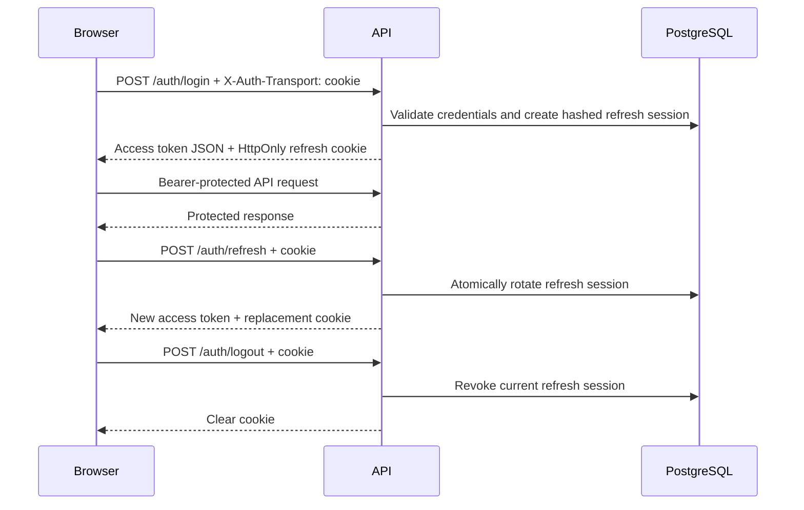

# Secure Browser Session Transport

Status: Implemented by Module 9.0

Contract version: 1.0

Default interface locale: `uz-Latn`

## Purpose

This document is the canonical security and integration contract for browser
authentication transport. It supplements the API-first authentication
architecture without changing authentication, RBAC, credential-epoch, or
database ownership rules.

Browser clients keep short-lived access tokens only in JavaScript memory.
Opaque refresh credentials are held only in an `HttpOnly` cookie. Native,
mobile, Telegram, CLI, and trusted integration clients may continue to use the
legacy JSON body refresh-token transport until a separately versioned contract
replaces it.

## Decision

### Access token

- The API returns the short-lived access token in the login and refresh JSON
  response.
- The React client stores it only in the in-memory authentication store.
- The token is sent as `Authorization: Bearer <token>`.
- The token is never written to `localStorage`, `sessionStorage`, cookies,
  URLs, logs, or analytics.

### Browser refresh token

- Browser auth requests identify the transport with
  `X-Auth-Transport: cookie`.
- Login writes the opaque refresh token to the configured cookie.
- Refresh reads and rotates that cookie.
- Browser JSON responses never contain the refresh token.
- JavaScript cannot inspect the cookie because it is `HttpOnly`.
- The database continues to store only the SHA-256 token hash.

### Cookie attributes

| Attribute | Contract                                                               |
| --------- | ---------------------------------------------------------------------- |
| Name      | Validated `AUTH_REFRESH_COOKIE_NAME`; default `turk_tili_refresh`      |
| HttpOnly  | Always `true`                                                          |
| Secure    | Always `true` in production; may be `false` for local HTTP development |
| SameSite  | `Lax` by default; validated alternatives are `lax` and `strict`        |
| Path      | Fixed validated `AUTH_REFRESH_COOKIE_PATH=/api/v1/auth`                |
| Domain    | Unset, producing a host-only cookie                                    |
| Max-Age   | Remaining server-side refresh-session lifetime                         |
| Expires   | Exact server-side refresh-session expiration                           |

`SameSite=None` is intentionally unsupported in v1. Production deployments
must keep the web application and API same-site. A genuinely cross-site
deployment requires a new reviewed contract with an additional CSRF token
mechanism before enabling cookies.

## Browser lifecycle



On application startup, the frontend calls cookie-based refresh with
credentials included. A successful response restores the in-memory access
token, user, roles, and permissions. A failed response clears the local public
session state. `/auth/me` remains bearer-only and may be called when a client
needs an additional profile refresh.

Frontend login, refresh, logout, and logout-all operations are serialized so a
late refresh response cannot overwrite a newer login or recreate a cookie after
logout. Concurrent `401` responses still share one refresh operation. Protected
React Query state is cleared on authentication loss and authenticated-user
replacement before the next browser paint.

## Endpoint behavior

### `POST /api/v1/auth/login`

- Cookie transport requires `X-Auth-Transport: cookie`, a trusted
  `Origin`/`Referer`, and `clientType: WEB`.
- It creates the normal server-side refresh session, returns the access token
  and safe identity metadata, and sets the refresh cookie.
- It omits `refreshToken` from browser JSON.
- Legacy requests without the transport header and without browser
  `Origin`/`Referer` context retain the existing JSON refresh-token response.
- A request carrying browser `Origin` or `Referer` context must explicitly use
  cookie transport; it cannot downgrade to a JavaScript-readable refresh token.

### `POST /api/v1/auth/refresh`

- Cookie transport sends no refresh token in the request body.
- The cookie token is hashed and resolved through the existing session store.
- Successful rotation revokes the old session, creates one replacement in the
  same token family, and reissues the cookie with the original absolute
  session expiry.
- Invalid, expired, revoked, reused, or malformed credentials return the
  bounded `INVALID_REFRESH_TOKEN` error.
- Invalid browser credentials clear the cookie where possible.

### `POST /api/v1/auth/logout`

- Cookie transport may operate without an access token.
- The cookie identifies the exact server session to revoke.
- Missing or already-invalid cookies remain idempotent.
- The response clears the cookie regardless of whether a live session was
  found.
- Legacy transport continues to require bearer authentication.

### `POST /api/v1/auth/logout-all`

- Bearer authentication remains mandatory.
- Every active session for the user is revoked.
- Cookie transport also clears the current browser cookie.

### `GET /api/v1/auth/me`

- A valid access-token bearer remains mandatory.
- The refresh cookie alone never grants access to user data or protected
  capabilities.

## Transport separation and compatibility

The browser cookie flow and legacy body flow are explicit alternatives:

| Header                      | Cookie | Body token | Result                     |
| --------------------------- | ------ | ---------- | -------------------------- |
| `X-Auth-Transport: cookie`  | Yes    | No         | Browser flow               |
| `X-Auth-Transport: cookie`  | Yes    | Yes        | Rejected as ambiguous      |
| Absent, no browser context  | No     | Yes        | Legacy API flow            |
| Absent, browser context     | Any    | Any        | Rejected as invalid mode   |
| Absent or cookie transport  | No     | No         | Invalid refresh credential |
| Unsupported transport value | Any    | Any        | `INVALID_AUTH_TRANSPORT`   |

An ambient cookie and an explicit body token are never assigned precedence;
the request is rejected with `AMBIGUOUS_REFRESH_TRANSPORT`. Duplicate or
malformed configured refresh cookies are rejected as invalid credentials. This
prevents cross-user or cross-client credential confusion.

## CORS contract

- `FRONTEND_URL` is a validated exact origin.
- Credentialed CORS uses `credentials: true`.
- Wildcard origins are forbidden.
- Untrusted `Origin` values are rejected before route execution.
- Requests without `Origin` remain available to native and server clients.
- Allowed browser headers include `Authorization`, `Content-Type`,
  `Idempotency-Key`, `X-Auth-Transport`, `X-Request-ID`, and
  `X-Step-Up-Proof`.
- The frontend Axios client uses `withCredentials: true`.

Production deployments must update `FRONTEND_URL` to the exact HTTPS frontend
origin. Startup validation rejects an HTTP production frontend origin.
Arbitrary origin reflection is not used.

## CSRF model

The refresh cookie is an ambient browser credential, so browser auth mutations
use layered protection:

1. A same-site `SameSite=Lax` or `SameSite=Strict` cookie.
2. The non-simple `X-Auth-Transport: cookie` request header.
3. Exact configured-origin CORS.
4. Mandatory trusted `Origin`, with trusted `Referer` fallback, on cookie-mode
   login, refresh, logout, and logout-all requests.
5. Rejection of mixed cookie/body credentials.

Bearer-only requests do not require CSRF tokens because bearer credentials are
not ambient. No refresh credential is accepted from a URL or query parameter.

This model assumes a same-site frontend/API deployment and trusted frontend
origin integrity. It does not protect a compromised trusted frontend origin or
an XSS defect; `HttpOnly` reduces token theft impact but does not replace
content security, output encoding, and dependency security.

## Rotation, reuse, and credential changes

- Existing one-time refresh rotation remains authoritative.
- Rotation happens transactionally; a failed transaction leaves the prior
  session unchanged.
- Reuse of a replaced token revokes the complete token family.
- Account inactivity, lock/password rules, credential epoch, and session
  expiration remain backend-owned.
- Logout and logout-all reuse existing audited revocation paths.
- Raw refresh credentials must never appear in audit metadata, request logs,
  error responses, or application logs.

## Development and production

Local development may use:

```dotenv
FRONTEND_URL=http://localhost:5173
AUTH_REFRESH_COOKIE_SECURE=false
AUTH_REFRESH_COOKIE_SAME_SITE=lax
AUTH_REFRESH_COOKIE_PATH=/api/v1/auth
```

Production must use HTTPS and:

```dotenv
FRONTEND_URL=https://approved-frontend.example
AUTH_REFRESH_COOKIE_SECURE=true
AUTH_REFRESH_COOKIE_SAME_SITE=lax
AUTH_REFRESH_COOKIE_PATH=/api/v1/auth
```

Environment validation refuses `AUTH_REFRESH_COOKIE_SECURE=false` and an HTTP
`FRONTEND_URL` when `NODE_ENV=production`. Cookie names are validated and the
cookie path is fixed to the narrow auth scope. Production domains are not
hard-coded.

## Operational and security review

- Reverse proxies must preserve the correct `Origin`, `Referer`, HTTPS, and
  `Set-Cookie` headers.
- Caches must not cache login, refresh, logout, or personalized responses.
- Authentication routes emit `Cache-Control: no-store` and
  `Pragma: no-cache`.
- TLS termination must be trusted and correctly configured before production.
- Security monitoring should alert on refresh-token reuse and unusual session
  revocation patterns without recording raw credentials.
- A cross-site frontend/API topology, multiple frontend origins, or federated
  login requires a new architecture review.

## Non-goals

Module 9.0 does not add the login page, password reset UI, dashboard routing,
MFA, social login, a cookie-access-token design, or Module 9.1/9.2 runtime.
