# Personas and Information Architecture

**Status:** Review candidate

## Personas

### Visitor

Needs credible course outcomes, accessible public information, and a clear
route to an invitation or administrator-created account. Public registration is
not assumed.

### Student

Needs to resume quickly, understand `Kurs jarayoni`, learn across devices, and
recognize suspension/cancellation without losing trust. Primary navigation:
Dashboard, Kurslarim, Jarayonim, Profil. Notifications join only after that
module is approved; achievements are deferred.

### Teacher

Needs scoped course building, media reuse, enrollment oversight, and
`O‘zlashtirish` views for assigned courses. Teacher access never implies global
student or course access.

### Administrator

Needs secure graphical management of users, roles, courses, media, enrollments,
content, settings, audit, and reports. The owner is assumed nontechnical:
ordinary operations must not require source edits, while secrets,
infrastructure, migrations, integrations, and core security remain
developer-owned.

## Information architecture

```mermaid
flowchart TD
  Public["Public"]
  Student["Student application"]
  Teacher["Teacher workspace"]
  Admin["Admin workspace"]

  Public --> Home["Home"]
  Public --> Catalog["Course catalog"]
  Public --> Detail["Course detail"]
  Public --> Auth["Login and recovery"]
  Public --> Content["About, FAQ, Support, Legal"]

  Student --> SDashboard["Dashboard"]
  Student --> MyCourses["Kurslarim"]
  Student --> Player["Course player"]
  Student --> MyProgress["Jarayonim"]
  Student --> SProfile["Profile and settings"]

  Teacher --> TDashboard["Dashboard"]
  Teacher --> TCourses["Course list and builder"]
  Teacher --> TMedia["Media"]
  Teacher --> TEnrollments["Enrollments"]
  Teacher --> TProgress["O‘zlashtirish"]

  Admin --> ADashboard["Dashboard"]
  Admin --> AUsers["Users and access"]
  Admin --> ACourses["Courses and moderation"]
  Admin --> AEnrollments["Enrollments"]
  Admin --> AMedia["Media"]
  Admin --> AProgress["O‘zlashtirish"]
  Admin --> AAudit["Audit"]
  Admin --> ASettings["Typed settings"]
```

## Public area

| Destination       | Purpose                                        |
| ----------------- | ---------------------------------------------- |
| Home              | Product outcome, trust, featured learning      |
| Courses           | Published discovery and filtering              |
| Course detail     | Curriculum and state-aware enrollment decision |
| Login/recovery    | Secure account access                          |
| About/FAQ/Support | Managed trust and help content                 |
| Privacy/Terms     | Versioned approved legal content               |

Registration navigation is rendered only when the API capability permits it.

## Student area

| Destination      | Purpose                                        |
| ---------------- | ---------------------------------------------- |
| Dashboard        | Resume and current learning                    |
| Kurslarim        | Active, completed, and other enrollment states |
| Course player    | Focused lesson and content interaction         |
| Jarayonim        | Personal progress and completed courses        |
| Profile/settings | Identity and preferences                       |

`Jarayonim` is contract-blocked until Module #8 approval. No streak,
achievement, or playback-position entry appears in v1.

## Teacher area

| Destination   | Purpose                                    |
| ------------- | ------------------------------------------ |
| Dashboard     | Next operational work                      |
| Courses       | Scoped course creation/editing             |
| Media         | Scoped upload and reuse                    |
| Enrollments   | Scoped lifecycle oversight                 |
| O‘zlashtirish | Student/course learning progress reporting |
| Settings      | Self preferences when contract approved    |

## Admin area

| Destination   | Purpose                              |
| ------------- | ------------------------------------ |
| Dashboard     | Prioritized operational work         |
| Users         | Lifecycle, roles, sessions, activity |
| Access        | Roles and permission matrix          |
| Courses       | Moderation and administration        |
| Enrollments   | Lifecycle management                 |
| Media         | Global permitted asset management    |
| O‘zlashtirish | Permission-filtered reporting        |
| Audit         | Read-only important actions          |
| Settings      | Typed business/brand settings only   |

Security-sensitive admin actions use step-up authentication. Secrets and
infrastructure settings never enter this information architecture.

## Role shell behavior

- A user with multiple roles sees `RoleSwitcher`; it changes presentation
  context only.
- Route access always comes from API-authoritative capability and scope.
- Unauthorized items are omitted. Contextually unavailable permitted items may
  be disabled with a user-facing reason.
- Switching role returns to a valid landing page and announces the new context.
- Deep links preserve the intended route only when still authorized.

## Responsive navigation

- Below 768 px: student labeled bottom navigation; teacher/admin drawer.
- 768–1023 px: student 72 px icon rail; teacher/admin drawer.
- 1024 px and above: expanded/collapsible sidebar for all authenticated roles.
- Course Player does not mount the global student bottom navigation. Its own
  safe-area-aware sticky completion/previous/next region replaces it, and the
  top-bar Back control exits to the last authorized course/curriculum
  destination or `/app/courses`.

## Wayfinding

- One `h1` and descriptive document title per route.
- `aria-current` marks the active destination.
- Breadcrumbs appear for teacher/admin hierarchies and deep public content.
- Filters and tabs persist in the URL when returning to a list.
- Destructive completion returns to a stable list/detail focus target.
- Backend terms and permission identifiers never become navigation labels.
